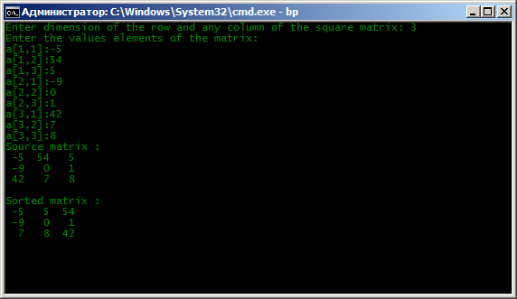
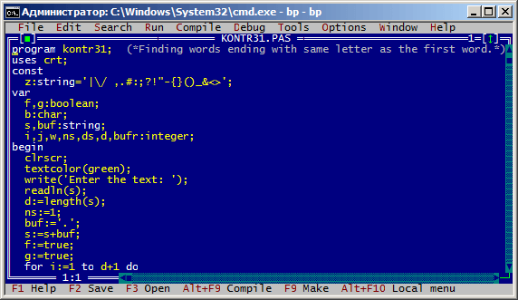

# Основы Borland Pascal
[&lt; назад](../)  
*Прочтите это на другом языке:* *[English](README.en.md)*, **[Русский](README.md)**.  
Дисциплина: *Основы алгоритмизации и программирования*.  
Все примеры исходных кодов предполагают запуск в IDE Borland Paskal 7.1.  
Работоспособность исходников в других IDE не проверялась.

## Лабораторные:
1. Дан вектор A(n). Если наименьший элемент вектора A находится на четном месте, то все элементы расположенные на нечетных местах умножить на 2. В противном случае вектор оставить без изменения;
2. Дана квадратная матрица A(nхn). Построить вектор b, где bi, i=1,…,n – среднее арифметическое положительных элементов i-ой строки матрицы.

## Контрольная:
* 1.1. Дан целочисленный вектор А(n). Подсчитать сколько раз встречается в этом векторе максимальное по величине число;
* 1.2. Дан целочисленный вектор А(n). Найти наибольшее из четных и количество нечетных чисел вектора. На печать выдавать исходный вектор и полученный результат;
* 1.3. Дан целочисленный вектор А(n). Отсортировать его элементы методом линейного выбора с подсчётом;
* 2.1. Дана действительная матрица размерности (n x n). Если максимальные элементы столбцов превышает сумму минимальных элементов строк, то к элементам, стоящим на побочной диагонали добавить соответствующие максимальные элементы столбцов. В противном случае матрицу оставить без изменения;
* 2.2. Дана действительная матрица размерности (n x n). Определить произведение элементов в тех строках, которые не содержат элементов кратных 3;
* 2.3. Дана действительная матрица размерности (n x n). Найти номер первого из столбцов, не содержащих элементов, меньших s;
* 2.4. Дана действительная матрица размерности (n x n). Проверить упорядочены ли элементы строк матрицы. Если нет, то упорядочить их в порядке возрастания методом линейного выбора с подсчетом;
* 3.1. В заданном тексте найти слова, которые заканчиваются на ту же букву, что и первое слово;
* 3.2. Выбрать в тексте первое по порядку слово с наибольшим числом вхождений в него буквы 'и'.

## Демонстрационные скриншоты:

