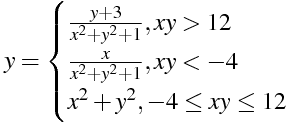
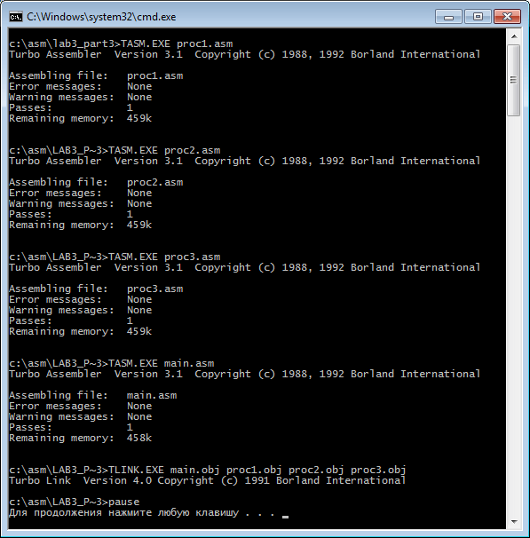
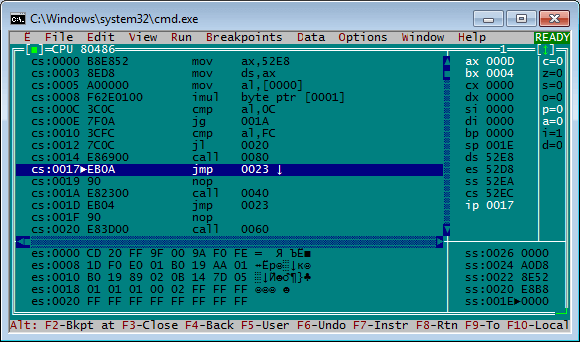
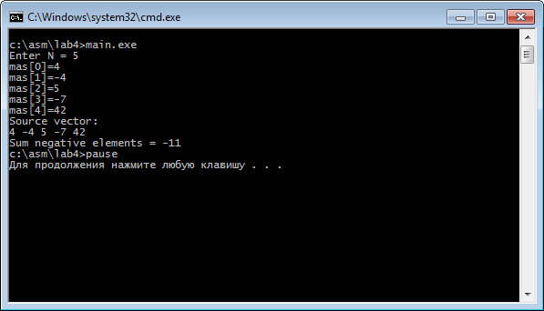
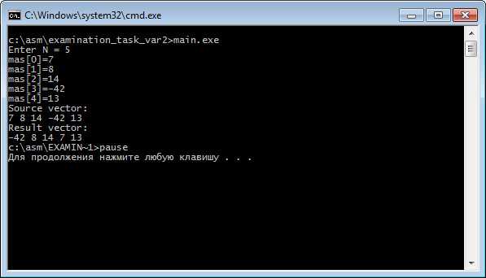
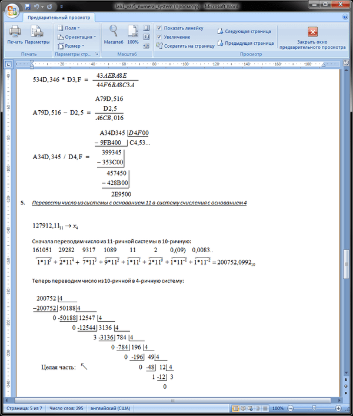

# Assembler
[&lt; back](../)  
*Read this in other languages:* **[English](README.en.md)**, *[Русский](README.md)*.  
Discipline: *Programming languages*.  
All examples assume the source code run in the TASM Turbo Assembler package.  
The efficiency of the sources in other packages or IDE has not been tested.

## Running applications:
All laboratory (except first) and examination task have the ability to run only on the 32-bit version of Windows. In case, if you need to run on 64-bit, it is necessary to put a virtual machine (for example VirtualBox) 32-bit OC and run it.  
##### How to start:
* 1. Unzip the translator (TASM.exe), linker (TLINK.exe) and debugger (TD.exe) from the archive *TASM, TLINK AND TURBO_DEBUGGER.zip* in directory of laboratory work;
* 2. Translate each file of the source code (asm) in an object file (obj) through a translator.  
For example: ```TASM.EXE main.asm```
* 3. Make linking object files by the linker.  
For example: ```TLINK.EXE main.obj show.obj input.obj```  
As a result, files are created with the link-listing (map) and executable (exe) file. For laboratory work 3.4, 4, and examination task, when you run the executable file, you can see the result of work.
Results of other laboratory work (2.1, 2.2, 3.1, 3.2 and 3.3) can be seen only in the debugger.
* 4. To start the debugging process run the compiled executable file in the Turbo debugger.  
For example: ```TD.EXE main.exe```  
As a result, the console will launch the debugger window. To step through debugging requires pressing a button ```F8```. Changing the values ​​of the variables and the result will be displayed in the 16-hex format in respective registers in the right part of the window.  

For ease of launch, for all of the above operations and the removal of the generated files, were written by batch files (bat): ```util_compile.bat```, ```util_debug.bat```, ```util_run.bat``` и ```util_delete.bat```.

## Laboratory works:
* 1. *Number systems*:
  * 1.1. Fill in each row in the table where the same number should be recorded in notations with the bases of 2, 8, 10, 16.<table><tbody><tr><th>Base 2</th><th>Base 8</th><th>Base 10</th><th>Base 16</th></tr><tr><td align="center">1111110111.111</td><td></td><td></td><td></td></tr><tr><td></td><td align="center">565.25</td><td></td><td></td></tr><tr><td></td><td></td><td align="center">545.2</td><td></td></tr><tr><td></td><td></td><td></td><td align="center">5A1.21</td></tr></tbody></table>
  * 1.2. Perform the action in the binary system:<ul><li>110101001.011 + 110111.111</li><li>100101101.011 * 110111.011</li><li>101100001.001 - 110101.101</li><li>100101001.011 / 110101.11</li></ul>
  * 1.3. Perform the action in octal:<ul><li>125352.34 + 176.25</li><li>336352.34 * 516.52</li><li>226375.34 – 541.25</li><li>336152.34 / 546.23</li></ul>
  * 1.4. Perform the action in hexadecimal:<ul><li>A545.346 + D1.F</li><li>534D.346 * D3.F</li><li>A79D.516 – D2.5</li><li>A34D.345 / D4.F</li></ul>
  * 1.5. Translate the number of systems with a base 11 number system with the base 4: 127912.11<sub>11</sub> &rarr; x<sub>4</sub>
  * 1.6. Using the binary representation of the numbers to make addition of numbers, using the 3 ways of representing integers: «sign + module", «addition to one», «binary addition»: 64 + 11.
* 2. *Arithmetic commands Assembler*. To compile and debug a program in assembler to evaluate a given arithmetic expression: y=(2a+b-5)/(b+2). Write two versions of programs that use:
  * Work with bytes;
  * Work with words.
* 3. *Arithmetic commands Assembler*. Compile and debug Assembler language program to calculate the value of a function:  
  
To write 4 versions of the program:
  * Without using the procedures;
  * Using internal procedures;
  * Using external procedures;
  * Organize initial data input and output results.
* 4. *Programming of cyclical computing processes*. Create and debug a program in assembler language for use with single-dimensional arrays. Organize input array dimension and the array elements with the keyboard and display of the results on the screen.  
*Task*: Find the sum of the negative elements in the array.  

## Examination task:
Create and debug a program in assembler language for use with single-dimensional arrays. Organize input array dimension and the array elements with the keyboard and display of the results on the screen.  
*Task*: The first element of the array to replace a minimum element.

## Demo screenshots:






