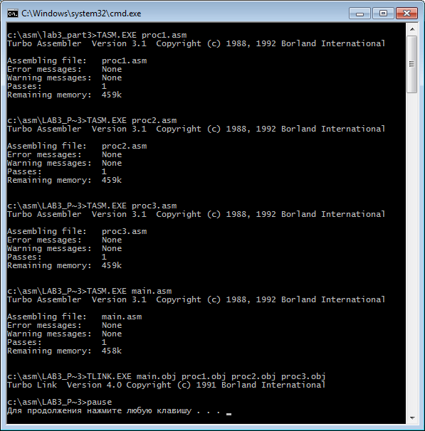
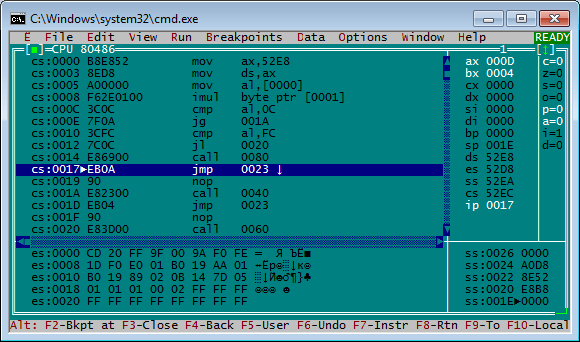
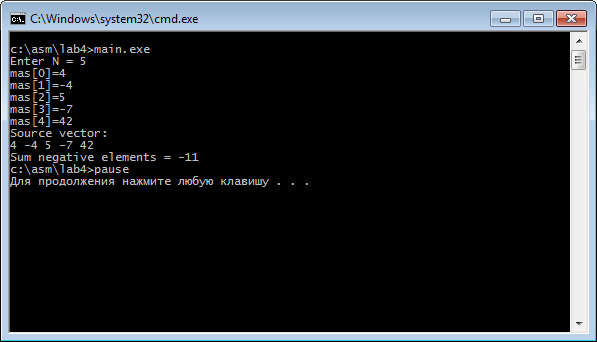
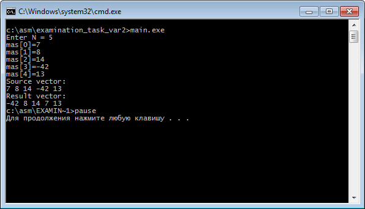

# Ассемблер
[&lt; назад](../)  
*Прочтите это на другом языке:* *[English](README.en.md)*, **[Русский](README.md)**.  
Дисциплина: *Языки программирования*.  
Все примеры исходных кодов предполагают запуск в пакете Турбо Ассемблера TASM  
(приложен в архиве *TASM, TLINK AND TURBO_DEBUGGER.zip*).  
Работоспособность исходников в других пакетах или IDE не проверялась.

## Запуск приложений:
Все лабораторные (за исключением первой) и экзаменационный билет имеют возможность запуска только на 32-битной версии OC Windows. В случае, если нужен запуск на 64-битной, придётся ставить виртуальную машину (напр. VirtualBox) с 32-битной OC и осуществлять запуск в ней.  
##### Порядок запуска:
* 1. Распаковать транслятор (TASM.exe), компоновщик (TLINK.exe) и отладчик (TD.exe) из архива *TASM, TLINK AND TURBO_DEBUGGER.zip* в каталог с лабораторной работой;
* 2. Транслировать каждый файл исходного кода (asm) в объектный файл (obj) посредством транслятора.  
Например: ```TASM.EXE main.asm```
* 3. Произвести компоновку объектных файлов посредством компоновщика.  
Например: ```TLINK.EXE main.obj show.obj input.obj```  
В результате будут созданы файлы с листингом компоновки (MAP) и исполняемый файл (EXE). Для лабораторных работ 3.4, 4 и экзаменационного билета при запуске исполняемого файла можно увидеть результат работы.
Результаты остальных лабораторных работ (2.1, 2.2, 3.1, 3.2 и 3.3) можно увидеть только в отладчике.
* 4. Для запуска процесса отладки запускаем скомпилированный исполняемый файл в Turbo debugger.  
Например:  ```TD.EXE main.exe```  
В результате будет запущено консольное окно отладчика. Для пошагового выполнения отладки требуется нажатия кнопки ```F8```. Изменение значений переменных и результат будут выведены в 16-ричном формате в соответсвующих регистрах в правой части окна.  

Для удобства запуска, для всех вышеперечисленных операций и удаления созданных файлов, были написаны пакетные файлы (bat): ```util_compile.bat```, ```util_debug.bat```, ```util_run.bat``` и ```util_delete.bat```.

## Лабораторные:
* 1. *Системы счисления*:
  * 1.1. Заполнить таблицу, в каждой строке которой одно и тоже число должно быть записано в системах счисления с основаниями 2,8,10,16.<table><tbody><tr><th>Основание 2</th><th>Основание 8</th><th>Основание 10</th><th>Основание 16</th></tr><tr><td align="center">1111110111,111</td><td></td><td></td><td></td></tr><tr><td></td><td align="center">565,25</td><td></td><td></td></tr><tr><td></td><td></td><td align="center">545,2</td><td></td></tr><tr><td></td><td></td><td></td><td align="center">5A1,21</td></tr></tbody></table>
  * 1.2. Произвести действие в двоичной системе счисления:<ul><li>110101001,011 + 110111,111</li><li>100101101,011 * 110111,011</li><li>101100001,001 - 110101,101</li><li>100101001,011 / 110101,11</li></ul>
  * 1.3. Произвести действие в восьмеричной системе счисления:<ul><li>125352,34 + 176,25</li><li>336352,34 * 516,52</li><li>226375,34 – 541,25</li><li>336152,34 / 546,23</li></ul>
  * 1.4. Произвести действие в шестнадцатеричной системе счисления:<ul><li>A545,346 + D1,F</li><li>534D,346 * D3,F</li><li>A79D,516 – D2,5</li><li>A34D,345 / D4,F</li></ul>
  * 1.5. Перевести число из системы с основанием 11 в систему счисления с основанием 4: 127912,11<sub>11</sub> &rarr; x<sub>4</sub>
  * 1.6. Используя двоичное представление чисел, произвести сложение чисел, используя 3 способа представления целых чисел: «знак + модуль», «дополнение до единицы», «двоичное дополнение»: 64 + 11.
* 2. *Арифметические команды ассемблера*. Составить и отладить программу на языке ассемблер для вычисления заданного арифметического выражения: y=(2a+b-5)/(b+2). Написать два варианта программы, использующие:
  * Работу с байтами;
  * Работу со словами.
* 3. *Арифметические команды ассемблера*. Составить и отладить программу на языке ассемблера для вычисления значения функции:  
  
Написать 4 варианта программы:
  * Без использования процедур;
  * С использованием внутренних процедур;
  * С использованием внешних процедур;
  * Организовать ввод исходных данных и вывод результатов.
* 4. *Программирование циклических вычислительных процессов*. Составить и отладить программу на языке ассемблера для работы с одномерными массивами. Организовать ввод размерности массива и элементов массива с клавиатуры и вывод полученных результатов на экран.  
*Задание*: Найти сумму отрицательных элементов массива.  

## Экзаменационный билет:
Составить и отладить программу на языке ассемблера для работы с одномерными массивами. Организовать ввод размерности массива и элементов массива с клавиатуры и вывод полученных результатов на экран.  
*Задание*: Первый элемент массива заменить минимальным.


## Демонстрационные скриншоты:






