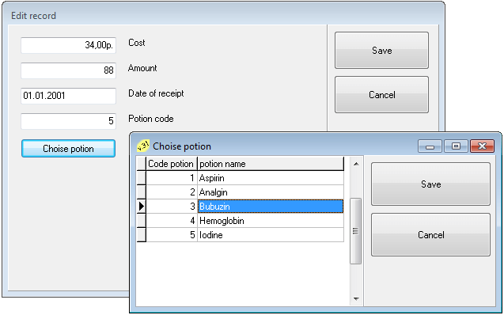

# Basics Borland Pascal
[&lt; back](../)  
*Read this in other languages:* **[English](README.en.md)**, *[Русский](README.md)*.  
Discipline: *Basics of designing programs*.  
Sources Delphi-projects involve launch of IDE Borland Delphi 7.  
The health of sources in other IDE has not been verified.  
The order of the database to connect to the project:
* 1. Create a database alias in the BDE Adminstrator (STANDART type, PARADOX driver).
* 2. Specify the alias in the project.  

The directory path to the database file should be no spaces.

## Task statement:
### Creating a database:

Develop a dialogue system for processing new database data with the composition of its records that contain different types of data. The system must provide:
* 1. maintaining a local database: view, adjustment, removal, addition database records;
* 2. populating the database entries of graphic elements (additional charge);
* 3. view the data in the table and edit windows;
* 4. formation of values ​​calculated field;
* 5. selection of database records on the condition of static and dynamic queries in SQL language in Query components;
* 6. search data in different ways, the selection of records from the database on a condition defined with the help of filters and components Table Query;
* 7. sorting data by main and additional indexes;
* 8. creation, preview and print the report data from the database.

### Calculated fields:

Within a single database table, you need to calculate the value of a calculated field. You can add and subtract (field type date and numeric), divide and multiply (numeric field). If the tables you will not find on any fields to build calculated fields, you can add a required field in the structure of the corresponding database table.

### Search and filter data:

In each of the database tables should be at least 5 meaningful records. The search should be carried out at least 10 fields from different database tables. You must use the methods Locate, LookUP. Also, entries should be filtered through the same set of data fields. Search and filtering should take place on a separate form (one for all database tables).

### Sorting:

It must be realized, at least 4 ways to sort data:
* а) sorting by main index should be organized as descending;
* б) and ascending; 
* в) sort by an additional index, the index is created manually; 
* г) create an additional index during program operation; 
* д) Optional: Create the main index at run time, it is desirable that the index consisted of two or more fields.  
The first four sorting should be organized in the fields of one table.

### Static and dynamic queries:

Basic requirements for queries to invent:
* 1) Queries must be at least 8;
* 2) Each query must include data from multiple database tables;
* 3) Must be at least 3 dynamic parametric query;
* 4) Must be at least one query with aggregate functions and the group by clause (for building grouping query);
* 5) If possible, you should use as many different keywords operator SELECT (IN, BETWEEN и.т.д.).

### Reports:

Should be done at least 3 report:

* 1) on the table, using the report wizard.
* 2) on query made in the manual.
* 3) groups report, made by hand.  

Should be vertical and horizontal lines, the current page number.

## Task (Variant 18):
Subject area: **Parents of students**.  
Information objects:

* *Student* (Student code, Name of faculty, Group number, Student's last name, Home address, Year of birth, Home phone);
* *Father* (Code, Student code, Father's last name, Age, Place of work, Phone);
* *Mother* (Code, Student code, Mother's last name, Place of work, Phone).

## Task (Variant 31):
Subject area: **Pharmacy kiosk**.  
Information objects:
* *Finished potions* (Code potion, Name, Implementation period);
* *Delievery potions* (Code delievery, Code potion, Cost, Amount, Date);
* *Sale potions* (Code sale, Code potion, Amount, Date).

## Demo screenshots:

