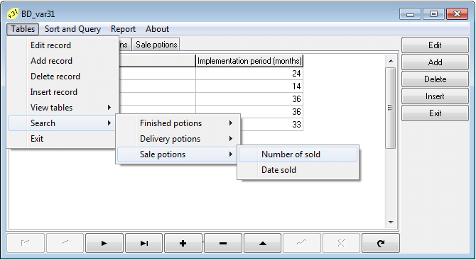
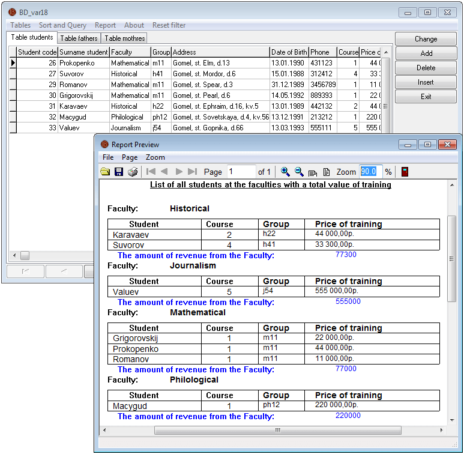

# Borland Delphi (БД Paradox)
[&lt; назад](../)  
*Прочтите это на другом языке:* *[English](README.en.md)*, **[Русский](README.md)**.  
Дисциплина: *Основы конструирования программ*.  
Исходники Delphi-проектов предполагают запуск в Borland Delphi 7.  
Работоспособность исходников в других IDE не проверялась.  
Порядок подключения БД к проекту:
* 1. Создать alias базы данных в BDE Adminstrator (тип STANDART, драйвер PARADOX).
* 2. Указать этот alias в проекте.  

В пути к каталогу с файлами базы данных не должно быть пробелов.

## Постановка задачи:
### Создание базы данных:

Разработать диалоговую систему для обработки данных новой базы данных с данным составом ее записей, содержащих различные типы данных. Система должна обеспечить:
* 1. ведение локальной базы данных: просмотр, корректировку, удаление, дополнение записей БД;
* 2. заполнение графических элементов записи базы (доп);
* 3. просмотр данных в таблице и окнах редактирования;
* 4. формирование значения вычисляемого поля;
* 5. отбор записей из БД по условию статического и динамического запросов на языке SQL в компонентах Query;
* 6. поиск данных различными способами, отбор записей из БД по условию, определенному с помощью фильтров компонентов Table и Query;
* 7. сортировку данных по основному и дополнительным индексам;
* 8. формирование, предварительный просмотр и печать отчета данных из БД.

### Вычисляемые поля:

В пределах одной таблицы БД, необходимо рассчитать значения вычисляемого поля. Можно складывать и отнимать (поля типа даты и числовые), делить и умножать (числовые поля). Если в таблицах вы не найдете по каким полям построить вычисляемые поля, то можно добавить необходимое поле в структуру соответствующей таблицы БД.

### Поиск и фильтрация данных:

В каждой из таблиц БД должно быть, по крайней мере, 5 осмысленных записей. Поиск должен осуществляться, как минимум по 10 полям из различных таблиц БД. Необходимо использовать методы Locate, LookUP. Также должна осуществляться фильтрация записей по тем же полям НД. Поиск и фильтрация должны происходить на отдельной форме (одной для всех таблиц БД).

### Сортировка:

Должно быть реализовано, как минимум 4 способа сортировки данных:
* а) сортировка по основному индексу должна быть организована как по убыванию;
* б) так и по возрастанию; 
* в) сортировка по дополнительному индексу, индекс создан вручную; 
* г) создание дополнительного индекса во время работы программы; 
* д) Дополнительно: создание основного индекса во время работы программы, желательно, чтобы индекс состоял из двух или более полей.  
Первые четыре сортировки должны быть организованы по полям одной таблицы.

### Статические и динамические запросы:

Основные требования для придумываемых запросов:
* 1) Запросов должно быть не менее 8;
* 2) Каждый запрос должен охватывать данные из нескольких таблиц БД;
* 3) Должно быть, как минимум, 3 динамических параметрических запроса;
* 4) Должен быть, как минимум, один запрос с использование агрегатных функций и секции group by (для построения группирующего запроса);
* 5) По возможности, необходимо использовать как можно больше различных ключевых слов оператора SELECT (IN, BETWEEN и.т.д.)

### Отчеты:

Должно быть сделано, как минимум 3 отчета:

* 1) по таблице, используя мастер построения отчетов.
* 2) по запросу, сделанный в ручную.
* 3) группирующий отчет, сделанный в ручную.  

Должны быть вертикальные и горизонтальные линии, номер текущей страницы.

## Задание (Вариант 18):
Предметная область: **Родители студента**.  
Информационные объекты:

* *Студент* (Код студента, Название факультета, Номер группы, Фамилия студента, Домашний адрес, Год рождения, Домашний телефон);
* *Отец* (Код, Код студента, Фамилия отца, Возраст, Место работы, Телефон);
* *Мать* (Код, Код студента, Фамилия матери, Возраст, Место работы Телефон).

## Задание (Вариант 31):
Предметная область: **Аптечный киоск**.  
Информационные объекты:
* *Готовые лекарства* (Код лекарства, Название, Срок реализации);
* *Поступление лекарств* (Код поступления, Код лекарства, Цена, Количество, Дата);
* *Продажа* (Код продажи, Код лекарства, Количество, Дата).

## Демонстрационные скриншоты:

