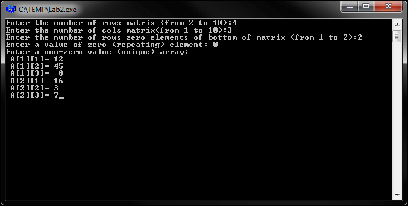
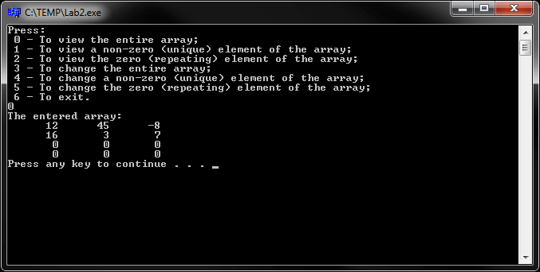
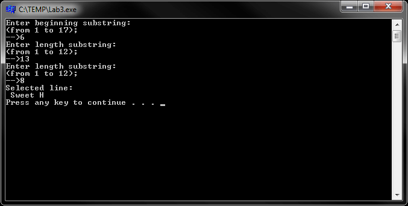
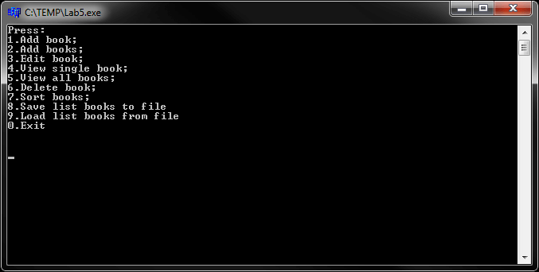
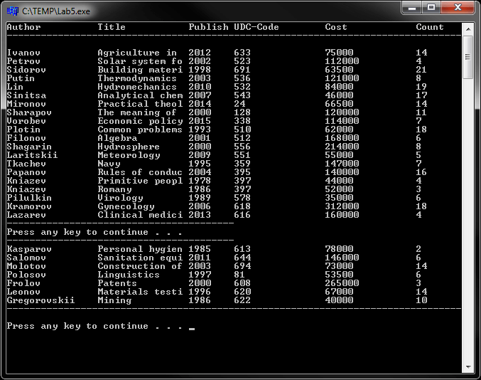

# Basics and Data Structures (sparse array and linked lists)
[&lt; back](../)  
*Read this in other languages:* **[English](README.en.md)**, *[Русский](README.md)*.  
Discipline: *The structure and organization of data*.  
All examples assume the source code run in the IDE Borland C++ Builder 6.  
The efficiency of the sources in other IDE has not been tested.

## Laboratory works:
* 1.1. Calculate the value of the function f(x)=3,5x+cosx/sin2x+ex, where x=0,1. Round the value f(x) to the nearest integer.
* 1.2. Displays three three-digit integer numbers. Determine the number of preceding each of the input numbers and the amount received by the numbers.
* 1.3. Enter three real numbers a, b, c. Find the integral and fractional parts of a division (a + b) on c.
* 1.4. Enter two integers a, b. Find the number x, corresponding to the whole of division a on b. Determine the character whose serial number is found x.
* 1.5. Determine the number obtained by writing out in the reverse order of numbers given three-digit number.
* 1.6. Enter any lowercase character from the keyboard. Print its sequence and the corresponding uppercase character.
* 1.7. Modify any program so that the program is executed as long as the end is not indicated in any way by the user.  
* 2. Develop a method for economical accommodation in the memory of a given sparse static array. All zero (identical) elements are arranged in lower part of the matrix.  
* 3. Selection from the string substring indicating the start and length of the substring. Provide a reaction to an incorrect setting of the parameters. Do not use the existing rows in the language processing tools.  
* 4. *Unidirectional unordered linked list*:  
The data structure in the RAM's capacity is represented as a one-way linear list.  
In function 'main' should be a structure that describes the menu.  
General program variables:  
 - pointer to the beginning of the list;  
 - filename to store the list (D_STRUCT.DAT).  
Should also be:  
 - Function list print (by 20 elements);  
 - Function list input (end of input - when entering name instead the symbol '\*');  
 - Function add an item to the list;  
 - Function list element delete (overwrite pointers neighboring nodes and freeing memory);  
 - Function changes values list item fields;  
 - Function list sorting (by bubble method);  
 - Function list save to disk (in file D_STRUCT.DAT);  
 - Function list load from file (file D_STRUCT.DAT).  
Initial data according to options:  
 - *Scope*: Library;  
 - *Attributes*: author, title, year of publication, UDC-code, price, count.  
* 5. *Bidirectional unordered linked list*: same task as in the laboratory N4, only data storage implemented using bidirectional unordered linked list.

## Demo screenshots:

