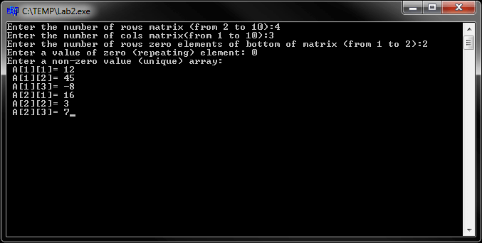
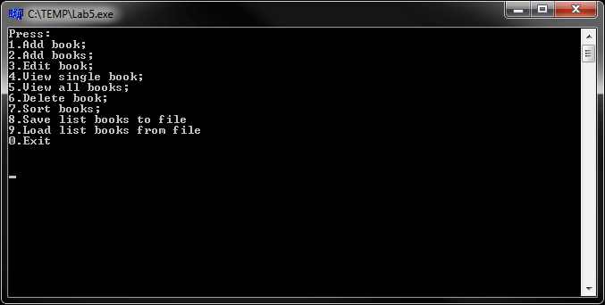
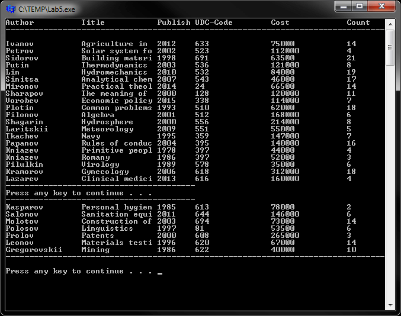

# Основы и структуры данных (разреженный массив и связные списки)
[&lt; назад](../)  
*Прочтите это на другом языке:* *[English](README.en.md)*, **[Русский](README.md)**.  
Дисциплина: *Структура и организация данных*.  
Все примеры исходных кодов предполагают запуск в IDE Borland C++ Builder 6.  
Работоспособность исходников в других IDE не проверялась.

## Лабораторные:
* 1.1. Вычислить значение функции f(x)=3,5x+cosx/sin2x+ex, где x=0,1. Округлить значение f(x) к ближайшему целому.
* 1.2. Вывести три целых трехзначных числа. Определить число, предшествующее каждому из вводимых чисел и сумму полученных чисел.
* 1.3. Ввести три вещественных числа a, b, c. Найти целую и дробную части от деления (a+b) на c.
* 1.4. Ввести два целых числа a, b. Найти число x, соответствующее целому от деления а на b. Определить символ, порядковый номер которого равен найденному х.
* 1.5. Определить число, полученное выписыванием в обратном порядке цифр заданного трехзначного числа.
* 1.6. Ввести любой латинский строчный символ с клавиатуры. Вывести его порядковый и соответствующий прописной символ.  
* 1.7. Модифицировать любую программу таким образом, чтобы программа выполнялась до тех пор, пока об окончании не будет указано каким-либо образом пользователем.  
* 2. Разработать способ экономного размещения в памяти заданного разреженного массива. Разработать процедуры/функции, обеспечивающие доступ к элементам массива по номерам строки и столбца. В контрольной программе обеспечить запись и чтение всех элементов массива. Все нулевые элементы расположены в нижней части матрицы.  
* 3. Разработать процедуру или функцию, выполняющую: выбор из строки подстроки, начиная с позиции 'n' длинной 'm'. Предусмотреть и описать реакцию на некорректное задание параметров. Не использовать имеющиеся в языке средства обработки строк.  
* 4. *Однонаправленный неупорядоченный связный список*:  
Структура данных в оперативной пямяти представлена как однонаправленный линейный список.  
В функции main должна быть структура, описывающая меню.  
Общие программные переменные:  
 - указатель на начало списка;  
 - имя файла для хранения списка (D_STRUCT.DAT).  
Также должны быть:  
 - Функция списка печати (по 20 элементов);  
 - Функция списка ввода (конец входных данных - при вводе символа '\*' вместо имени автора);  
 - Функция добавления элемента в список;  
 - Функция удаления элемента списка (перезапись указателей соседних узлов и освобождение памяти);  
 - Функция изменения значений полей элемента;  
 - Функция сортировки списка (методом пузырька);  
 - Функция сохранения списка в файл на диске (в файле D_STRUCT.DAT);  
 - Функция загрузки списка из файла на диске (файл D_STRUCT.DAT).  
Исходные данные согласно варианта:  
 - *Предметная область*: Библиотека;  
 - *Аттрибуты информации*: автор книги, название, год издания, код УДК, цена, количество в библиотеке.  
* 5. *Двунаправленный неупорядоченный связный список*: тоже задание, что и в лабораторной N4, только хранение данных реализовать при помощи неупорядоченного линейного 2-направленного списка.

## Демонстрационные скриншоты:

