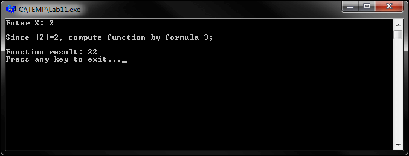
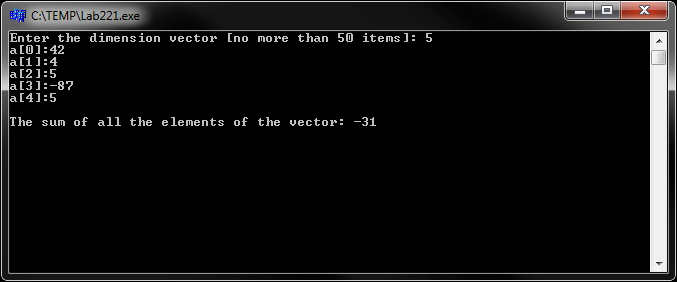
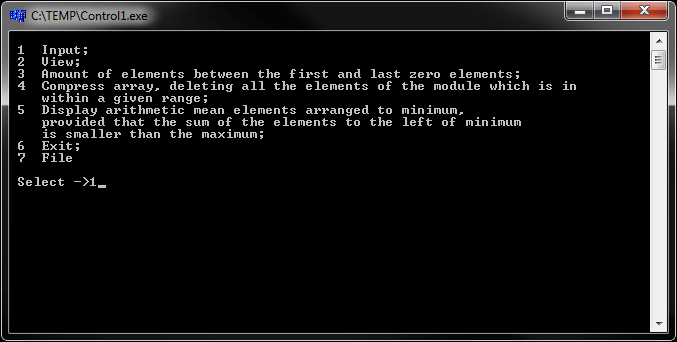
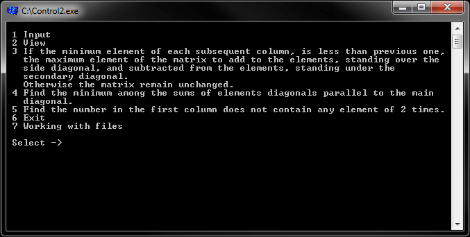
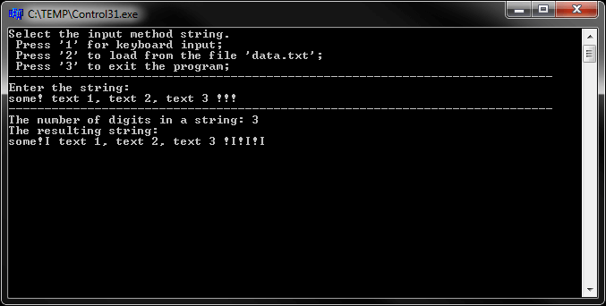

# Basics of C/C++ language
[&lt; back](../)  
*Read this in other languages:* **[English](README.en.md)**, *[Русский](README.md)*.  
Discipline: *Programming languages*.  
All examples assume the source code run in the IDE Borland C++ Builder 6.  
The efficiency of the sources in other IDE has not been tested.

## Laboratory works:
* 0.1. Calculate the value «f» function using a float. Calculate values ​​for at least three pairs of arguments that implement each of the branches of the computational process. On the print «x», «y», «xy», the value of the function.
  * For (x\*y)<1 value of the function: (atan(1/(x-y)));
  * For 1<=(x\*y)<8 value of the function: (exp(x))+log(5)\*fabs(x-y);
  * For (x\*y)>=8 value of the function: 1/(1+x-(x\*y)).
* 0.2. Calculate the value of the function «g», with using an integer data type, the interim and final results, operations of integer arithmetic, MAXINT constant, ranges of case selection operator. Calculate values ​​for at least three pairs of arguments that implement each of the branches of the computational process. On the print «x», «y», «xy», the value of the function.
  * For (x\*y)<3 value of the function: (pow(x,2)-pow(y,2)+3\*x)/sqrt(2\*pow((x\*y),4));
  * For 3<=(x\*y)<=10 value of the function: (x+1+sqrt(abs(y+1)))/(pow(x,2)+x\*y);
  * For (x\*y)>10 value of the function: (-5\*pow(x,2)+abs(x-y)).
* 1.1. Calculate the value of the function f(x) for the entered value of the argument. calculation function is performed using the operator 'if'. Use the formatted input-output function of &lt;stdio.h&gt; and other functions for controlling the output of the screen &lt;conio.h&gt;. To use mathematical functions, connect the header &lt;math.h&gt;.
  * For x<2 value of the function: (pow((x-1),2)+x)/(2+x);
  * For x>2 value of the function: (pow((x+1),3)+2\*x)/(sqrt(pow(3x-2,2)+1));
  * For x=2 value of the function: abs(pow(x,2)+3)+15.
* 1.2. Display up to five decimal points table of the function f(x) for n+1, the value of x in interval [a, b]. In the program to check the correctness of input data. Calculation functions programmed using the 'if' operator. Use data type float and control functions of the input-output library &lt;conio.h&gt;. For the organization to use the cycle operator for.
  * For (x\*y)<0 value of the function: ((4\*a)-y+1)/(pow(y,2)+1);
  * For (x\*y)=0 value of the function: 3+pow(a,2)+pow(y,2);
  * For (x\*y)>0 value of the function: (x-y)/(1+pow(y,2)+pow(a,2)).
* 2.1. Create C-program that computes the value of the function f(x) for the input argument values. The calculation functions are implemented using the 'if' operator. All variables must be pointers. Use the function of task 1.1;
* 2.2. Develop 2 programs that implement the vector processing. For programs to implement the transfer of data between functions to implement the decision of the vector processing tasks, and the main() function with the help of:
  * 2.2.1. Global data description (Task: Sum of all vector elements);
  * 2.2.2. Formal and actual arguments and transmission of results to the caller (Task: Calculation of the amount of negative elements).

## Control work:
* 1. *Vectors*. Develop a vector processing program, consisting of the following functions: input the dimensions and elements of the vector, view vector elements, solution problem 1, solution problem 2, solution of the problem 3. To transfer data between the functions to use formal and actual arguments. To return the results of the functions use pointers and return values ​​to the caller. Memory for the arrays is dynamically allocated. 
  * 1.1. Given a vector of dimension N. Find the sum of the elements located between the first and the last zero element;
  * 1.2. Given a vector of dimension N. Compress array, deleting all the elements of the module that is in the interval [a, b]. The released at the end of the array elements fill with zeros;
  * 1.3. Given a vector of dimension N. If the sum of the elements located to the left of the minimum is less than the maximum, then find the arithmetic mean of the elements located to the minimum.
* 2. *Matrix*. Develop matrix processing program consisting of the following functions: input dimension and elements of square matrix, view matrix elements, solution problem 1, solution problem 2, solution problem 3. To transfer data between functions use formal and actual arguments. To return the results of the functions use the links and return values to the caller. Memory for arrays allocate dynamically.
  * 2.1. Given an integer matrix of dimension (n x n). If the smallest element of each subsequent column is less than the previous one, then the maximum element of a matrix add to the elements above the diagonal side, and subtract from the elements, standing under the side diagonal. Otherwise, the matrix remain unchanged.
  * 2.2. Given an integer matrix of dimension (n x n). Find the minimum among elements parallel to the diagonals of the amounts of the main diagonal of a matrix;
  * 2.3. Given an integer matrix of dimension (n x n). Find the number of the first column that does not contain any element multiple of 2.
* 3. *Strings*. Develop programs to handle strings: the first handle the string as an array of characters in the second line handling implemented using the functions described in &lt;string.h&gt; and(or) using pointers. Memory for the string to one program statically, dynamically in the second.
  * 3.1. After each character '!' Insert symbol 'l' and count the total number of digits in a string;
  * 3.2. Determine the number of words, the second letter 'P'.

## Demo screenshots:

