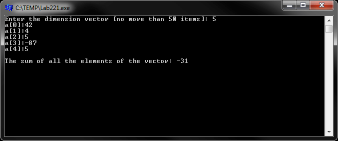
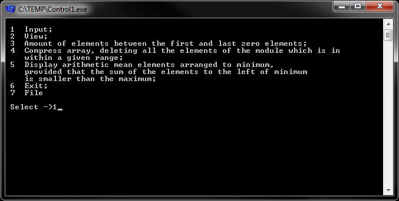
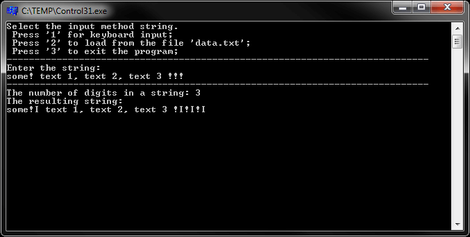

# Основы языка C/C++
[&lt; назад](../)  
*Прочтите это на другом языке:* *[English](README.en.md)*, **[Русский](README.md)**.  
Дисциплина: *Языки программирования*.  
Все примеры исходных кодов предполагают запуск в IDE Borland C++ Builder 6.  
Работоспособность исходников в других IDE не проверялась.

## Лабораторные:
* 0.1. Вычислить значение функции «f», используя тип float. Вычислить значения по крайней мере для трех пар аргументов, которые реализуют каждой из ветвей вычислительного процесса. На печать выдавать «x», «y», «xy», значение функции.
  * Для (x\*y)<1 значение функции: (atan(1/(x-y)));
  * Для 1<=(x\*y)<8 значение функции: (exp(x))+log(5)\*fabs(x-y);
  * Для (x\*y)>=8 значение функции: 1/(1+x-(x\*y)).
* 0.2. Вычислить значение функции «g», с используя целочисленной тип данных, промежуточные и окончательные результаты, операции целочисленной арифметики, константу MAXINT, диапазоны оператора выбора case. Вычислить значения по крайней мере для трех пар аргументов, которые реализуют каждой из ветвей вычислительного процесса. На печать выдавать «x», «y», «xy», значение функции.
  * Для (x\*y)<3 значение функции: (pow(x,2)-pow(y,2)+3\*x)/sqrt(2\*pow((x\*y),4));
  * Для 3<=(x\*y)<=10 значение функции: (x+1+sqrt(abs(y+1)))/(pow(x,2)+x\*y);
  * Для (x\*y)>10 значение функции: (-5\*pow(x,2)+abs(x-y)).
* 1.1. Вычислить значение функции f(x) для введенного значения аргумента. Функция вычисления выполняется с использованием оператора if. Используйте функции форматного ввода-вывода из &lt;stdio.h&gt; и других функций для управления выводом на экран из &lt;conio.h&gt;. Для использования математических функций подключите заголовочный файл &lt;math.h&gt;.
  * Для x<2 значение функции: (pow((x-1),2)+x)/(2+x);
  * Для x>2 значение функции: (pow((x+1),3)+2\*x)/(sqrt(pow(3x-2,2)+1));
  * Для x=2 значение функции: abs(pow(x,2)+3)+15.
* 1.2. Вывести с точностью до пяти знаков после точки таблицу значений функции f(x) для n+1 значения x из отрезка [a,b]. В программе проверить правильность вводимых данных. Вычисление функции запрограммировать с помощью оператора if. Использовать данные типа float и функции управления вводом-выводом из библиотеки &lt;conio.h&gt;. Для организации цикла использовать оператор for.
  * Для (x\*y)<0 значение функции: ((4\*a)-y+1)/(pow(y,2)+1);
  * Для (x\*y)=0 значение функции: 3+pow(a,2)+pow(y,2);
  * Для (x\*y)>0 значение функции: (x-y)/(1+pow(y,2)+pow(a,2)).
* 2.1. Составить C–программу, вычисляющую значение функции f(x) для вводимого значения аргумента. Вычисление функции реализовать с помощью оператора if. Все переменные должны быть указателями. Использовать функцию из задания 1.1;
* 2.2. Разработать 2 программы, реализующие обработку вектора. Для программ реализовать передачу данных между функцией, реализующей решение задачи обработки вектора, и функцией main() с помощью:
  * 2.2.1. Глобального описания данных (Задача: Cумма всех элементов вектора);
  * 2.2.2. Формальных и фактических аргументов и передачи результатов в точку вызова (Задача: Подсчёт суммы отрицательных элементов).

## Контрольная:
* 1. *Вектора*. Разработать программу обработки вектора, состоящую из следующих функций: ввода размерности и элементов вектора, просмотра элементов вектора, решения задачи 1, решения задачи 2, решения задачи 3. Для передачи данных между функциями использовать формальные и фактические аргументы. Для возврата результатов из функций использовать указатели и возврат значения в точку вызова. Память под массивы выделять динамически. 
  * 1.1. Дан вектор размерности N. Найти сумму элементов, расположенных между первым и последним нулевым элементом;
  * 1.2. Дан вектор размерности N. Сжать массив, удалив из него все элементы, модуль которых находится в интервале [a,b]. Освободившиеся в конце массива элементы заполнить нулями;
  * 1.3. Дан вектор размерности N. Если сумма элементов, расположенных левее минимального меньше максимального, то найти среднее арифметическое элементов, расположенных до минимального.
* 2. *Матрицы*. Разработать программу обработки матрицы, состоящую из следующих функций: ввода размерности и элементов квадратной матрицы, просмотра элементов матрицы, решения задачи 1, решения задачи 2, решения задачи 3. Для передачи данных между функциями использовать формальные и фактические аргументы. Для возврата результатов из функций использовать ссылки и возврат значения в точку вызова. Память под массивы выделять динамически.
  * 2.1. Дана целочисленная матрица размерности (n x n). Если минимальный элемент каждого последующего столбца меньше предыдущего, то максимальный элемент матрицы добавить к элементам, стоящим над побочной диагональю, и вычесть из элементов, стоящих под побочной диагональю. В противном случае матрицу оставить без изменения.
  * 2.2. Дана целочисленная матрица размерности (n x n). Найти минимум среди сумм элементов диагоналей, параллельных главной диагонали матрицы;
  * 2.3. Дана целочисленная матрица размерности (n x n). Найти номер первого столбца, не содержащих ни одного элемента кратного 2.
* 3. *Строки*. Разработать две программы обработки строк: в первой реализовать обработку строки как массива символов, во второй обработку строки реализовать с помощью функций, описанных в &lt;string.h&gt; и(или) с использованием указателей. Память под строки выделять в одной программе статически, во второй динамически.
  * 3.1. После каждого символа '!' вставить символ 'I' и подсчитать общее количество цифр в строке;
  * 3.2. Определить количество слов, вторая буква которых 'P'.

## Демонстрационные скриншоты:

