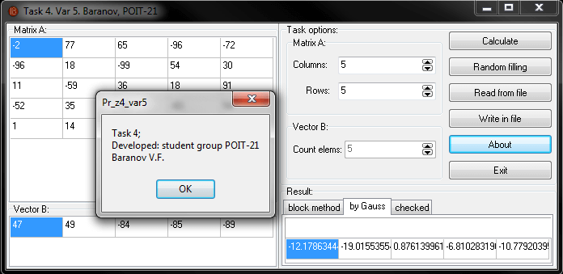

# General engineering practice Pascal/Delphi
[&lt; back](../)  
*Read this in other languages:* **[English](README.en.md)**, *[Русский](README.md)*.  
Sources Pascal involve launch of IDE Borland Pascal 7.1.  
Sources Delphi-projects involve launch of IDE Borland Delphi 7.  
The health of sources in other IDE has not been verified.

## Tasks:
1. Pascal. Find natural numbers from a range between n and k, the number of divisors which is the product of two primes;
2. Pascal. Find the arrangement of the circle of RADIUS R centered at the point (x0, y0) and point a with coordinates (x1, y1). The original data is read from a text file input.txt. The results graphically displayed on the screen;
3. Delphi. Develop an application for the implementation of the matrix following operations: addition, subtraction, multiplication of matrices, matrix multiplication in the number of rows of the matrix method of sorting line selection, transpose, find the inverse matrix calculation of the determinant of the matrix;
4. Delphi. Develop an application for solving the linear matrix method and Gauss.

## Demo screenshots:

