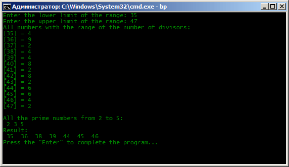
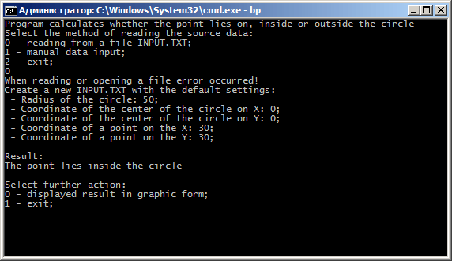
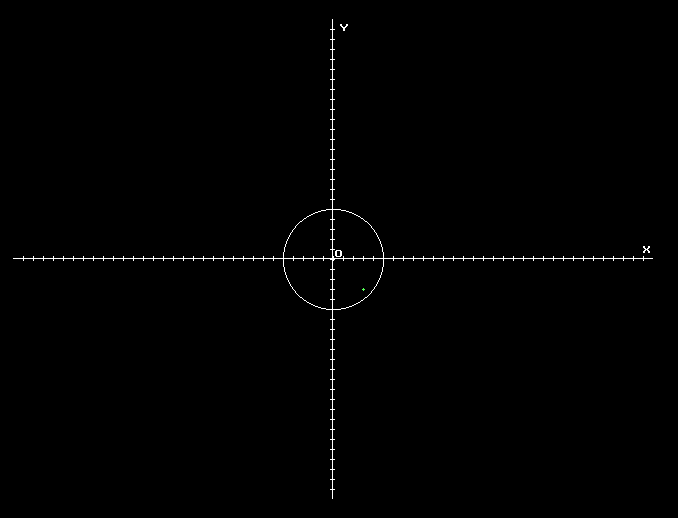
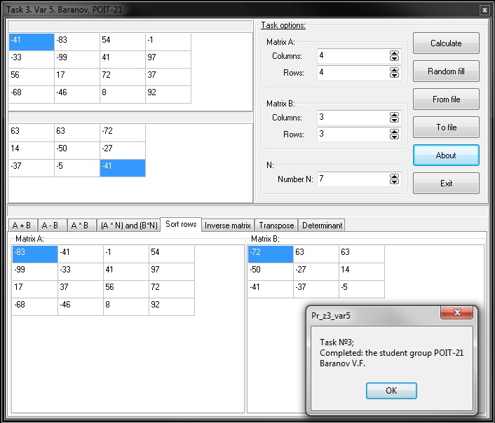
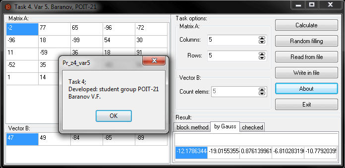

# Учебная общеинженерная практика Pascal/Delphi
[&lt; назад](../)  
*Прочтите это на другом языке:* *[English](README.en.md)*, **[Русский](README.md)**.  
Исходники языка Pascal предполагают запуск в IDE Borland Pascal 7.1.  
Исходники Delphi-проектов предполагают запуск в Borland Delphi 7.  
Работоспособность исходников в других IDE не проверялась.

## Задания:
1. Pascal. Найти натуральные числа из диапазона от n до k, количество делителей у которых является произведением двух простых чисел;
2. Pascal. Найти взаимное расположение окружности радиуса R с центром в точке (x0, y0) и точки А с координатами (x1, y1). Исходные данные считываются из текстового файла input.txt. Результаты в графическом виде отображаются на экране;
3. Delphi. Разработать приложение для осуществления над матрицами следующих операций: сложение, вычитание, умножение матриц, умножение матрицы на число, сортировка строк матрицы методом линейного выбора, транспонирование, нахождение обратной матрицы, подсчёт определителя матрицы;
4. Delphi. Разработать приложение для решения СЛАУ матричным методом и методом Гаусса.

## Демонстрационные скриншоты:

