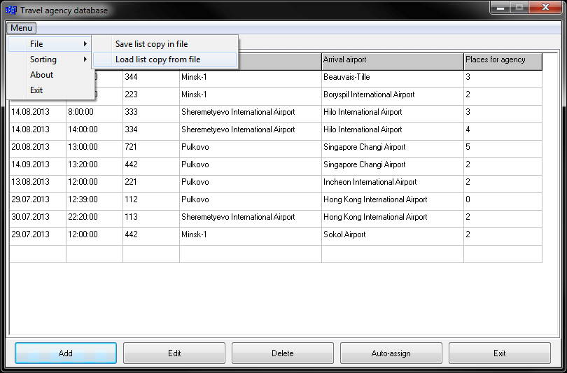
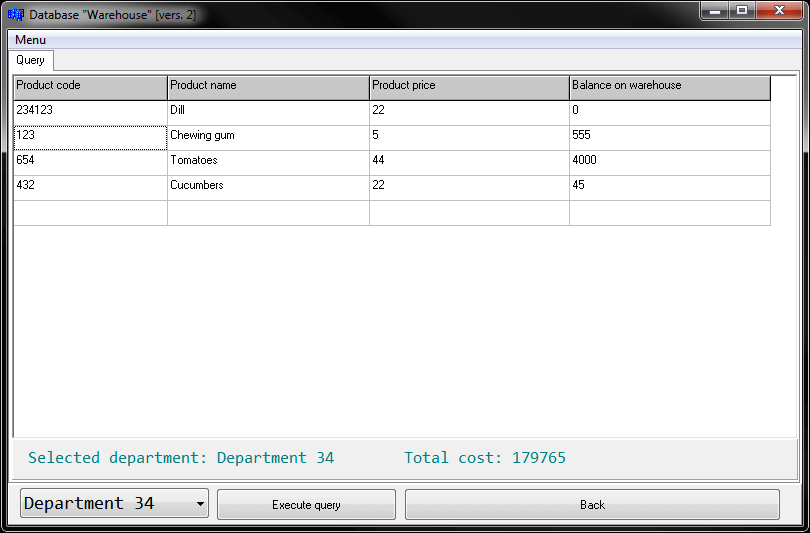

# Course project
[&lt; back](../)  
*Read this in other languages:* **[English](README.en.md)**, *[Русский](README.md)*.  
Project theme: *programming technology with dynamic lists*.  
Sources projects involve launch of IDE Borland C++ Builder 6.  
The health of sources in other IDE has not been verified.

## Tasks:
### My project (with explanatory note) (*Travel agency*):
* You should consider the following theoretical questions: structure, files, lists. For lists, consider their views, create, view, modify (insert, delete, add) and work with them. Develop a program in C++ for the proposed task.
* Exist two dynamic list:  
First – on available flights travel agent with fields: date; hour; flight number; airport of departure; destination airport; the number of free seats for travel agencies.  
The second list describes clients that bought the "package holidays" with the following fields: the name; surname; date of departure; place of rest; number of participants; a pointer to a flight that is NULL, if the client not assigned to the flight.  
To develop a function, which should assign to each client the desired flight number, given the date of dispatch and the place of rest.  
For each flight from the list of flights with a seating capacity greater than 0, assign has not yet awarded the trip as long as there are no more free places.  
The appointment of the flight for the client - this means to assign field of the client "pointer flight" the address of the site which describes the flight.  
The process ends when the no more customers without flight or flights with free yet places.  
The program should contain the list functions (create list, view, changes, write list in file, restore the list from a file), destination flights function, which takes two arguments as above described list). Use a linked list with a pointer to the beginning of the list.  
*Refinements*:  
  * Number of participants - the number of people traveling to the same place of rest and at the same time.  
  * Arrival airport and resting place may not be the same.

### Remaking project for another variant (*Warehouse 1*):
* You should consider the following theoretical questions: structure, files, lists. For lists, consider their views, create, view, modify (insert, delete, add) and work with them. Develop a program in C++ for the proposed task.
* The warehouse is divided into sectors, which store products belonging to a particular department.  
Product information is stored in two dynamic lists.  
First list contains: product code (15 letters); department name to which he belongs; product price.  
Second list contains: product code (15 letters); warehouse code (number); balances in warehouse (one product can be in several warehouses).  
Need to develop a function, which has arguments department number, and returns the number of products of the department, which are the remains of (total) more than 100 pieces and minimum balances in each stock more than 10 pieces.  
The program should contain the list functions (create list, view, changes, write list in file, restore the list from a file), function that implements the proposed action. Use the doubly linked list with a pointer to the beginning of the list.

### Other remaking project for another variant (*Warehouse 2*):
* You should consider the following theoretical questions: structure, files, lists. For lists, consider their views, create, view, modify (insert, delete, add) and work with them. Develop a program in C++ for the proposed task.
* The warehouse is divided into sectors, which store products belonging to a particular department.  
Product information is stored in two dynamic lists.  
First list contains: product code (15 letters); department name to which he belongs; product price.  
Second list contains: product code (15 letters); balances (balances in warehouse).  
Need to develop a function, which has arguments department number and two lists and displays on the screen all the products that belong to the department, and their overall cost.  
The program should contain the list functions (create list, view, changes, write list in file, restore the list from a file), function that implements the proposed action. Use a linked list with a pointer to the end of the list.

## Demo screenshots:

