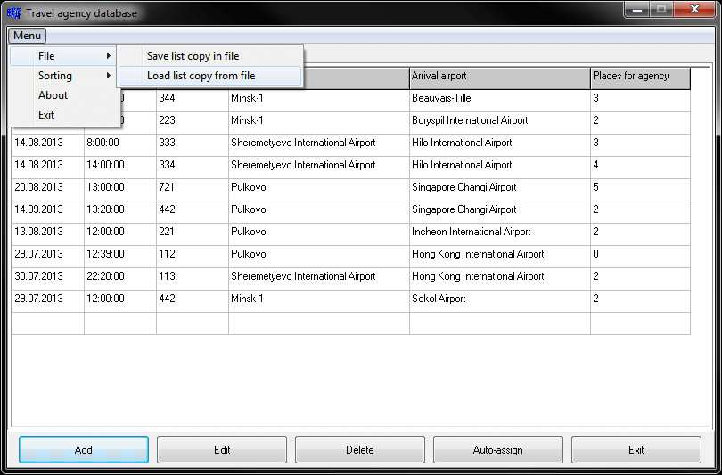
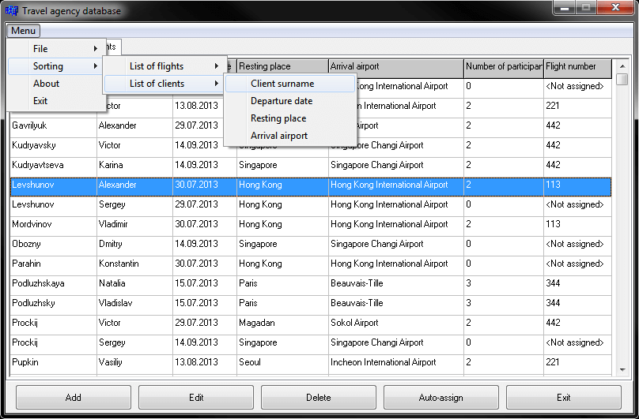
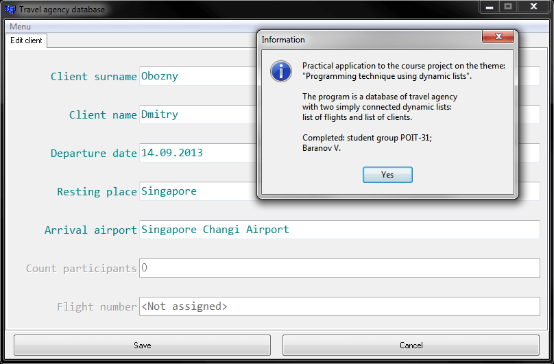
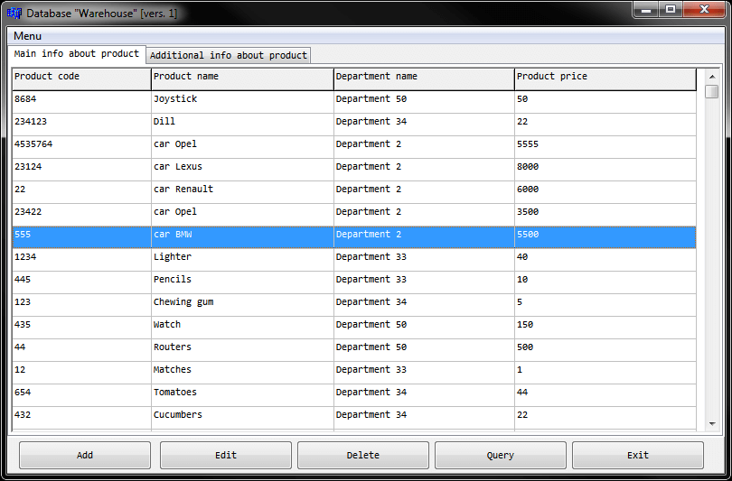
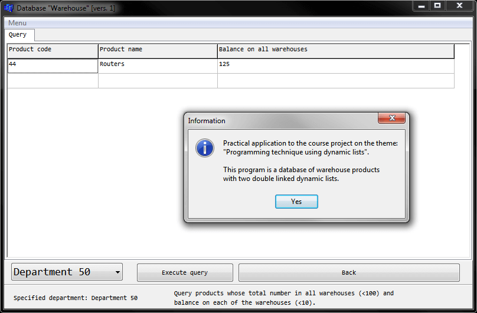
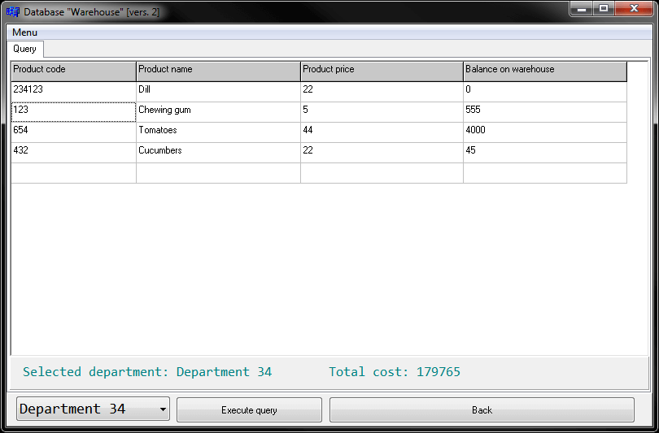

# Курсовой проект
[&lt; назад](../)  
*Прочтите это на другом языке:* *[English](README.en.md)*, **[Русский](README.md)**.  
Тема проекта: *Технология программирования с помощью динамических списков*.  
Исходники проектов предполагают запуск в IDE Borland C++ Builder 6.  
Работоспособность исходников в других IDE не проверялась.

## Задания:
### Мой проект (с пояснительной запиской) (*Travel agency*):
* Должны быть рассмотрены следующие теоретические вопросы: структуры, файлы, списки. Для списков рассмотреть их виды, создание, просмотр, изменение (вставка, удаление, добавление) и работу с ними. Разработать программу на С++ для предлагаемой задачи.
* Имеются два динамических списка:  
Первый – об имеющихся полетах турагенства со следующими полями: дата; час; номер рейса; аэропорт вылета; аэропорт прилета; количество свободных мест для турагенства.  
Второй список описывает клиентов, которые купили "пакет каникул" со следующими полями: имя; фамилия; дата вылета; место отдыха; количество участников; указатель полета, который равен NULL, если клиенту не еще был назначен рейс.  
Разработать функцию, которая должна назначить каждому клиенту нужный номер рейса, учитывая дату отправки и место отдыха.  
Для каждого рейса из списка рейсов, с количеством мест большим 0, назначать еще не присужденные поездки до тех пор, пока больше нет свободных мест.  
Назначение полета для клиента это значит назначить полю клиента «указатель полета»  адрес узла, который описывает полет.  
Процесс завершается, когда больше не осталось клиентов без полета или полетов со свободными еще местами.  
Программа должна содержать функции работы со списками (создания списка, просмотра, изменения, запись списка в файл, восстановление списка из файла), функцию назначения рейсов, которая в качестве аргументов получает два выше описанные списка). Использовать односвязный список с указателем на начало списка.  
*Уточнения*:  
  * Количество участников - это число людей, выезжающих в одно и тоже место отдыха и в одно и тоже время.  
  * Аэропорт прилета и место отдыха могут не совпадать.

### Переделка моего проекта под другой вариант (*Warehouse 1*):
* Должны быть рассмотрены следующие теоретические вопросы: структуры, файлы, списки. Для списков рассмотреть их виды, создание, просмотр, изменение (вставка, удаление, добавление) и работу с ними. Разработать программу на С++ для предлагаемой задачи.
* Склад разделен на сектора, в которых хранится товар, принадлежащий определенному отделу.  
Информация о товарах хранится в двух динамических списках.  
Первый список содержит: код продукта (15 букв); имя отдела, которому он принадлежит; цена продукта.  
Второй список содержит: код продукта (15 букв); код склада (численный); и остатки на складе (один продукт может находиться в нескольких складах).  
Необходимо разработать функцию, которая в качестве аргументов имеет номер отдела и два списка, и возвращает количество продуктов указанного отдела, которые имеют остатки (суммарные) более 100 штук и минимальные остатки в каждом складе более 10 штук.  
Программа должна содержать функции работы со списками (создания списков, их просмотров, их изменений, запись списка в файл, восстановление списка из файла), функцию, реализующую предлагаемые действия. Использовать двусвязный список с указателем на начало списка.

### Ещё одна переделка моего проекта под другой вариант (*Warehouse 2*):
* Должны быть рассмотрены следующие теоретические вопросы: структуры, файлы, списки. Для списков рассмотреть их виды, создание, просмотр, изменение (вставка, удаление, добавление) и работу с ними. Разработать программу на С++ для предлагаемой задачи.
* Склад разделен на сектора, в которых хранится товар, принадлежащий определенному отделу.  
Информация о товарах хранится в двух динамических списках.  
Первый список содержит: код продукта (15 букв); имя отдела, которому он принадлежит; цена продукта.  
Второй список содержит: код продукта (15 букв); остаток (остаточное количество на складе).  
Необходимо разработать функцию, которая в качестве аргументов имеет номер отдела и два списка и выдаст на экране все продукты, которые относятся к указанному отделу, и их общую стоимость.  
Программа должна содержать функции работы со списками (создания списков, их просмотров, их изменений, запись списка в файл, восстановление списка из файла), функцию, реализующую предлагаемые действия. Использовать односвязный список с указателем на конец списка.

## Демонстрационные скриншоты:

