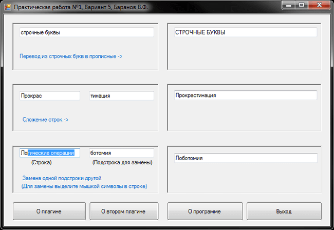
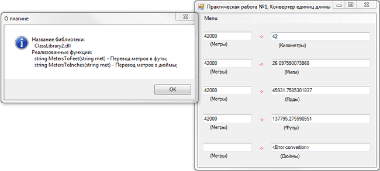
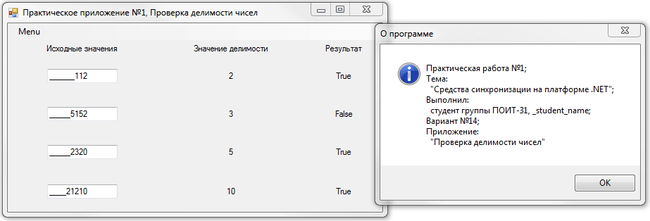

# C# - Threads, WCF, .Net Remoting.
[&lt; back](../)  
*Read this in other languages:* **[English](README.en.md)**, *[Русский](README.md)*.  
Discipline: *Operating systems and system programming*.  
Examples of practical applications run in the IDE Visual Studio Express 2013 for Windows Desktop.  
The efficiency of the sources in other IDE has not been tested.

## Theoretical task:
* General system data types in .NET. Dimensional and reference data types.

## Practical tasks:
* 1.**Synchronization tools on the .NET platform**.  
Develop an application that is running in the following algorithm: two parallel threads cyclically perform the call of plug-ins from dll libraries. Each thread uses its own plugin. The results of the work, each thread places into a common queue of finite length. A third thread takes from the queue the results of the plug-ins and displays them on the screen. Scheme of interaction of flows is shown in picture:  
  
Queue must be implemented using two synchronization objects Semaphore (for threads 1 and 2, and thread 3). When filling the queue threads 1 and 2 shall be suspended standby function. In the absence of results in the queue thread 3 must also be suspended waiting function. Section of code puts results in a queue should be executed using the synchronization object Monitor.
Threads must be completed correctly when the application is complete. To do this, the program is necessary to provide a synchronization object Event, changes its state when the application completion. In the application, it shall be possible to only a single run through using Mutex synchronization object. If you run a second copy of the program must receive an alert.
* 2.1. **Technology of remote call objects .NET Remoting**.  
Develop an application in IDE Visual C#, as according to the variant task. Each plug-in must be in a separate DLL and must contain, in addition to the function implementation of the algorithm, function, returns the purpose of the plugin. Implement task using .NET Remoting
* 2.2. **Technology Web-services**.  
Develop an application in IDE Visual C#, as according to the variant task. Each plug-in must be in a separate DLL and must contain, in addition to the function implementation of the algorithm, function, returns the purpose of the plugin. Implement the task using the technology of Web-services.

## Variants for practical tasks (for my and remaking works for other variants):
<table><tr><th>Variant</th><th>Task</th><th>Part 1</th><th>Part 2.1</th><th>Part 2.2</th></tr><tr><td align="center">5</td><td><strong>Application</strong>: String editor. <strong>Operations</strong>: addition, replacing one another substring, replacing the lowercase letters in uppercase (including for Russian letters).</td><td align="center">X</td><td align="center">X</td><td align="center"></td></tr><tr><td align="center">6</td><td><strong>Application</strong>: String editor. <strong>Operations</strong>: "coup" text, translated in transliteration, replacing the uppercase letters lowercase (including for Russian letters).</td><td align="center">X</td><td align="center"></td><td align="center">X</td></tr><tr><td align="center">8</td><td><strong>Application</strong>: Octal calculator. <strong>Operations</strong>: addition, subtraction, multiplication, modulo.</td><td align="center">X</td><td align="center"></td><td align="center">X</td></tr><tr><td align="center">13</td><td><strong>Application</strong>: Converter of units of length. <strong>The translation length from meters to</strong>: kilometers, miles, yards, ft, inches.</td><td align="center">X</td><td align="center">X</td><td align="center"></td></tr><tr><td align="center">14</td><td><strong>Application</strong>: Checking the divisibility of numbers. <strong>Checking the divisibility of integer numbers on</strong>: 2, 3, 5, 10.</td><td align="center">X</td><td align="center"></td><td align="center">X</td></tr></table>

## Demo screenshots:

