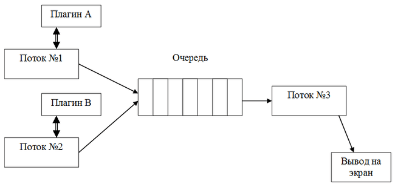
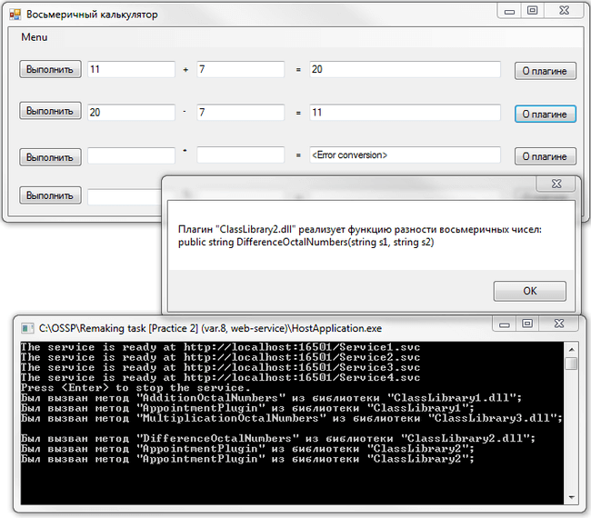

# C# - Потоки, WCF, .Net Remoting.
[&lt; назад](../)  
*Прочтите это на другом языке:* *[English](README.en.md)*, **[Русский](README.md)**.  
Дисциплина: *Операционные системы и системное программирование*.  
Примеры практических приложений предполагает запуск в Visual Studio Express 2013 для Windows Desktop.  
Работоспособность исходников в других IDE не проверялась.

## Теоретическое задание:
* Общая система типов данных в среде .NET. Размерные и ссылочные типы данных.

## Практические задания:
* 1.**Средства синхронизации на платформе .NET**.  
Разработать приложение, в котором выполняется следующий алгоритм: два параллельных потока циклически выполняют вызов плагинов из библиотек dll (согласно варианта). Каждый поток использует свой плагин. Результаты работы каждый поток помещает в общую очередь конечной длины. Третий поток забирает из очереди результаты работы плагинов и отображает их на экране в произвольной форме. Схема взаимодействия потоков приведена на рисунке:  
  
Очередь должна быть реализована с использованием двух объектов синхронизации Семафор (для потоков 1 и 2, и для потока 3). При заполнении очереди потоки 1 и 2 должны приостанавливаться функцией ожидания. При отсутствии результатов в очереди поток 3 также должен приостанавливаться функцией ожидания. Участок кода помещения результатов в очередь должен быть оформлен с использованием объекта синхронизации Монитор.
Потоки должны корректно завершаться при завершении приложения. Для этого в программе нужно предусмотреть объект синхронизации Событие, меняющий свое состояние при завершении приложения. В приложении должна быть предусмотрена возможность только однократного запуска через использование объекта синхронизации Мьютекс. В случае запуска второй копии программы должно выводиться соответствующее предупреждение.
* 2.1. **Технология удаленного вызова объектов .NET Remoting**.  
Разработать приложение в среде Visual C#, выполняющее функции согласно варианта задания. Каждый плагин должен быть оформлен в виде отдельной однотипной библиотеки DLL и должен содержать помимо функции реализации алгоритма, функцию, возвращающую назначение плагина. Реализовать задание с использованием .NET Remoting
* 2.2. **Технология Web-служб**.  
Разработать приложение в среде Visual C#, выполняющее функции согласно варианта задания. Каждый плагин должен быть оформлен в виде отдельной однотипной библиотеки DLL и должен содержать помимо функции реализации алгоритма, функцию, возвращающую назначение плагина. 
Реализовать задание с использованием технологии Web-служб.

## Варианты практических заданий (для моей и переделанных работ для других вариантов):
<table><tr><th>Вариант</th><th>Задание</th><th>Часть 1</th><th>Часть 2.1</th><th>Часть 2.2</th></tr><tr><td align="center">5</td><td><strong>Приложение</strong>: Редактор строки. <strong>Операции</strong>: сложение, замена одной подстроки другой, замена строчных букв прописными (в т.ч. для русских букв).</td><td align="center">X</td><td align="center">X</td><td align="center"></td></tr><tr><td align="center">6</td><td><strong>Приложение</strong>: Редактор строки. <strong>Операции</strong>: «переворот» текста, перевод в транслитерацию, замена прописных букв строчными (в т.ч. для русских букв).</td><td align="center">X</td><td align="center"></td><td align="center">X</td></tr><tr><td align="center">8</td><td><strong>Приложение</strong>: Восьмеричный калькулятор. <strong>Операции</strong>: Сложение, вычитание, умножение, остаток от деления.</td><td align="center">X</td><td align="center"></td><td align="center">X</td></tr><tr><td align="center">13</td><td><strong>Приложение</strong>: Конвертер единиц длины. <strong>Перевод длины из метров в</strong>: километры, мили, ярды, футы, дюймы.</td><td align="center">X</td><td align="center">X</td><td align="center"></td></tr><tr><td align="center">14</td><td><strong>Приложение</strong>: Проверка делимости чисел. <strong>Проверка делимости целых чисел на</strong>: 2, 3, 5, 10.</td><td align="center">X</td><td align="center"></td><td align="center">X</td></tr></table>

## Демонстрационные скриншоты:

