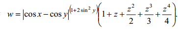
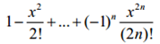
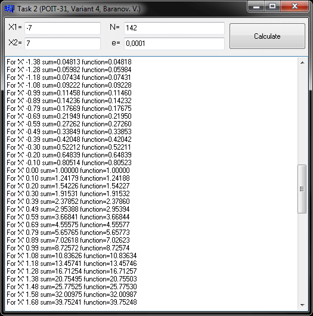
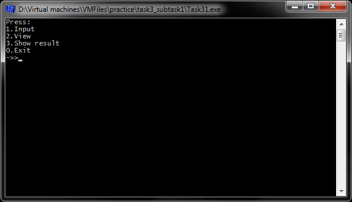
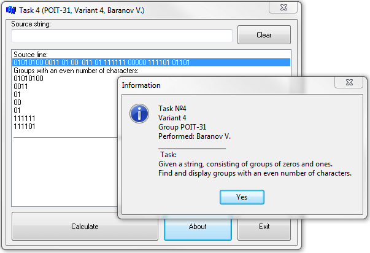
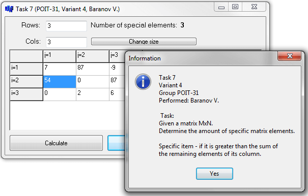
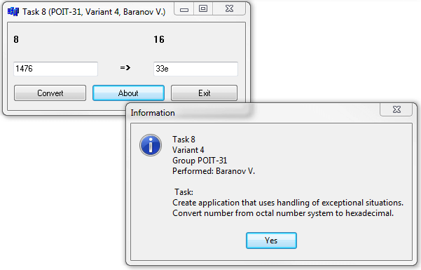

# General engineering practice C++ Builder 6
[&lt; back](../)  
*Read this in other languages:* **[English](README.en.md)**, *[Русский](README.md)*.  
Sources projects involve launch of IDE IDE Borland C++ Builder 6.  
The health of sources in other IDE has not been verified.

## Tasks:
* 1. *Programming linear algorithms*.  
Calculate:  
  
When **x** = 0.4x10^4; **y** = -0.875; **z** = -0.475x10^-3 **w** = 1.9873.
* 2. *Programming cyclic algorithms*.  
Write and debug a program that displays a table of function values **S(x)** for **х**, changing in interval from **X1** to **X2** with step **h**:  
<table><thead><tr><th>a</th><th>b</th><th>S(x)</th><th>n</th><th>Y(x)</th></tr></thead><tbody><tr><td>0.1</td><td>1</td><td></td><td>80</td><td>cos x</td></tr></tbody></table>  

* 3. *String handling*.
  * 3.1 *Processing lines: character-wise*.  
  Task: After the last letter of each word to insert a point. The extra characters (from 81st) to delete.  
  * 3.1 *Processing lines: using pointers and functions of library &lt;cstring&gt;*.  
  Task: In each pair of characters 'AB' insert '\*' symbol. Count how many times in the line the character 'I' is before last '2'.
* 4. *Programming using strings*.  
Task: Given a string, consisting of groups of 1 and 0. Find and display group with an even number of characters. Initial data entered using TEdit component in TListBox component. Scalar results are displayed via TLabel component. Input linefinish by pressing Enter.
* 5. *Programming using structures*.  
Task: Write a program using the data type "struct". In the program to provide for the preservation of the input data to a file and be able to read from a previously saved file. In the bus station to store the schedule of buses. For each bus trip is listed with its number, the type of bus, destination, time of departure and arrival. Display information about routes that can are for arrival at destination before a specified time.
* 6. *Programming with files*.  
Task: Select a task from the task 5. Provide recording raw data to a file, and the ability to read from it. The result on the screen and to a file.
* 7. *Programming using pointers*. *Dynamic memory allocation*.  
Task: Given a matrix MxN. Determine the amount of specific matrix elements. Specific item - if it is greater than the sum of the remaining elements of its column.
* 8. *Programming using exception-processing*.  
Task: Create application that uses handling of exceptional situations. Convert number from octal number system to hexadecimal.

## Demo screenshots:

