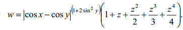
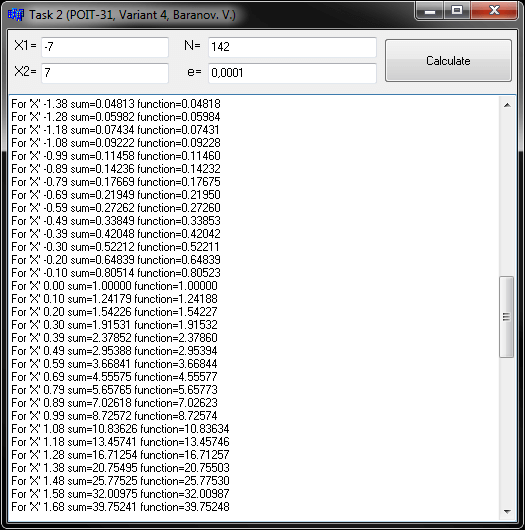
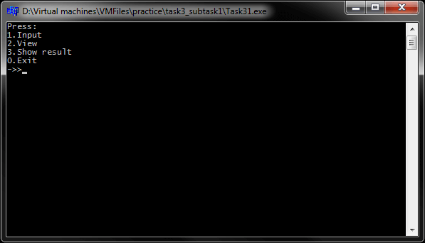
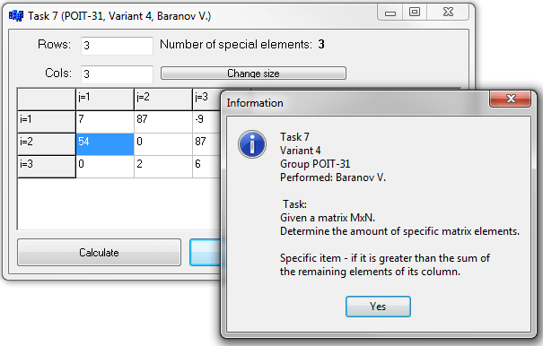

# Учебная общеинженерная практика C++ Builder 6
[&lt; назад](../)  
*Прочтите это на другом языке:* *[English](README.en.md)*, **[Русский](README.md)**.  
Исходники проектов предполагают запуск в IDE Borland C++ Builder 6.  
Работоспособность исходников в других IDE не проверялась.

## Задания:
* 1. *Программирование линейных алгоритмов*.  
Вычислить:  
  
При **x** = 0.4x10^4; **y** = -0.875; **z** = -0.475x10^-3 **w** = 1.9873.
* 2. *Программирование циклических алгоритмов*.  
Hаписать и отладить программу, которая выводит таблицу значений функции **S(x)** для **х**, изменяющегося в интервале от **X1** до **X2** c шагом **h**:  
<table><thead><tr><th>a</th><th>b</th><th>S(x)</th><th>n</th><th>Y(x)</th></tr></thead><tbody><tr><td>0.1</td><td>1</td><td></td><td>80</td><td>cos x</td></tr></tbody></table>  

* 3. *Обработка строк*.
  * 3.1 *Посимвольная обработка строк*.  
  Задача: После последней буквы каждого слова вставить точку. Лишние символы (с 81-ого) отбросить.  
  * 3.1 *Обработка строк с помощью указателей и ф-ций из библиотеки &lt;cstring&gt;*.  
  Задача: В каждую пару символов 'AB' вставить символ '\*'. Подсчитать, сколько раз в строке символ 'I' стоит перед '2'.
* 4. *Программирование с использованием строк*.  
Задача: Дана строка, состоящая из групп нулей и единиц. Найти и вывести на экран группы с чётным количеством символов. Исходные данные вводить с помощью компонента TEdit в компонент TListBox. Скалярный результат выводить с помощью компонента TLabel. Ввод строки заканчивать нажатием Enter.
* 5. *Программирование с использованием структур*.  
Задача: Написать программу с использованием данных типа "struct". В программе предусмотреть сохранение вводимых данных в файл и возможность чтения из ранее сохранённого файла. В справочной автовокзала храниться расписание движения автобусов. Для каждого рейса указаны его номер, тип автобуса, пункт назначения, время отправления и прибытия. Вывести информацию о рейсах, которыми можно воспользоваться для прибытия в пункт назначения раньше заданного времени.
* 6. *Программирование с использованием файлов*.  
Задача: Написать программу с использованием данных типа "struct". Выбрать вариант задания из задания 5. Предусмотреть запись исходных данных в файл и возможность чтения из него. Результат вывести на экран и в файл.
* 7. *Программирование с использованием указателей*. *Динамическое распределение памяти*.  
Задача: Дана матрица MxN. Определить количество особых элементов матрицы, считая элемент особым, если он больше суммы остальных элементов своего столбца.
* 8. *Программирование с использованием механизма обработки исключительных ситуаций*.  
Задача: Создать приложение, использующее механизм обработки исключительных ситуаций. Перевод числа из восьмеричной системы счисления в шестнадцатеричную.

## Демонстрационные скриншоты:

