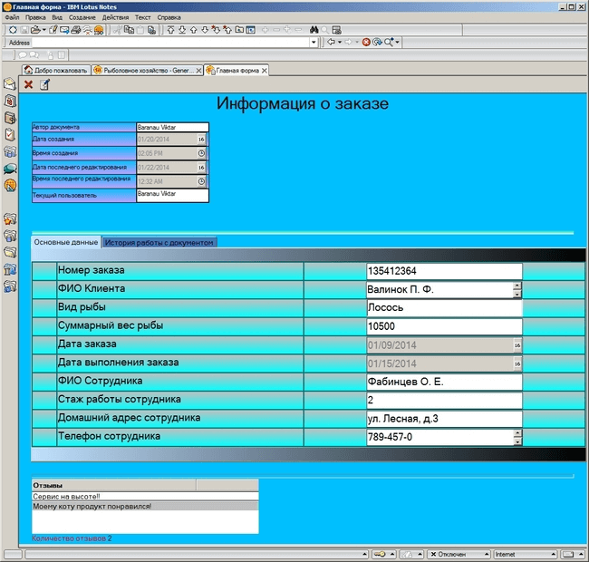
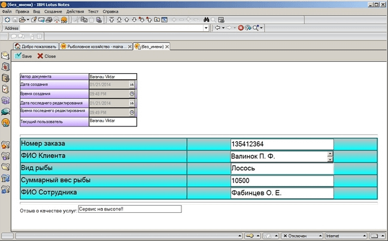
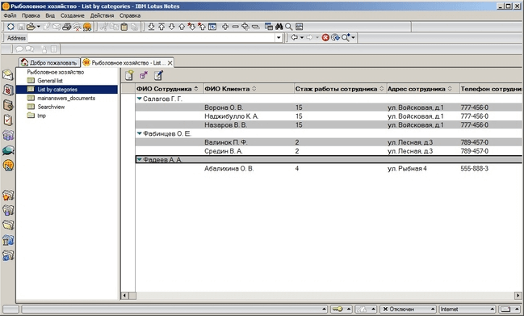

# Lotus Notes
[&lt; back](../)  
*Read this in other languages:* **[English](README.en.md)**, *[Русский](README.md)*.  
Discipline: *Lotus Domino/Notes*.  
Database assume run in Lotus Notes.

## Task:
**Domain**: Fisheries.  
**Fields**: order number, client fullname, type of fish, total weight fish, order date, order execution date, employee fullname, work experience, home address, phone.
* 1. Create a learning database form in accordance with a predetermined application domain. The form should contain the title bar with the name of the form and the data area. The data area must be a table with two tabs: Basic data and work history with the document. Create the required fields for data entry. Field type must match the type of input data, so may not use the text fields for numeric or date data. Fields with information is required you must mark "star" to be displayed only in the edit mode. Add action buttons: Close (always visible), Edit (visible only in read-only mode), Save (visible only in edit mode).
* 2. Create in learning database two views: a general list and a list by category. Views should display the key fields of the documents and have the ability to sort columns. Add to each view action button: New document, Edit, Delete.
* 3. Create in learning database tree of choice for their views, place it on the page. Create a frameset, containing a database name, a page with a list of views (wood) and the selected view. Add the image in general resources and use it in the design of the DB.
* 4. Write formulas for previously created in learning database action-buttons on the form and views (delete in views to organize 2 ways). Make show name of the database in a frameset dynamic, based on the header specified in the properties of the DB. In form in the header pane, add calculated fields display when and who created the document, as well as who and when it changed. Write formulas for calculated fields on the second tab of the table.
* 5. Write LotusScript scan fill in compulsory fields on a form with the message and transfer focus on blank or incorrectly filled field. You must use event handlers, 'Exiting' a field(at least two fields), 'QuerySave' form(also handled field 2!). To display messages you need to use like the MessageBox function and the InputBox function.
* 6. Drag the title bar to the form to the subform. Create a form with a comment field similar in design the main form, and use the same subform in the header area. This form must be used to create documents-answers for basic documents. This subform will inherit the part of the fixed fields of the main document and display them without editing capabilities.
* 7. Create another view to show the main documents together with documents in a hierarchical responses view. View should include a button to create responses. Create a hidden view to display only documents-answers and embed it in the form of a main document so, to display the list of documents only for the currently opened document. Embedded view should hide when you create new documents.
* 8. Create agent counts the number of documents-replies and writes this information into the main documents. A field number must be visible in the view general list of the main documents, also on the form, but not edit this field. Start the agent must be done through the button-action on the view with general list. In the end, the agent is obliged to update all views in the database.
* 9. To organize the search data in the database using the formula language and the LotusScript language (using agents, MessageBox and InputBox).

## Demo screenshots:

## Agent code and event handlers:
<ul>
	<li>Task 5 - check the required fields on the form:</li>
	<ul>
		<li>
			Querysave:
			<pre><code>
Sub Querysave(Source As Notesuidocument, Continue As Variant)
  If Len(Source.FieldGetText("client_name")) = 0 Then
    Messagebox "ФИО Клиента не заполнено"
    source.GotoField "client_name"
    continue = False
    Exit Sub
  End If
  If Len(Source.FieldGetText("kind_fish")) = 0 Then
    Messagebox "Вид рыбы не заполнен"
    source.GotoField "kind_fish"
    continue = False
    Exit Sub
  End If
  If Len(Source.FieldGetText("employee_name")) = 0 Then
    Messagebox "ФИО Сотрудника не заполнено"
    source.GotoField "employee_name"
    continue = False
    Exit Sub
  End If
End Sub
			</code></pre>
		</li>
		<li>
			Exiting(1):
			<pre><code>
Sub Exiting(Source As Field)
  Dim ws As New NotesUIWorkspace
  Dim uidoc As NotesUIDocument
  Set uidoc = ws.CurrentDocument
  fl=1
  Do While fl=1
    
    If((Trim(uidoc.FieldGetText("order_number"))<>"") 
      And (Isnumeric(uidoc.FieldGetText("order_number")))) Then
      fl=0
    Else
      retCode =Inputbox$ ("Введите номер заказа!",,100,100,30 )
      If Isnumeric(retCode) Then
        Call uidoc.FieldSetText( "order_number" , retCode) 
        fl=0
      End If  
    End If 
    
  Loop  
End Sub
			</code></pre>
		</li>
		<li>
			Exiting(2):  
			<pre><code>
Sub Exiting(Source As Field)
  Dim ws1 As New NotesUIWorkspace
  Dim uidoc1 As NotesUIDocument
  Set uidoc1 = ws1.CurrentDocument
  fk=1
  Do While fk=1
    If Trim(uidoc1.FieldGetText("total_weight_fish")) <> "" Then
      fk=0
    Else
      retCode =Inputbox$ ("Введите вес рыб (грамм)",,100,100,30 )
      If Isnumeric(retCode) Then
        fk=0
        Call uidoc1.FieldSetText( "total_weight_fish" , retCode) 
        
      End If  
    End If 
    
  Loop  
End Sub
			</code></pre>
		</li>
	</ul>
	<li>Task 8 - agent calculate counts the number of documents responses and recording this information in the main documents:</li>
	<ul>
		<li>
			Initialize:
			<pre><code>
	Sub Initialize
	  Dim session As New NotesSession
	  Dim ws As New NotesUIWorkspace
	  Dim db As NotesDatabase
	  Dim doc As NotesDocument 
	  Dim view As NotesView
	  Dim Views As Variant
	  Dim docv As NotesDocument 
	  Dim col As NotesDocumentCollection 
	  Dim RespCount As Integer
	  
	  Set db = session.CurrentDatabase
	  Set col=db.AllDocuments
	  Set view= db.GetView( "General list" )
	  Set docv = view.GetFirstDocument
	  
	  Do While Not docv Is Nothing 
	    If Not docv.IsResponse Then
	      RespCount=0 
	      Set doc = col.GetFirstDocument 
	      Do While Not doc Is Nothing
	        If doc.IsResponse And docv.UniversalID=doc.ParentDocumentUNID  Then 
	          RespCount=RespCount+1   
	        End If
	        Set doc=col.GetNextDocument(doc)
	      Loop
	    End If
	    Call docv.ReplaceItemValue("RespCount",Cstr(RespCount))
	    Call docv.Save(True,False)
	    Set docv = view.GetNextDocument( docv )
	  Loop  
	  
	  views=db.Views
	  Forall v In views
	    Call v.Refresh  
	  End Forall
	End Sub
			</code></pre>
		</li>
	</ul>
	<li>Task 9 – agents and event handlers of search in DB:</li>
	<ul>
		<li>
			Initialize(1):
			<pre><code>
Sub Initialize
  Dim ws As New NotesUIWorkspace
  Dim viewb As NotesView
  Dim viewf As NotesUIView
  Dim doc As NotesDocument
  retCode =Inputbox$ ("Введите ФИО Клиента",,"Средин В. А.",100,30 )
  If Not Isnull(retCode) Then
          'переход от клиента к серверу   
    Set viewf =ws.CurrentView
    Set viewb=viewf.VIEW
    Set doc = viewb.GetDocumentByKey(retCode, False)    
    viewf.SelectDocument(doc) 
    ws.EditDocument(True)
    'копирую найденный документ в папку
    doc.PutInFolder("tmp")    
  'viewb.Refresh  
    'viewf.View.Refresh 
  End If    
End Sub
			</code></pre>
		</li>
		<li>
			Initialize(2):
			<pre><code>
Sub Initialize
  Dim ws As New NotesUIWorkspace
  Dim viewb As NotesView
  Dim viewf As NotesUIView
  Dim doc As NotesDocument
  Dim i,kolnum As Integer
  Dim column As NotesViewColumn
  kolnum =Cint(Inputbox$ ("Введите номер столбца ",,"1",100,30 ))
  retCode =Inputbox$ ("Введите ФИО Клиента",,"Средин В. А.",100,30 )
  If Not Isnull(retCode) Then
    Set viewf =ws.CurrentView
    Set viewb=viewf.VIEW
    For i=0 To viewb.ColumnCount-1
      Set column = viewb.Columns(i) 
      column.IsSorted=False
    Next i
    Set column = viewb.Columns( kolnum )  
    column.IsSorted=True
    Call ws.ViewRebuild
    Set doc = viewb.GetDocumentByKey(retCode, False)    
    viewf.SelectDocument(doc) 
    ws.EditDocument(True)
  End If    
End Sub
			</code></pre>
		</li>
		<li>
			Event handler(1):
			<pre><code>
ch:=@DbLookup("":"NoCache";"":"";"Search_view";"Средин В. А.";"client_name";[PartialMatch]);
t:=@Text(ch);
@Prompt([Ok];"Значение первого столбца";t)
			</code></pre>
		</li>
		<li>
			Event handler(2):
			<pre><code>
ch:=@DbLookup("":"NoCache";"":"";"Search_view";
  "Средин В.А."; "client_name";[PartialMatch]:[ReturnDocumentUniqueID]);
@Command([OpenDocument];1;ch)
			</code></pre>
		</li>
	</ul>
</ul>
