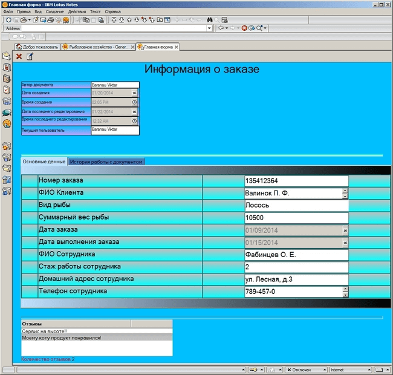

# Lotus Notes
[&lt; назад](../)  
*Прочтите это на другом языке:* *[English](README.en.md)*, **[Русский](README.md)**.  
Дисциплина: *Lotus Domino/Notes*.  
База данных предполагает запуск в Lotus Notes.

## Задания:
**Предметная область**: Рыболовное хозяйство.  
**Поля**: Номер заказа, ФИО клиента, вид рыбы, суммарный вес рыбы, дата заказа, дата выполнения заказа, ФИО сотрудника, стаж работы, домашний адрес, телефон.
* 1. Создайте в учебной базе данных(УБД) форму в соответствии с заданной прикладной областью. Форма должна содержать область заголовка с названием формы и область данных. В области данных должна быть таблица с двумя вкладками: основные данные и история работы с документом. Создайте необходимые поля для ввода данных. Тип полей должен соответствовать типу вводимых данных, так запрещается использовать текстовые поля для числовых данных или даты. Поля с обязательной для заполнения информацией необходимо пометить «звездочкой», которая  должна отображаться лишь в режиме редактирования. Добавьте кнопки-действия: Закрыть (видима всегда), Редактировать (видима только в режиме чтения), Сохранить (видима только в режиме редактирования).
* 2. Создать в УБД два представления: общий список и список по категориям. Представления должны отображать основные поля документов и иметь возможность сортировки столбцов. Добавьте на каждое представление кнопки-действия: Новый документ, Редактировать, Удалить.
* 3. Создайте в УБД дерево выбора для своих представлений, разместить его на странице. Создайте набор фреймов, содержащий название базы данных, страницу со списком представлений(дерево выбора) и выбранное представление. Добавьте изображение в общие ресурсы и используйте его в дизайне БД.
* 4. Напишите формулы для ранее созданных в УБД кнопок-действий на форме и представлениях (удаление в представлениях организовать 2 способами). Сделайте вывод названия базы данных в наборе фреймов динамическим на основе заголовка заданного в свойствах БД. На форму в область заголовка добавьте вычисляемые поля, отображающие кто и когда создал документ, а также кто и когда его изменил. Напишите формулы для вычисляемых полей на второй закладке таблицы.
* 5. Напишите на LotusScript проверку заполнения обязательных полей на форме с выводом сообщения и передачей фокуса ввода на незаполненное или неправильно заполненное поле. Необходимо использовать обработчики событий Exiting поля(как минимум у двух полей), QuerySave формы(также обрабатываются 2 поля!). Для вывода сообщений необходимо использовать, как функцию MessageBox, так и функцию InputBox.
* 6. Перенесите область заголовка с формы в подформу. Создайте форму с полем комментария аналогичную по дизайну основной форме и использующую ту же подформу в области заголовка. Данная форма должны использоваться для создания документов-ответов для основных документов. Эта подчиненная форма должна наследовать часть основных полей основного документа и отображать их без возможности редактирования.
* 7. Создайте еще одно представление для отображения основных документов вместе с документами-ответами в иерархическом виде. Представление должно содержать кнопку для создания документов-ответов. Создайте скрытое представление для отображения только документов-ответов и внедрите его на форму основного документа так, чтобы отображался список документов-ответов только для открытого в данный момент документа. Внедренное представление должно скрываться при создании новых документов.
* 8. Создайте агента, подсчитывающего количество документов-ответов и записывающего эту информацию в основные документы. Поле с количеством ответов должно быть видимо в представлении с общим списком основных документов, а также на форме без возможности редактирования этого поля. Запуск агента должен осуществляться через кнопку-действие на представлении с общим списком. В конце работы агент обязан обновить все представления в базе данных.
* 9. Организовать поиск данных в базе данных, используя язык формул и язык LotusScript (используя программы-агенты, функции MessageBox и InputBox).

## Демонстрационные скриншоты:

## Код агентов и обработчиков событий:
<ul>
	<li>Задание 5 - проверка заполнения обязательных полей на форме:</li>
	<ul>
		<li>
			Querysave:
			<pre><code>
Sub Querysave(Source As Notesuidocument, Continue As Variant)
  If Len(Source.FieldGetText("client_name")) = 0 Then
    Messagebox "ФИО Клиента не заполнено"
    source.GotoField "client_name"
    continue = False
    Exit Sub
  End If
  If Len(Source.FieldGetText("kind_fish")) = 0 Then
    Messagebox "Вид рыбы не заполнен"
    source.GotoField "kind_fish"
    continue = False
    Exit Sub
  End If
  If Len(Source.FieldGetText("employee_name")) = 0 Then
    Messagebox "ФИО Сотрудника не заполнено"
    source.GotoField "employee_name"
    continue = False
    Exit Sub
  End If
End Sub
			</code></pre>
		</li>
		<li>
			Exiting(1):  
			<pre><code>
  Sub Exiting(Source As Field)
  Dim ws As New NotesUIWorkspace
  Dim uidoc As NotesUIDocument
  Set uidoc = ws.CurrentDocument
  fl=1
  Do While fl=1
    
    If((Trim(uidoc.FieldGetText("order_number"))<>"") 
      And (Isnumeric(uidoc.FieldGetText("order_number")))) Then
      fl=0
    Else
      retCode =Inputbox$ ("Введите номер заказа!",,100,100,30 )
      If Isnumeric(retCode) Then
        Call uidoc.FieldSetText( "order_number" , retCode) 
        fl=0
      End If  
    End If 
    
  Loop  
End Sub
			</code></pre>
		</li>
		<li>
			Exiting(2):  
			<pre><code>
Sub Exiting(Source As Field)
  Dim ws1 As New NotesUIWorkspace
  Dim uidoc1 As NotesUIDocument
  Set uidoc1 = ws1.CurrentDocument
  fk=1
  Do While fk=1
    If Trim(uidoc1.FieldGetText("total_weight_fish")) <> "" Then
      fk=0
    Else
      retCode =Inputbox$ ("Введите вес рыб (грамм)",,100,100,30 )
      If Isnumeric(retCode) Then
        fk=0
        Call uidoc1.FieldSetText( "total_weight_fish" , retCode) 
        
      End If  
    End If 
    
  Loop  
End Sub
			</code></pre>
		</li>
	</ul>
	<li>Задание 8 - агент, подсчитывающий количество документов-ответов и записывающий эту информацию в основные документы:</li>
	<ul>
		<li>
			Initialize:
			<pre><code>
Sub Initialize
  Dim session As New NotesSession
  Dim ws As New NotesUIWorkspace
  Dim db As NotesDatabase
  Dim doc As NotesDocument 
  Dim view As NotesView
  Dim Views As Variant
  Dim docv As NotesDocument 
  Dim col As NotesDocumentCollection 
  Dim RespCount As Integer
  
  Set db = session.CurrentDatabase
  Set col=db.AllDocuments
  Set view= db.GetView( "General list" )
  Set docv = view.GetFirstDocument
  
  Do While Not docv Is Nothing 
    If Not docv.IsResponse Then
      RespCount=0 
      Set doc = col.GetFirstDocument 
      Do While Not doc Is Nothing
        If doc.IsResponse And docv.UniversalID=doc.ParentDocumentUNID  Then 
          RespCount=RespCount+1   
        End If
        Set doc=col.GetNextDocument(doc)
      Loop
    End If
    Call docv.ReplaceItemValue("RespCount",Cstr(RespCount))
    Call docv.Save(True,False)
    Set docv = view.GetNextDocument( docv )
  Loop  
  
  views=db.Views
  Forall v In views
    Call v.Refresh  
  End Forall
End Sub
			</code></pre>
		</li>
	</ul>
	<li>Задание 9 – агенты и обработчики событий поиска в БД:</li>
	<ul>
		<li>
			Initialize(1):
			<pre><code>
Sub Initialize
  Dim ws As New NotesUIWorkspace
  Dim viewb As NotesView
  Dim viewf As NotesUIView
  Dim doc As NotesDocument
  retCode =Inputbox$ ("Введите ФИО Клиента",,"Средин В. А.",100,30 )
  If Not Isnull(retCode) Then
          'переход от клиента к серверу   
    Set viewf =ws.CurrentView
    Set viewb=viewf.VIEW
    Set doc = viewb.GetDocumentByKey(retCode, False)    
    viewf.SelectDocument(doc) 
    ws.EditDocument(True)
    'копирую найденный документ в папку
    doc.PutInFolder("tmp")    
  'viewb.Refresh  
    'viewf.View.Refresh 
  End If    
End Sub
			</code></pre>
		</li>
		<li>
			Initialize(2):
			<pre><code>
Sub Initialize
  Dim ws As New NotesUIWorkspace
  Dim viewb As NotesView
  Dim viewf As NotesUIView
  Dim doc As NotesDocument
  Dim i,kolnum As Integer
  Dim column As NotesViewColumn
  kolnum =Cint(Inputbox$ ("Введите номер столбца ",,"1",100,30 ))
  retCode =Inputbox$ ("Введите ФИО Клиента",,"Средин В. А.",100,30 )
  If Not Isnull(retCode) Then
    Set viewf =ws.CurrentView
    Set viewb=viewf.VIEW
    For i=0 To viewb.ColumnCount-1
      Set column = viewb.Columns(i) 
      column.IsSorted=False
    Next i
    Set column = viewb.Columns( kolnum )  
    column.IsSorted=True
    Call ws.ViewRebuild
    Set doc = viewb.GetDocumentByKey(retCode, False)    
    viewf.SelectDocument(doc) 
    ws.EditDocument(True)
  End If    
End Sub
			</code></pre>
		</li>
		<li>
			Обработчик событий(1):
			<pre><code>
ch:=@DbLookup("":"NoCache";"":"";"Search_view";"Средин В. А.";"client_name";[PartialMatch]);
t:=@Text(ch);
@Prompt([Ok];"Значение первого столбца";t)
			</code></pre>
		</li>
		<li>
			Обработчик событий(2):
			<pre><code>
ch:=@DbLookup("":"NoCache";"":"";"Search_view";
  "Средин В.А."; "client_name";[PartialMatch]:[ReturnDocumentUniqueID]);
@Command([OpenDocument];1;ch)
			</code></pre>
		</li>
	</ul>
</ul>
