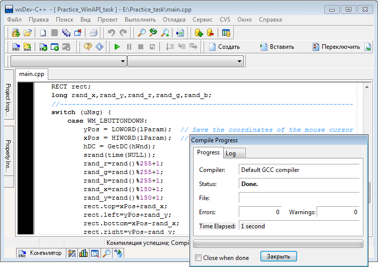

# Basics WinAPI
[&lt; back](../)  
*Read this in other languages:* **[English](README.en.md)**, *[Русский](README.md)*.  
Discipline: *Operating systems and system programming*.  
Example of practical application run in the IDE Borland C++ Builder 6.  
The efficiency of the sources in other IDE has not been tested.

## Theoretical tasks:
* 1. How is the addressing of memory cells in real mode?
* 2. Tell us about memory caching mechanism.

## Practical task:
* Write source code of the program, drawing by clicking mouse rectangle random size and fill colors centered on the point the mouse cursor clicking. When performing tasks using Windows API functions, and do not use the library and language extensions that are not part of standard C ++ library.

## Demo screenshots:

