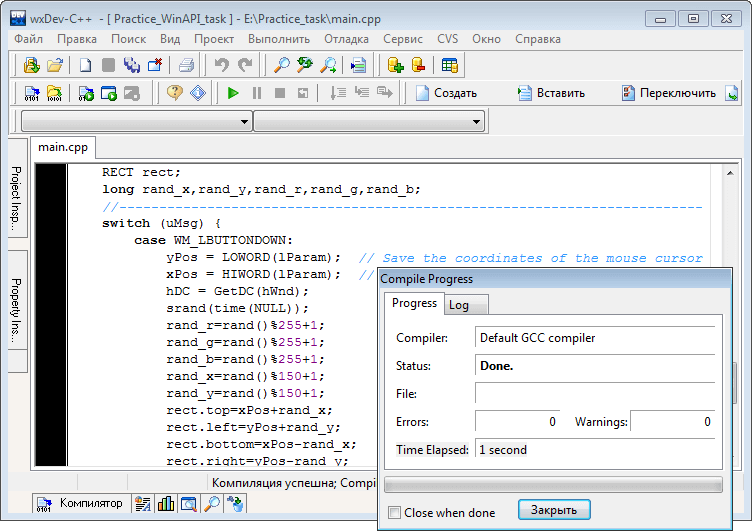
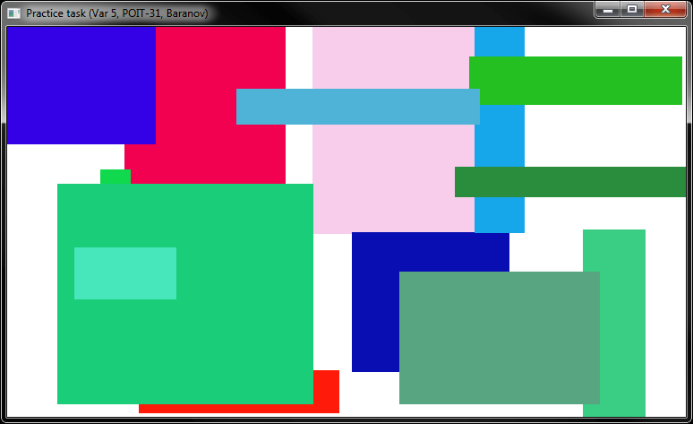

# Основы WinAPI
[&lt; назад](../)  
*Прочтите это на другом языке:* *[English](README.en.md)*, **[Русский](README.md)**.  
Дисциплина: *Операционные системы и системное программирование*.  
Пример практического приложения предполагает запуск в IDE wxDev-C++ 7.4.2 (Компилятор MingW).  
Работоспособность исходников в других IDE не проверялась.

## Теоретические задания:
* 1. Как строится адресация ячеек памяти в реальном режиме?
* 2. Расскажите о механизме кэширования памяти.

## Практическое задание:
* Привести исходный код программы, рисующей по нажатию мыши прямоугольник случайного размера и цвета заливки с центром в точке нажатия курсора мыши. Практическое задание необходимо выполнить на языке программирования С++. При выполнении задания необходимо пользоваться функциями Windows API и не использовать библиотеки и расширения языка, не являющиеся частью стандартной библиотеки С++.

## Демонстрационные скриншоты:

