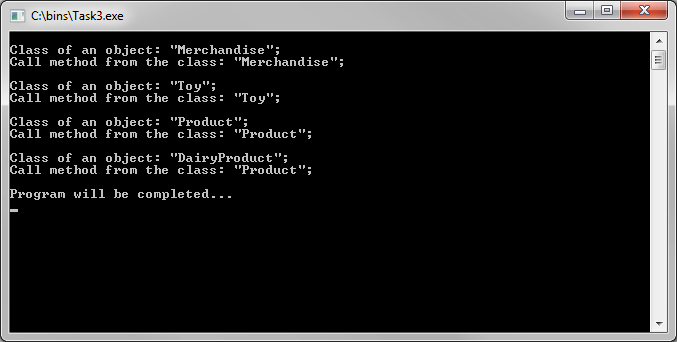
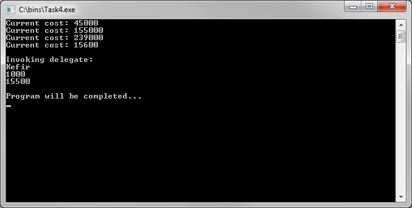

# Basics of C# language
[&lt; back](../)  
*Read this in other languages:* **[English](README.en.md)**, *[Русский](README.md)*.  
Discipline: *C# and platform .NET Framework*.  
All examples assume the source code run in the IDE Visual Studio Express 2013 for Windows Desktop.  
The efficiency of the sources in other IDE has not been tested.

## Tasks:
* 1. *Develop basic programs in the C# programming language*.  
Write a C# program that implements a function from the table. Initial data are entered from the keyboard. 
<table><tr><th>Laboratory</th><th>Control</th></tr><tr><td>Calculation of the quotient of two integers.</td><td>Squaring the cube difference between two integers.</td></tr></table>  

* 2. *Objects and classes (inheritance, constructors, destructors)*.  
To build a class hierarchy in accordance with a variant of the task:
<table><tr><th>Laboratory</th><th>Control</th></tr><tr><td>Detail, mechanism, device, unit.                </td><td>Toy, product, goods, dairy product.                           </td></tr></table>  

* 3. *Programming polymorphic methods*.  
To extend the class hierarchy from the laboratory/contol task №2 with the use of virtual class as the basis of the hierarchy. Show an example of using polymorphism of methods.
* 4. *Advanced programming language*.  
Implement a hierarchy of laboratory/contol tasks №3 the mechanism of the interfaces, one of the classes must implement at least 2 interface. Use to check all methods of this class multicast delegate.
* 5. *Event-oriented programming*.  
Implement error handling for laboratory/contol task №4, overriding through inheritance event: **IndexOutOfRangeException**.

## Demo screenshots:

