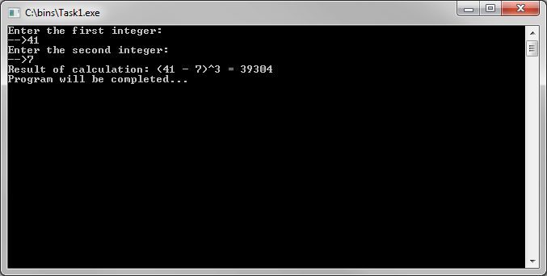
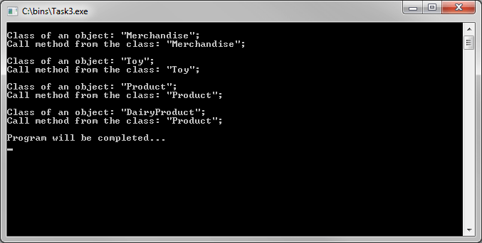
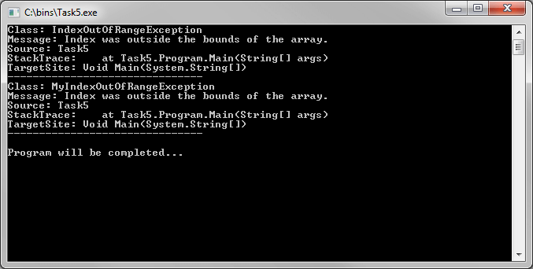

# Основы языка C# 
[&lt; назад](../)  
*Прочтите это на другом языке:* *[English](README.en.md)*, **[Русский](README.md)**.  
Дисциплина: *C# и платформа .NET Framework*.  
Все примеры исходных кодов предполагают запуск в IDE Visual Studio Express 2013 для Windows Desktop.  
Работоспособность исходников в других IDE не проверялась.

## Задания:
* 1. *Разработка элементарных программ на языке программирования C#*.  
Написать C# программу, реализующую функцию согласно варианту задания. Исходные данные вводятся с клавиатуры. 
<table><tr><th>Лабораторная</th><th>Контрольная</th></tr><tr><td>Вычисление частного двух целых чисел.</td><td>Возведение в куб разности двух целых чисел.</td></tr></table>  

* 2. *Объекты и классы (наследование, конструкторы, деструкторы)*.  
Построить иерархию классов в соответствии с вариантом задания:
<table><tr><th>Лабораторная</th><th>Контрольная</th></tr><tr><td>Деталь, механизм, изделие, узел.           </td><td>Игрушка, продукт, товар, молочный продукт.    </td></tr></table>  

* 3. *Программирование полиморфных методов*.  
Расширить иерархию классов из лабораторной/контрольной задачи №2 с использованием виртуального класса в качестве основы иерархии. Показать пример использования полиморфизма методов.
* 4. *Расширенные возможности языка программирования*.  
Реализовать для иерархии из лабораторной/контрольной задачи №3 механизм интерфейсов, при этом один из классов должен реализовывать как минимум 2 интерфейса. Использовать для проверки всех методов данного класса многоадресный делегат.
* 5. *Событийно-ориентированное программирование*.  
Реализовать обработку ошибок для лабораторной/контрольной задачи №4, при этом переопределив с помощью наследования событие: **IndexOutOfRangeException**.

## Демонстрационные скриншоты:

