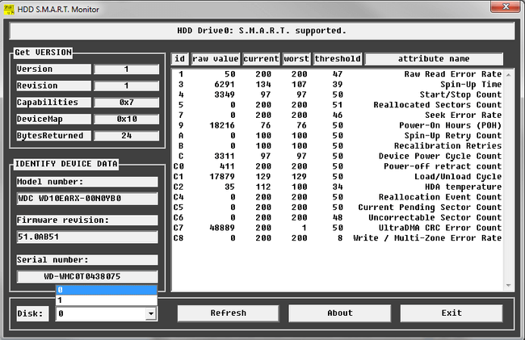
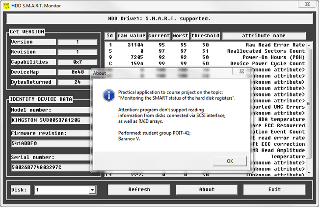

# Course project (WinAPI)
[&lt; back](../)  
*Read this in other languages:* **[English](README.en.md)**, *[Русский](README.md)*.  
Project theme: *Development of software for monitoring the SMART status of the hard disk registers*.  
Source project involve launch of IDE wxDev-C++ 7.4.2 (Compiler MingW).  
The health of sources in other IDE has not been verified.

## Task:
To develop a Windows app for monitoring the SMART status of the hard disk registers. The application displays a list of all disk devices in the system and gives complete information about the specified hard disk as the device, its identity, model, SMART status registers, etc.

## Demo screenshots:

