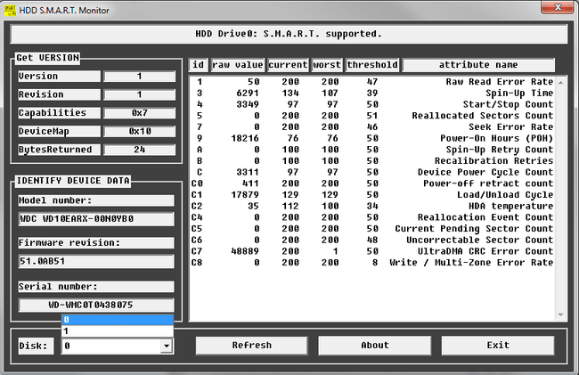
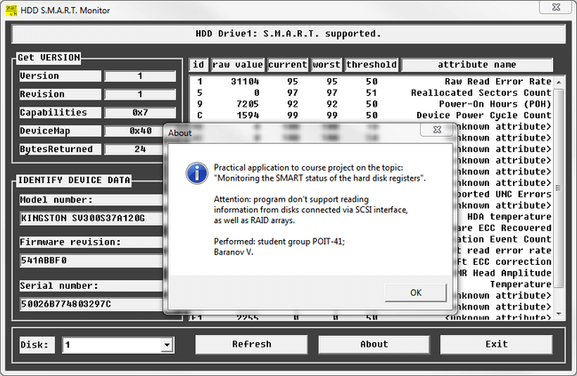
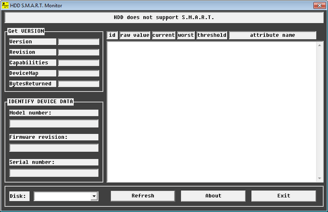
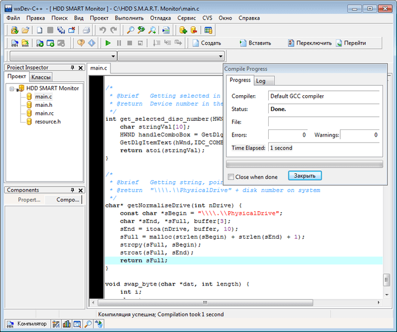

# Курсовой проект (WinAPI)
[&lt; назад](../)  
*Прочтите это на другом языке:* *[English](README.en.md)*, **[Русский](README.md)**.  
Тема проекта: *Разработка приложения для мониторинга состояния SMART регистров жесткого диска*.  
Пример практического приложения предполагает запуск в IDE wxDev-C++ 7.4.2 (Компилятор MingW).  
Работоспособность исходников в других IDE не проверялась.

## Задание:
Разработать Windows-приложение для мониторинга состояния SMART регистров жесткого диска. Приложение выводит список всех дисковых устройств в системе и выдает полную информацию об указанном жестком диске как устройстве, его идентификационные данные, модель, состояние SMART регистров и т.д.

## Демонстрационные скриншоты:

