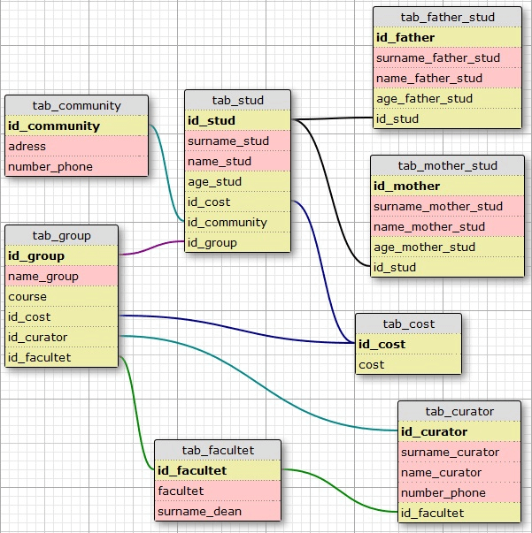
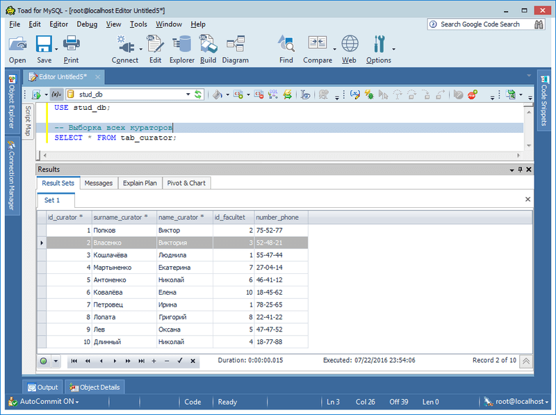
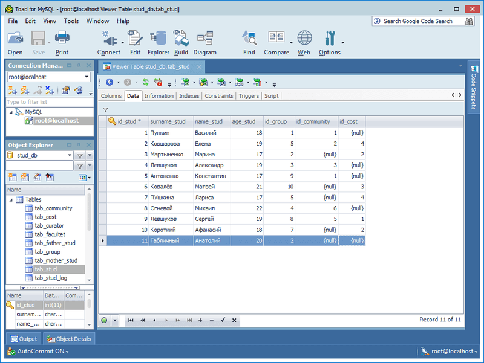
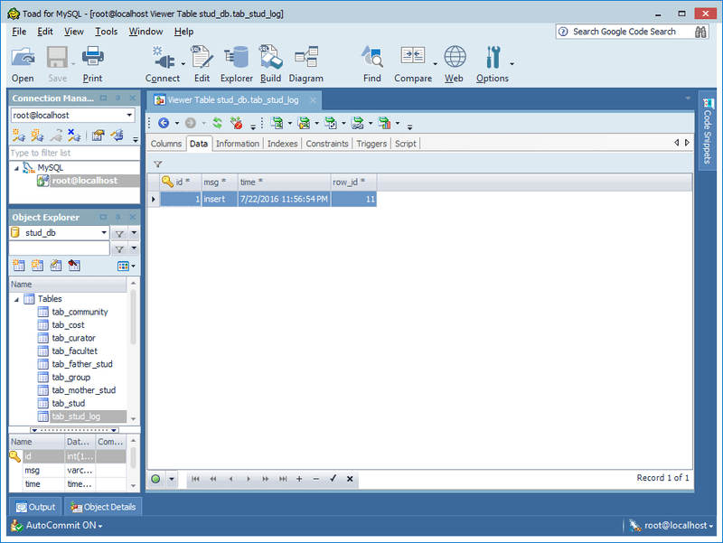

# Basics MySQL
[&lt; back](../)  
*Read this in other languages:* **[English](README.en.md)**, *[Русский](README.md)*.  
Discipline: *Databases*.  
Examples of scripts that expect to be run in the database MySQL 5.5.  
The efficiency of scripts in other DB has not been verified.

## Task:
Create in database management system 8 related tables that meets the 1, 2, and 3 normal forms.  
Subject area: **information about the University students**.  
*Additional task*: add triggers.

## Description of the solution:
As a database management system selected MySQL. To demonstrate the trigger added 1 table logging.

### Description of the main tables:
Name | Description 
--- | --- 
*tab_stud* | Table **students**. Has a secondary key to a table of hostels, groups, and prices. 
*tab_father_stud* | Table **fathers of students**. It has secondary key on the table students. 
*tab_mother_stud* | Table **mothers of students**. It has secondary key on the table students. 
*tab_community* | Table **hostels**. Secondary keys do not have. 
*tab_group* | Table **groups**. Has a secondary key to the table faculties, curators and prices. 
*tab_cost* | Table **price**. Secondary keys do not have. 
*tab_curator* | Table **curators**. It has secondary key on the table of the faculties. 
*tab_facultet* | Table **faculties**. Secondary keys do not have. 

### Description additional table and trigger:
Type | Name | Description 
--- | --- | --- 
Таблица | *tab_stud_log* | Table **logging** insert new values into the table students. 
Триггер | *update_stud_event* | Called when inserting new values into a table of students and writes information to table logging (date/time and id of the record). 

### Relations diagram main tables:

## Demo screenshots:

