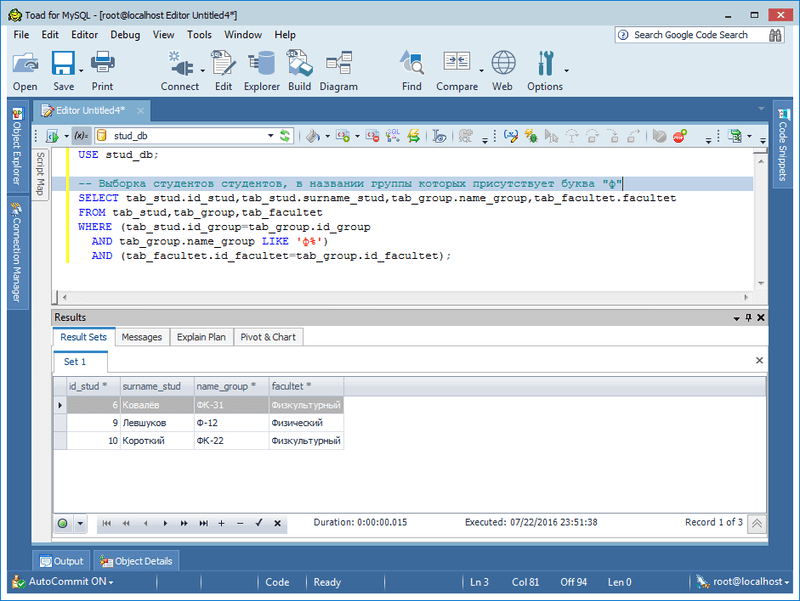
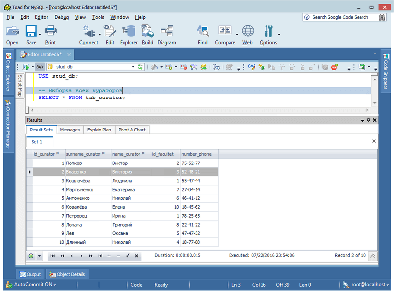

# Основы MySQL
[&lt; назад](../)  
*Прочтите это на другом языке:* *[English](README.en.md)*, **[Русский](README.md)**.  
Дисциплина: *Базы данных*.  
Примеры скриптов предполагают запуск в базе данных MySQL 5.5.  
Работоспособность скриптов в других БД не проверялась.

## Задание:
Создать в СУБД 8 связанных таблиц, отвечающих 1,2 и 3-ей нормальным формам.  
Предметная область: **информация об учащихся ВУЗа**.  
*Дополнительное задание*: добавить триггеры.

## Описание решения:
В качестве СУБД выбрана MySQL. Для демонстрации работы триггера добавлена 1 таблица логгирования.

### Описание основных таблиц:
Название | Описание 
--- | --- 
*tab_stud* | Таблица **студентов**. Имеет вторичные ключи на таблицу общежитий, групп и цен. 
*tab_father_stud* | Таблица **отцов студентов**. Имеет вторичный ключ на таблицу студентов. 
*tab_mother_stud* | Таблица **матерей студентов**. Имеет вторичный ключ на таблицу студентов. 
*tab_community* | Таблица **общежитий**. Вторичных ключей не имеет. 
*tab_group* | Таблица **групп**. Имеет вторичные ключи на таблицу факультетов, кураторов и цен. 
*tab_cost* | Таблица **цен**. Вторичных ключей не имеет. 
*tab_curator* | Таблица **кураторов**. Имеет вторичный ключ на таблицу факультетов. 
*tab_facultet* | Таблица **факультетов**. Вторичных ключей не имеет. 

### Описание дополнительной таблицы и триггера:
Тип | Название | Описание 
--- | --- | --- 
Таблица | *tab_stud_log* | Таблица **логирования** вставки новых значений в таблицу студентов. 
Триггер | *update_stud_event* | Вызывается при вставке новых значений в таблицу студентов и записывает информацию в таблицу логгирования (дату/время и id записи). 

### Схема связей основных таблиц:

## Демонстрационные скриншоты:

