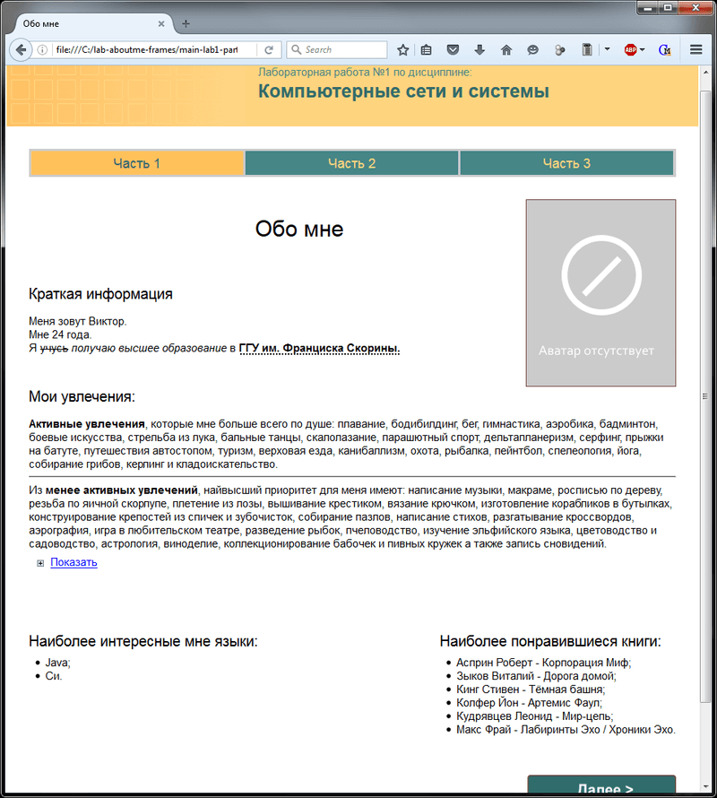
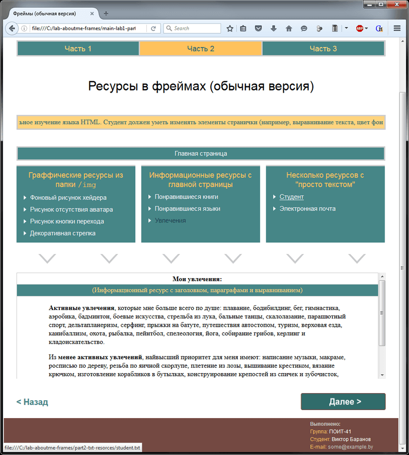
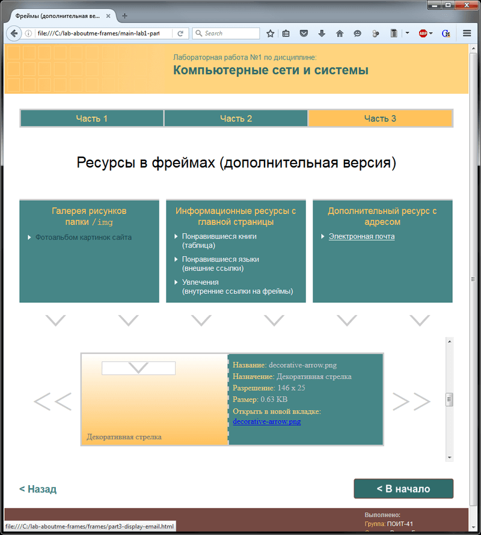

# Basics of HTML, CSS
[&lt; back](../)  
*Read this in other languages:* **[English](README.en.md)**, *[Русский](README.md)*.  
Discipline: *Computer networks and systems*.  
Task don't correspond to the subject, so the teacher gave him before dismissal, and did not "load" the students of non-core subject.

## Task:
Need to develop a "Personal Web page" using the markup language HTML. Laboratory work consists of three parts:
* 1. Develop a main page personal Web-page (file index.htm).  
  **Requirements for implementation (must be present)**:
  * title page (title on browser);
  * brief information about the owner of the page (demonstrate the use of various font sizes, color, selection (italic, bold, underline), use horizontal lines);
  * graphic image (image);
  * wallpaper.
* 2. Design the layout of the next page personal Web page that should open on clicking links on the main page. On the title page, you must add the appropriate link in the form of an image.  
  **Requirements for implementation**:
  * page should be split into frames;
  * in the first frame must be located marquee with the text;
  * second frame should contain links to resources personal page and a link to the main page;
  * must be defined by the appropriate color for a simple, active and visited links;
  * third frame should be informational - it displays the selected the second frame resources;
  * perform content resources with information about yourself (in text should be present headings and paragraphs, lists (including nested), must be demonstrated different text alignment, background coloring);
  * when you click on other links on the second frame in the third frame should appear just the text.
* 3. Perform further content is developed in part 2 of page layout.  
  **Requirements for implementation**:
  * one of the resources must be in the form of a table;
  * one of the resources must be in the form of a photo album (pictures, captions, alternate image captions);
  * one of the resources should contain a link to contact you by email;
  * one of the resources must contain hyperlinks to external resources whose contents are to be displayed in a new browser window;
  * one of the resources inside the text in the information frame to place internal links, the activation of which should lead to the display of the relevant resources in the same frame.

## Demo screenshots:

