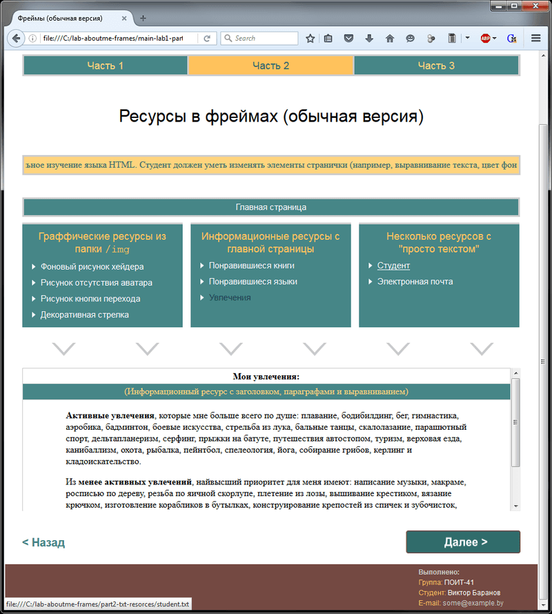

# Основы HTML, CSS
[&lt; назад](../)  
*Прочтите это на другом языке:* *[English](README.en.md)*, **[Русский](README.md)**.  
Дисциплина: *Компьютерные сети и системы*.  
Задание не соответсвует предмету, так преподаватель выдал его перед увольнением и не стал "нагружать" студентов непрофильным предметом.

## Задание:
Необходимо разработать «Персональную Web-страничку» с использованием языка разметки страниц HTML. Лабораторная работа состоит из трех частей:
* 1. Разработать заглавную страничку персональной Web-странички (файл index.htm).  
  **Требования по реализации (должны присутствовать)**:
  * название странички (заголовок на браузера);
  * краткая информация о владельце странички (продемонстрировать использование различных шрифтов по размеру, цвету, выделению (курсив, полужирный, подчеркнутый), использование горизонтальных линий);
  * графическое изображение (рисунок);
  * обои.
* 2. Разработать макет следующей страницы персональной Web-странички, которая должна открываться по нажатию ссылки на заглавной страничке. На заглавную страничку необходимо добавить соответствующую ссылку в виде изображения.  
  **Требования по реализации**:
  * страница должна быть разбита на фреймы;
  * в первом фрейме должна быть расположена бегущая строка с текстом;
  * второй фрейм должен содержать ссылки на ресурсы персональной странички и ссылку на заглавную страничку;
  * должны быть определены соответственные цвета для простой, активной и посещенной ссылки;
  * третий фрейм должен быть информационным, т.е. в нем отображаются выбранные во втором фрейме ресурсы;
  * выполнить информационное наполнение ресурсов с информацией о себе (в тексте должны присутствовать заголовки и параграфы, списки (в том числе вложенные), должно быть продемонстрировано различное выравнивание текста, раскраска фона);
  * при нажатии на остальные ссылки на втором фрейме в третьем фрейме должен появляться просто соответствующий текст.
* 3. Выполнить дальнейшее информационное наполнение разработанного в части 2 макета страницы.  
  **Требования по реализации**:
  * один из ресурсов должен быть оформлен в виде таблицы;
  * один из ресурсов должен быть оформлен в виде фотоальбома (рисунки, подписи к ним, альтернативные подписи к рисункам);
  * один из ресурсов должен содержать ссылку для связи с вами по электронной почте;
  * один из ресурсов должен содержать гиперссылки на внешние ресурсы, содержимое которых должно отображаться в новом окне браузера;
  * для одного из ресурсов внутри текста в информационном фрейме разместить внутренние ссылки, активизация которых должна приводить к отображению соответствующих ресурсов в том же фрейме.

## Демонстрационные скриншоты:

