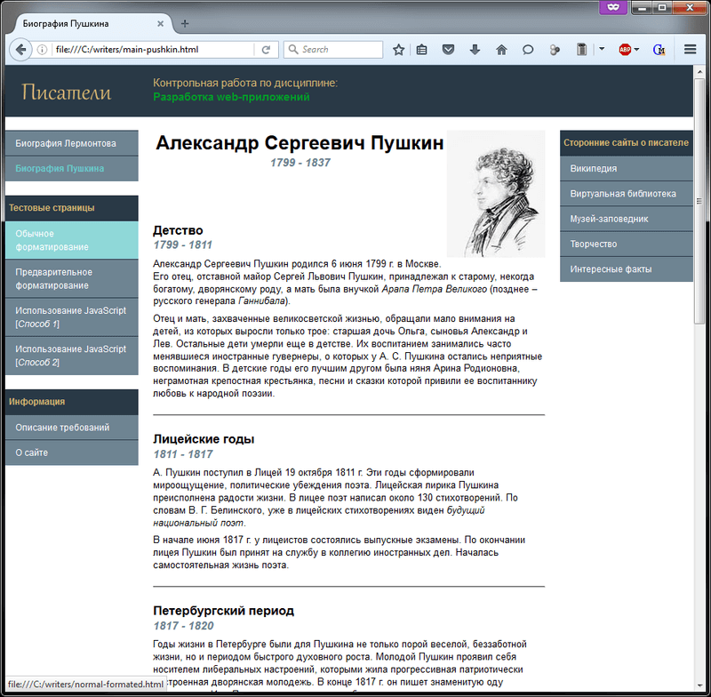
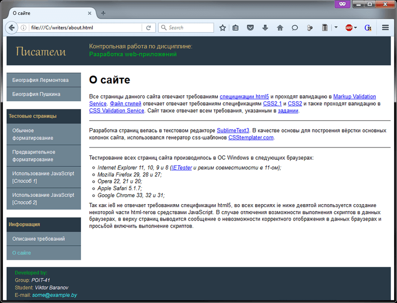
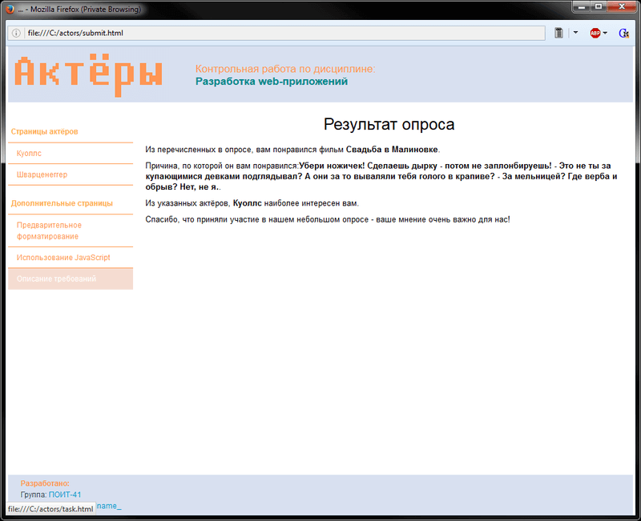

# Basics of HTML, CSS, JS
[&lt; back](../)  
*Read this in other languages:* **[English](README.en.md)**, *[Русский](README.md)*.  
Discipline: *Development of Web-applications*.  
Testing pages in Windows browsers:
* Internet Explorer 11, 10, 9 and 8 (IETester and a quirks mode in 11-th);
* Mozilla Firefox 29, 28 and 27;
* Opera 22, 21 and 20;
* Apple Safari 5.1.7;
* Google Chrome 33, 32 and 31;  

So as IE8 does not meet the requirements of the html5 specification, in all ie versions below ninth is used to create some of the html-tags JavaScript tools. If you disable the ability to run the scripts in these browsers, in the top of the page displays a message about the impossibility of correctly display the data browsers and request enable the execution of scripts.

## Task:
Creating a web-site on the theme: 

Variant | Theme 
--- | --- 
4 (My variant) | Writers 
3 (Remaking for another variant) | Actors 

Plan the website in the form (image), consisting of main and several subsidiary pages, which interact with each other through hyperlinks. All styles should be placed in a separate file and to connect through a tag &lt;link&gt;.

Page should contain the following elements: 
* lists; 
* headers; 
* tables; 
* images; 
* links; 
* text, divided into paragraphs; 
* text without formatting; 
* alignment of the text; 
* changing the color and font size. 

Perform a site layout with block layout. Use only <em>static</em> and <em>relative</em> layout (property can take values <i>position</i>={static, relative, <del>absolute</del>, <del>fixed</del>}), allowed to use the opportunity to block flow (property float), different ways to display blocks (property display), control the stacking order of layers by using z-index.

Create a form on a separate page. When layout forms use tables. Form must contain at least 5 different elements (<i>text fields</i>, <i>text blocks</i>, <i>drop-down list</i>, <i>radio button</i>, <i>checkbox</i>, <i>password field</i>, <i>button reset</i>, <i>button submit</i>, <i>file upload field</i>). When you click on the submit button, you need to open a new window and display all the data from the form, using javascript. Under all data refers to a marked checkbox, the value drop-down lists, etc.

Requirements for task:
* Great attention is paid to the colours. The text should be readable.
* Container names must conform to the image. Location of the containers may be slightly different, but they must all be present. Container 'sw_div' must be defined with the property 'float'.
* Verify that the site is well displayed under modern known browsers.

## Description of the solution:
All pages on this site meet the requirements of <a href="http://www.w3.org/TR/html51/" title="Specification html5"> specifications html5</a> and pass validation in <a href="http://validator.w3.org" title="Markup Validation Service"> Markup Validation Service</a>. Style file meets the requirements of specifications <a href="http://www.w3.org/TR/CSS2/" title="Cascading Style Sheets Level 2 Revision 1 (CSS 2.1) Specification"> CSS2.1</a> и <a href="http://www.w3.org/TR/2008/REC-CSS2-20080411/" title="Cascading Style Sheets, level 2 CSS2 Specification"> CSS2</a> and also pass the validation <a href="http://jigsaw.w3.org/css-validator/" title="CSS Validation Service">CSS Validation Service</a>. Support of modern browsers listed at the beginning of this document.  
The development of the pages had been conducted in a text editor <a href="http://www.sublimetext.com/3" title="SublimeText 3">SublimeText3</a>. As a basis for building layout the main columns of the site, used generator css-templates <a href="http://csstemplater.com" title="CSStemplater.com">CSStemplater.com</a>.

## Demo screenshots:

