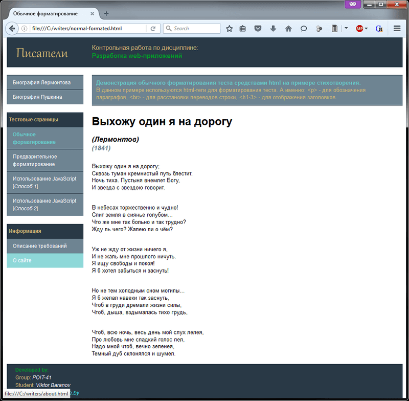

# Основы HTML, CSS, JS
[&lt; назад](../)  
*Прочтите это на другом языке:* *[English](README.en.md)*, **[Русский](README.md)**.  
Дисциплина: *Разработка Web-приложений*.  
Тестирование работы страниц производилось в OC Windows в следующих браузерах:
* Internet Explorer 11, 10, 9 и 8 (IETester и режим совместимости в 11-ом);
* Mozilla Firefox 29, 28 и 27;
* Opera 22, 21 и 20;
* Apple Safari 5.1.7;
* Google Chrome 33, 32 и 31;  

Так как ie8 не отвечает требованиям спецификации html5, во всех версиях ie ниже девятой используется создание некоторой части html-тегов средствами JavaScript. В случае отключения возможности выполнения скриптов в данных браузерах, в верху страниц выводится сообщение о невозможности корректного отображения в данных браузерах и просьбой включить выполнение скриптов.

## Задание:
Создание web-сайта на тему: 

Вариант | Тема 
--- | --- 
4 (Мой вариант) | Писатели 
3 (Переделка для другого варианта) | Актеры 

Спланируйте сайт в виде рис.1, состоящий из главной и нескольких вспомогательных страниц, которые взаимодействуют между собой посредством гиперссылок. Все стили должны располагаться в отдельном файле и подключаться посредством тега &lt;link&gt;.

Страницы сайта должна обязательно содержать следующие элементы: 
* список; 
* заголовки; 
* таблицы; 
* изображения; 
* ссылки; 
* текст, разбитый на параграфы; 
* текст без форматирования; 
* выравнивание текста; 
* изменение цвета и размера шрифта. 

Выполнить верстку сайта с помощью блочной верстки. Разрешается использовать только <em>статическую</em> и <em>относительную</em> верстку (значения которые может принимать свойство <i>position</i>={static, relative, <del>absolute</del>, <del>fixed</del>}), допускается использовать возможность обтекания блоков (свойство float), различные способы отображения блоков (свойства display), управлять порядком наложения слоев с помощью свойства z-index.

Создайте на отдельной странице форму. При верстке форм используйте таблицы. Форма должна содержать не менее 5 различных элементов (<i>текстовые поля</i>, <i>текстовые блоки</i>, <i>выпадающий список</i>, <i>радиокнопка</i>, <i>флажок checkbox</i>, <i>поле для ввода пароля</i>, <i>кнопка сброса reset</i>, <i>кнопка отправки данных submit</i>, <i>поле загрузки файла</i>). При нажатии на кнопку отправки данных, необходимо открыть новое окно и отобразить  в нем  все данные из формы, используя javascript. Под всеми данными подразумеваются отмеченные checkbox, значение выпадающих списков и т.д.

Требования к контрольной работе:
* Большое внимание уделяется цветовой гамме. Текст должен быть читаемым.
* Названия контейнеров должны соответствовать приведенным на рисунке. Расположение контейнеров может быть несколько иным, но все они должны присутствовать. Контейнер sw_div должен быть определен со свойством float.
* Проверить, чтобы сайт хорошо отображался под современными известными браузерами.

## Описание решения:
Все страницы данного сайта отвечают требованиям <a href="http://www.w3.org/TR/html51/" title="Specification html5"> спецификации html5</a> и проходят валидацию в <a href="http://validator.w3.org" title="Markup Validation Service"> Markup Validation Service</a>. Файл стилей отвечает требованиям спецификации <a href="http://www.w3.org/TR/CSS2/" title="Cascading Style Sheets Level 2 Revision 1 (CSS 2.1) Specification"> CSS2.1</a> и <a href="http://www.w3.org/TR/2008/REC-CSS2-20080411/" title="Cascading Style Sheets, level 2 CSS2 Specification"> CSS2</a> и также проходят валидацию в <a href="http://jigsaw.w3.org/css-validator/" title="CSS Validation Service">CSS Validation Service</a>. Поддержка современными браузерами указана в начале этого документа.  
Разработка страниц велась в текстовом редакторе <a href="http://www.sublimetext.com/3" title="SublimeText 3">SublimeText3</a>. В качестве основы для построения вёрстки основных колонок сайта, использовался генератор css-шаблонов <a href="http://csstemplater.com" title="CSStemplater.com">CSStemplater.com</a>.

## Демонстрационные скриншоты:

