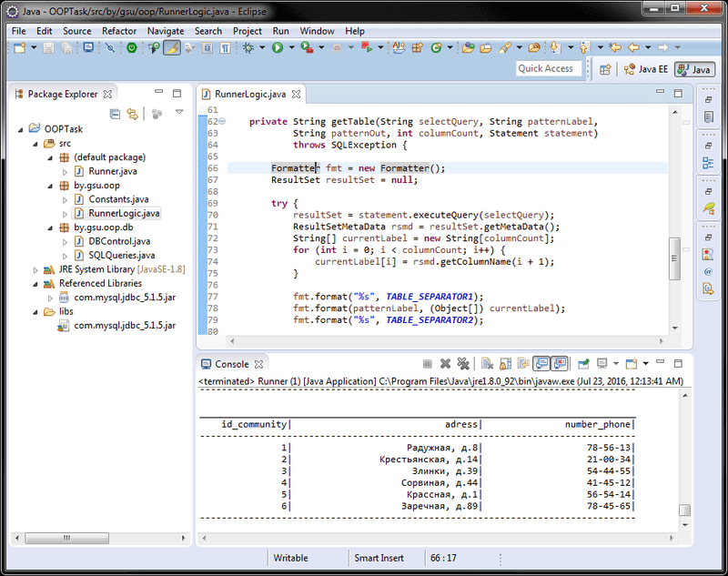

# Basics of JDBC (Java)
[&lt; back](../)  
*Read this in other languages:* **[English](README.en.md)**, *[Русский](README.md)*.  
Discipline: *Object-oriented programming*.  
Examples application involves running in JDK 6 and above.  
Also attached instructions for importing and running applications in IDE Eclipse, NetBeans and IntelliJ IDEA.

## Task:
Develop a Java application to a database connection and output to the console information from tables.

## Description of the solution:
As a database management system selected MySQL. A database is a 8 related tables with information about the students of the University, which meets the 1, 2 and 3 normal forms.  
Application create connection to the database, extracts all information from all of the tables and prints to the console.  
To format output is used the functionality of the class of `Formatter`.  
For connection management, implemented by pattern *Singleton*, located in the class `DBControl`. Also this class implements methods to correctly close resources.

### Description of DB tables:
Name | Description 
--- | --- 
*tab_stud* | Table **students**. Has a secondary key to a table of hostels, groups, and prices. 
*tab_father_stud* | Table **fathers of students**. It has secondary key on the table students. 
*tab_mother_stud* | Table **mothers of students**. It has secondary key on the table students. 
*tab_community* | Table **hostels**. Secondary keys do not have. 
*tab_group* | Table **groups**. Has a secondary key to the table faculties, curators and prices. 
*tab_cost* | Table **price**. Secondary keys do not have. 
*tab_curator* | Table **curators**. It has secondary key on the table of the faculties. 
*tab_facultet* | Table **faculties**. Secondary keys do not have. 

## Compile and run application in CMD:
To run an application in the OS requires an installed JDK version 6 or above.  
Also, requires MySQL version 5.1 or higher or access remote MySQL DB.  
In environment variables of the OS should be the paths to the JDK (To compile and run from CMD).
* 1. Require create a database `stud_db` in MySQL using proposed in the catalogue *mysql-scripts* scripts. For all subsequent actions the database needs to be running on 3306 port. 
* 2. You need to change the constants login (`DB_LOGIN`) and password (`DB_PASSWORD`) in class `Constants.java` to connect to the database. If you are using a remote database, then change the value in constant `DB_HOST`.
* 3. To compile java-files in class-files in *cmd*:  
`javac -encoding utf-8 -classpath ./src -d ./src src/Runner.java`
* 4. Next, to start, there are 2 ways: running a compiled class-files "as-is", any pre build class-files in the "runnable" jar-archive and start using it.
  * 4.1. *Run class-files "as is"*: for this in *cmd* need to use the command:  
  `java -classpath ./src;./libs/com.mysql.jdbc_5.1.5.jar Runner`
  * 4.2. *Build runnable jar*:  
    * 4.2.1. Packaging jar-file is carried of command:  
    `jar cvmf manifest.mf filename.jar -C ./src .`
    * 4.2.2. Starting created jar-file is carried of command:  
    `java -jar "filename".jar`

To make it easier to enter the above commands in *cmd* in the root of the project directory is script*compile and run.bat*.

## Import and run application in IDE
To import and run the project in the IDE must also be installed JDK/JRE and should be access MySQL.  
In MySQL, by using the supplied scripts, you must have created a database `stud_db`, and she needs MySQL to be running on 3306 port.
* **Eclipse**.  
  * 1. Create a new Java SE project: *File &rarr; New &rarr; Java Project*.
  * 2. To import the source code into your project: *File &rarr; Import &rarr; General &rarr; File System*.  
  You need to specify the directory *src* and *lib* and ignore the manifest file and the batch file.
  * 3. You need to specify in the project properties the path to the database driver:  
  *File &rarr; Properties &rarr; Java Build Path &rarr; Libraries &rarr; Add JARs &rarr; libs/com.mysql.jdbc_5.1.5.jar*  
  The link to the driver database appears in the project tab *Referenced Libraries* and the app is ready to launch.  
  If required, we also need to change the username/password of the DB connection in the class `Constants.java`.
* **NetBeans**.
  * 1. Create a new Java project from existing sources:  
  *File &rarr; New Project &rarr; Java &rarr; Java Project With Exiting Sources*  
  Next, you need to specify the path to directory *src* project:  
  *Exiting Sources &rarr; Source Package Folders &rarr; Add Folder*  
  This IDE does not correctly recognize the directory structure, and can make the root of the package *src*, so you need to specify it on the java-files **inside** *src*.
  * 2. If the directory created is not a directory *lib*, then create it and  
  manually copy the driver file from *libs/com.mysql.jdbc_5.1.5.jar*
  * 3. You need to specify in the project properties the path to the copied database driver:  
  *Project &rarr; Properties &rarr; Libraries &rarr; Compile &rarr; Add JAR/Folder &rarr; Relative Path &rarr; lib/com.mysql.jdbc_5.1.5.jar*  
  In this case, link to the database driver appears in the tab of the project *Libraries* and the application is ready to run. If required, we also need to change the username/password of the DB connection in the class `Constants.java`.
* **IntelliJ IDEA**.
  * 1. Import project - starting the IDE:  
  *Import Project &rarr; Set path to the project &rarr; Create project from exiting sources*  
  The database driver IDE finds automatically, but manually add in the dependency.
  * 2. Specify the database driver dependencies:  
  *File &rarr; Project Structure &rarr; Modules &rarr; Dependecies &rarr; + &rarr; Library &rarr; Add Selected*  
  In this case, link to the database driver appears in *Dependecies* and the application is ready to run. If required, we also need to change the username/password of the DB connection in the class `Constants.java`.

## Demo screenshots:

