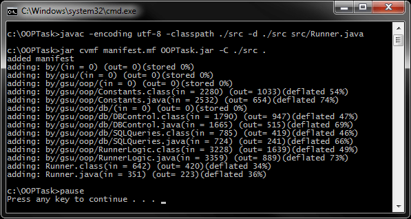

# Основы JDBC (Java)
[&lt; назад](../)  
*Прочтите это на другом языке:* *[English](README.en.md)*, **[Русский](README.md)**.  
Дисциплина: *Объектно-ориентированное программирование*.  
Пример приложения предполагает запуск в JDK 6 и выше.  
Также приложены инструкции по импорту и запуску приложения в IDE Eclipse, NetBeans и IDEA.

## Задание:
Разработать Java-приложения для соединения с БД и вывода в консоль информации из таблиц.

## Описание решения:
В качестве СУБД выбрана MySQL. База данных представляет собой 8 связанных таблиц с информацией об учащихся ВУЗа, которая отвечающих 1,2 и 3-ей нормальным формам.  
Приложение создаёт соединение с базой данных, извлекает всю информацию из всех указанных таблиц и выводит на консоль.  
Для форматирования вывода применяется функционал класса `Formatter`.  
Для управления соединением, реализован паттерн *Singleton*, расположенный в классе `DBControl`. Также в этом классе реализованы методы для корректного закрытия ресурсов.

### Описание таблиц БД:
Название | Описание 
--- | --- 
*tab_stud* | Таблица **студентов**. Имеет вторичные ключи на таблицу общежитий, групп и цен. 
*tab_father_stud* | Таблица **отцов студентов**. Имеет вторичный ключ на таблицу студентов. 
*tab_mother_stud* | Таблица **матерей студентов**. Имеет вторичный ключ на таблицу студентов. 
*tab_community* | Таблица **общежитий**. Вторичных ключей не имеет. 
*tab_group* | Таблица **групп**. Имеет вторичные ключи на таблицу факультетов, кураторов и цен. 
*tab_cost* | Таблица **цен**. Вторичных ключей не имеет. 
*tab_curator* | Таблица **кураторов**. Имеет вторичный ключ на таблицу факультетов. 
*tab_facultet* | Таблица **факультетов**. Вторичных ключей не имеет. 

## Компиляция и запуск приложения в CMD:
Для запуска приложения в ОС требуется установленная JDK версии 6 или выше.  
Также, требуется установленная БД MySQL версии 5.1 или выше, либо доступ к удалённой БД MySQL.  
В переменных окружения ОС должны быть прописаны пути к JDK (Для компиляции и запуска из CMD).
* 1. Требуется создать базу данных `stud_db` в MySQL при помощи предложеных в каталоге *mysql-scripts* скриптов. Для всех последующих действий БД должна быть запущена на 3306 порте. 
* 2. Нужно изменить константы логина (`DB_LOGIN`) и пароля (`DB_PASSWORD`) в классе `Constants.java` для подключения к БД. В случае, если используется удалённая БД, то поменять значение в константе `DB_HOST`.
* 3. Для компиляции java-файлов в class-файлы в *cmd*:  
`javac -encoding utf-8 -classpath ./src -d ./src src/Runner.java`
* 4. Далее, для запуска, есть 2 пути: запуск скомпилированных class-файлов "как есть", либо предварительная сборка class-файлов в "запускаемый" jar-архив и запуск через него.
  * 4.1. *Запуск class-файлов "как есть"*: для этого в *cmd* нужно воспользоваться командой:  
  `java -classpath ./src;./libs/com.mysql.jdbc_5.1.5.jar Runner`
  * 4.2. *Сборка запускаемого jar*:  
    * 4.2.1. Упаковка jar-файла осуществляется коммандой:  
    `jar cvmf manifest.mf filename.jar -C ./src .`
    * 4.2.2. Запуск созданного jar-файла осуществляется коммандой:  
    `java -jar "filename".jar`

Для упрощения ввода вышеперечисленных команд в *cmd* в корне каталога с проектом находится скрипт *compile and run.bat*.

## Импорт и запуск проекта в IDE
Для импорта и запуска проекта в IDE также должны быть установлены JDK/JRE и должен быть доступ к MySQL.  
В MySQL, при помощи приложенных скриптов, должна быть создана база данных `stud_db`, а сама MySQL должна быть запущена на 3306 порте.
* **Eclipse**.  
  * 1. Создать новый Java SE проект: *File &rarr; New &rarr; Java Project*.
  * 2. Импортировать исходники в созданный проект: *File &rarr; Import &rarr; General &rarr; File System*.  
  Требуется указать каталоги *src* и *lib* и проигнорировать файл манифеста и батник.
  * 3. Требуется указать в свойствах проекта путь к драйверу БД:  
  *File &rarr; Properties &rarr; Java Build Path &rarr; Libraries &rarr; Add JARs &rarr; libs/com.mysql.jdbc_5.1.5.jar*  
  При этом ссылка на драйвер БД появляется во вкладке проекта *Referenced Libraries и приложение готово к запуску. Если требуется, также нужно изменить логин/пароль подключения к БД в классе `Constants.java`.
* **NetBeans**.
  * 1. Создать новый Java проект из существующих исходников:  
  *File &rarr; New Project &rarr; Java &rarr; Java Project With Exiting Sources*  
  Затем нужно указать путь в каталог *src* проекта: *Exiting Sources &rarr; Source Package Folders &rarr; Add Folder*  
  Эта IDE не корректно распознаёт структуру каталогов, и может сделать корневым пакетом *src*, поэтому указывать нужно именно на java-файлы **внутри** *src*.
  * 2. Если в каталоге созданного нет каталога *lib* - то создать его и  
  вручную скопировать в него файл драйвера *libs/com.mysql.jdbc_5.1.5.jar*
  * 3. Требуется указать в свойствах проекта путь к скопированному драйверу БД:  
  *Проект &rarr; Properties &rarr; Libraries &rarr; Compile &rarr; Add JAR/Folder &rarr; Relative Path &rarr; lib/com.mysql.jdbc_5.1.5.jar*  
  При этом ссылка на драйвер БД появляется во вкладке проекта *Libraries* и приложение готово к запуску. Если требуется, также нужно изменить логин/пароль подключения к БД в классе `Constants.java`.
* **IntelliJ IDEA**.
  * 1. Импорт проекта - при запуске IDE:  
  *Import Project &rarr; Указать путь к проекту &rarr; Create project from exiting sources*  
  Драйвер БД IDE находит автоматически, однако его нужно вручную добавить в зависимости.
  * 2. Указываем драйвер БД в зависимостях:  
  *File &rarr; Project Structure &rarr; Modules &rarr; Dependecies &rarr; + &rarr; Library &rarr; Add Selected*  
  При этом ссылка на драйвер БД появляется в *Dependecies* и приложение готово к запуску. Если требуется, также нужно изменить логин/пароль подключения к БД в классе `Constants.java`.

## Демонстрационные скриншоты:

