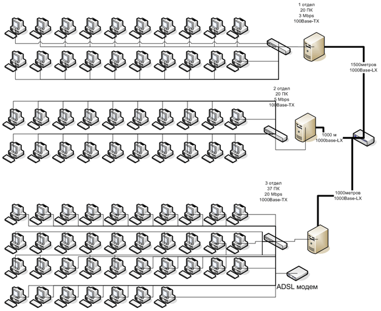
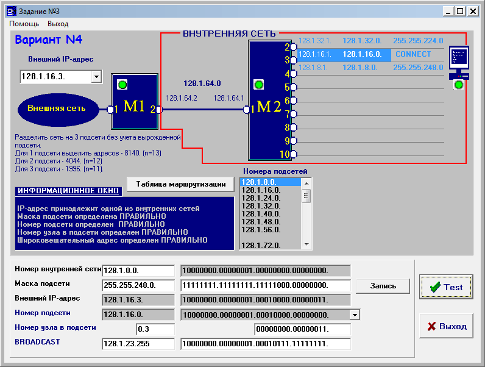
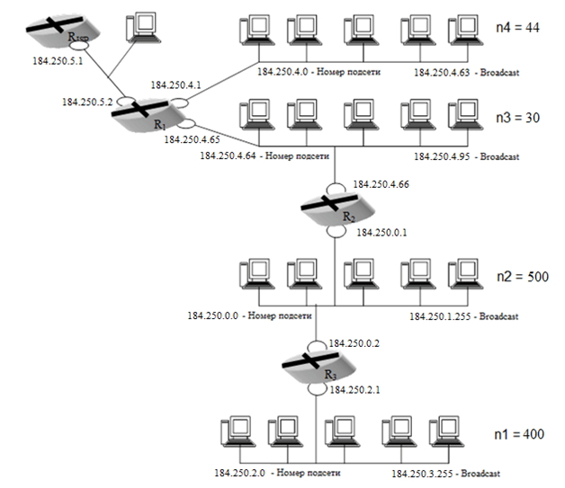
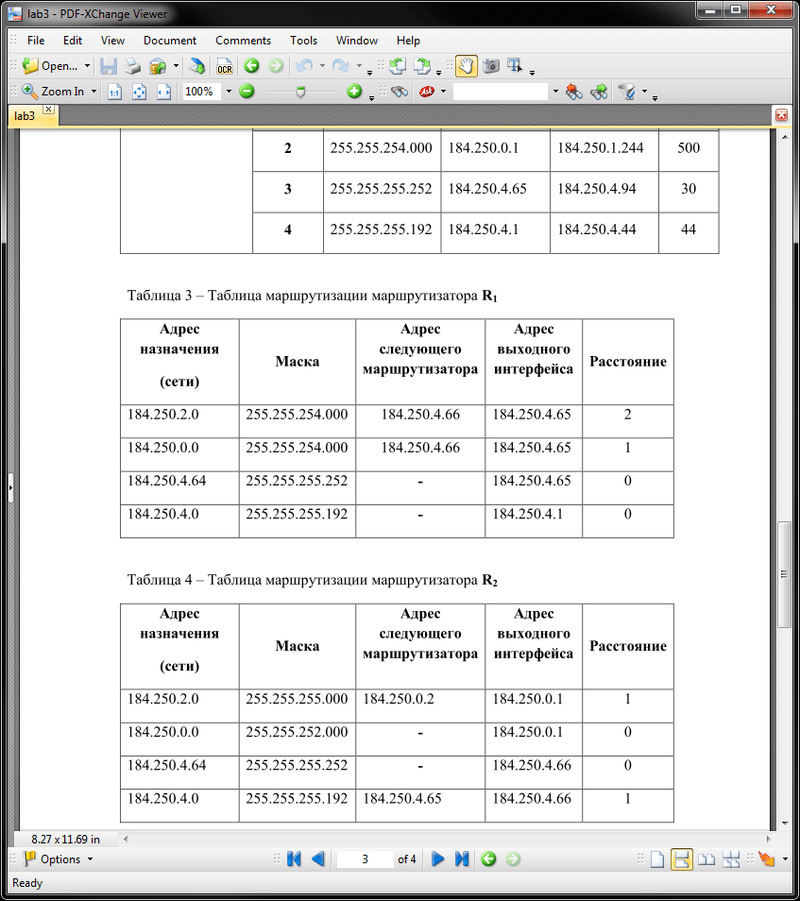

# Основы компьютерных сетей
[&lt; назад](../)  
<!--- *Прочтите это на другом языке:* *[~~English~~](README.en.md)*, **[Русский](README.md)**.  -->
Дисциплина: *Компьютерные сети и системы*.  

## Задания:
* 1.Объединить компьютеры **N** отделов  компании **FIO&K** в общую локальную сеть при условии, что расстояние между отделами составляет **Ri** метров и трафик между ними составляет **tr Mbps – type=1**. Если **type=0**, то обмен происходит только электронной почтой. Количество компьютеров в **j**-ом отделе **hj**. Требуется наличие выхода в Интернет **(Inetj=1)**, если нет – **Inetj=0**. Трафик внутри отдела **j** составляет **trj Mbps**.
  * 1.1.Представить общую топологию сети.
  * 1.2.Определить для каждого из отделов:
    * 1.2.1.Коэффициент загрузки сети.
    * 1.2.2.Рассчитать корректности сети (PDV, PVV).
    * 1.2.3.В зависимости от ее нагрузки выбрать соответствующие типы оборудования (линии связи, промежуточные устройства).
    * 1.2.4.Каждому из компьютеров отдела присвоить IP адрес и соответствующую маску подсети.
    * 1.2.5.Составить ARP таблицы.
  * 1.3.В случае необходимости каждый из отделов дополнить необходимым оборудованием для решения частных задач (например, сервером для обеспечения выхода в Internet).
  * 1.4.Рассчитать коэффициенты загрузки каналов связи между отделами.  

  **Замечание**: Выбор типов оборудования должен быть объяснен на основании расчетов п.1.2.1, 1.2.2.  
  Структуру ЛВС оформить в MS Visio.
  <table>
  <tr>
<th>N</th><th>R1</th><th>type</th><th>tr</th><th>h1</th><th>Inet1</th><th>tr1</th><th>R2</th><th>type</th><th>tr</th><th>h2</th><th>Inet2</th><th>tr2</th><th>R3</th><th>type</th><th>tr</th><th>h3</th><th>Inet3</th><th>tr3</th>
  </tr>
  <tr>
  <td>3</td><td>1500</td><td>0</td><td>0</td><td>20</td><td>0</td><td>3</td><td>1000</td><td>1</td><td>35</td><td>20</td><td>0</td><td>5</td><td>1000</td><td>0</td><td>0</td><td>37</td><td>1</td><td>20</td>
  </tr>
  </table>

* 2.**Формирование IP-адресов в гетерогенных ЛВС с использованием масок**.  
Работа выполняется с использованием утилиты **NetLab** (Находится в каталоге Lab2).  
Работа состоит из трёх заданий, в каждой из которых 10 вариантов.  
  * 2.1.**Структуризация внутренней сети с помощью маски постоянной длины на примере IP-адреса класса В**.  
  *Цель работы*: Научиться организовывать заданное число подсетей с учетом вырожденной сети, используя маску подсети постоянной длины.
  * 2.2.**Структуризация внутренней сети с помощью маски постоянной длины на примере IP-адреса класса В**.  
  *Цель работы*: Научиться организовывать подсети с заданным числом узлов, используя маску подсети постоянной длины.
  * 2.3.**Структуризация внутренней сети с помощью маски переменной длины на примере IP-адреса класса В.**  
  *Цель работы*: необходимо разделить сеть на три подсети (без учета вырожденной сети, соединяющей М1 и М2) с помощью масок переменной длины. При этом для каждой из подсетей выделить заданное количество адресов.  

  Варианты заданий расположены в утилите **NetLab**, методический материал - в каталоге *manuals*.
* 3.**Структуризация сети с использованием масок**.  
На предприятии было принято решение обратиться к поставщику услуг (ISP) для получения пула адресов, достаточного для создания сети. Сеть предприятия состоит из 4-х подсетей, причем, три подсети – это сети внутренних отделов в количестве **n1**, **n2** и **n3** соответственно. 4-я подсеть предусматривает отдельную сеть из **n4** узлов, предназначение которой – предоставление информации в режиме открытого доступа для потенциальных клиентов, содержащая набор различных серверов.  
В процессе выполнения задания необходимо:
  * 3.1.Разделить предоставленное адресное пространство (AП) между подсетями предприятия, используя маски переменной длинны.
  * 3.2.Результат оформить в виде таблицы адресных пространств подсетей предприятия.
  * 3.3.Для каждой из подсетей определить широковещательный адрес (broadcast).
  * 3.4.Указать IP адреса портов маршрутизаторов R1, R2, R3.
  * 3.5.Построить таблицы маршрутизации маршрутизаторов R1, R2, R3 в отдельных таблицах.  

  **Замечание**: Порты маршрутизаторов уже входят в количество узлов подсетей, указанных в таблице задания.  
  Выполнение лабораторной работы осуществить в MS Word, рисунок сети предприятия представить в MS Visio и затем добавить в отчет. Рисунок структуры сети должен содержать обозначения (номера) всех сетей **ni**, broadcast-ов, адреса портов всех маршрутизаторов.
  <table>
  <tr><th rowspan="2">AP</th><th colspan="4">Количество узлов в подсетях</th></tr>
  <tr><th>n1</th><th>n2</th><th>n3</th><th>n4</th></tr>
  <tr><td>184.250.0.0/16</td><td>400</td><td>500</td><td>30</td><td>44</td></tr>
  </table>

## Демонстрационные скриншоты:

