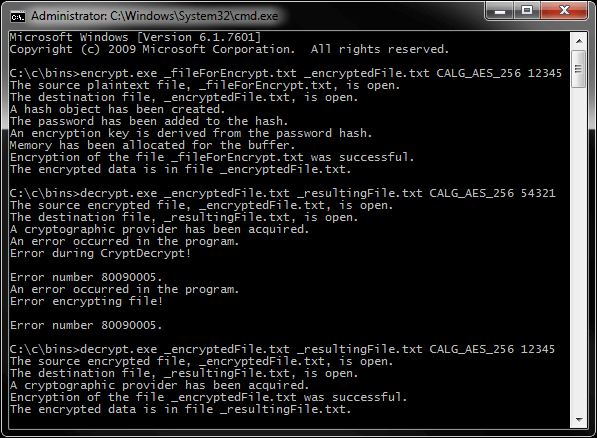
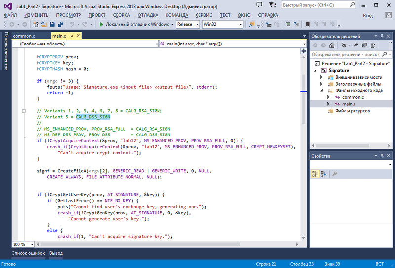
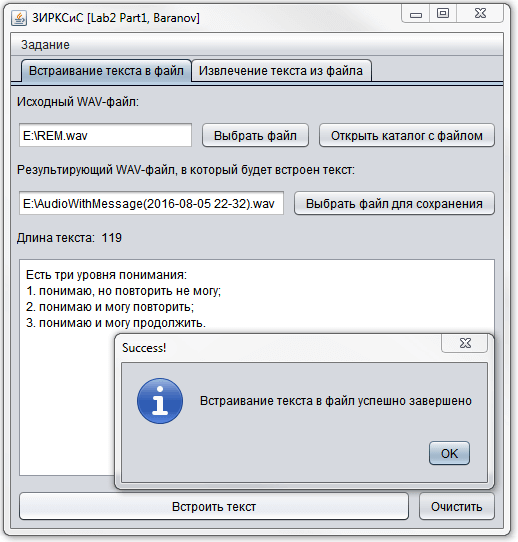
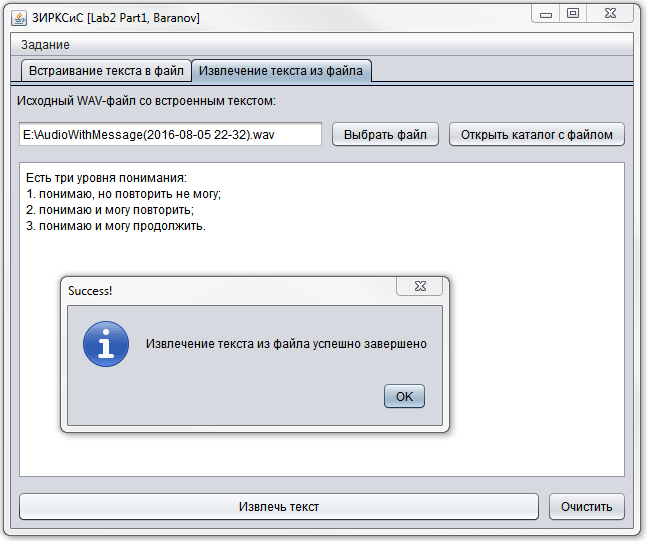
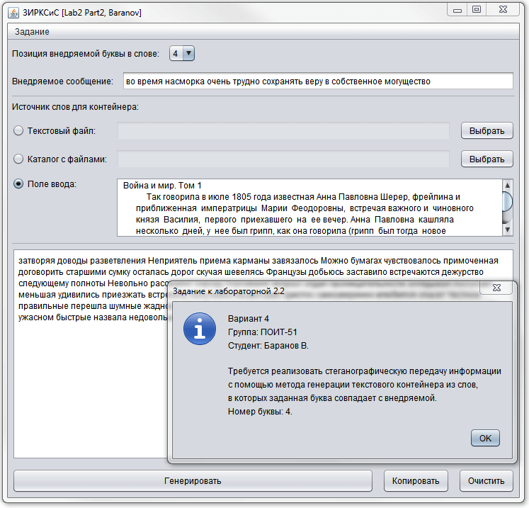
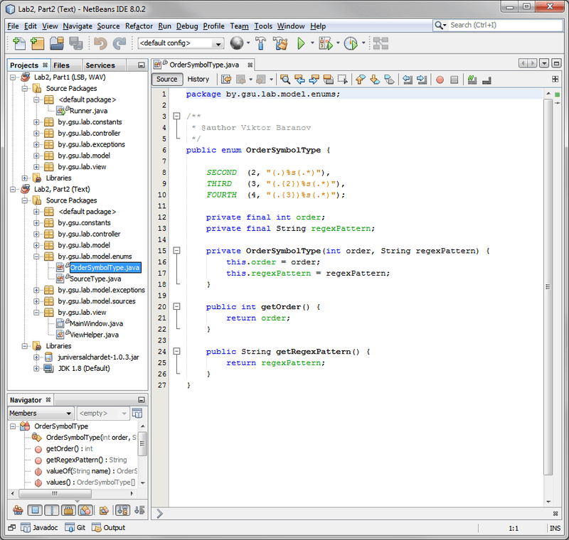

# Основы криптографии и стеганографии (C, Java)
[&lt; назад](../)  
<!--- *Прочтите это на другом языке:* *[~~English~~](README.en.md)*, **[Русский](README.md)**.  -->
Дисциплина: *Защита информационных ресурсов компьютерных систем и сетей*.  
Примеры проетов представлены для IDE Visual Studio 13 (Lab1.1, Lab1.2) и NetBeans 8 \[JDK8\] (Lab2.1, Lab2.2).

## Задания:
 * 1.Для реализации всех заданий используйте криптографические возможности, предоставляемые интерфейсом **Microsoft CryptoAPI**. Варианты заданий представлены в таблице.  
   * 1.1.Реализуйте программное средство защищенного обмена файлами. В функции программы входят шифрование и дешифрование файлов на дисках с помощью алгоритма симметричного шифрования ALG1. На вход программы подаются тип криптографической операции (шифрование/дешифрование), имя входного и выходного файлов и пароль. При выполнении шифрования на выходе получается зашифрованный файл, при выполнении дешифрования – файл, идентичный исходному (если введен правильный пароль).
   * 1.2.Реализуйте программное средство постановки электронной цифровой подписи для дисковых файлов с помощью соответствующего криптоалгоритма ALG2. На вход системы при постановке подписи подаются имя подписываемого файла и имя файла цифровой подписи, при проверке подписи входными данными являются имя подписанного файла и файла подписи, а также имя пользователя, подлинность подписи которого проверяется. В качестве алгоритма хеширования используйте криптоалгоритм ALG3.
   <table>
   <tr><th>Вариант</th><th>1</th><th>2</th><th>3</th><th>4</th></tr>
   <tr><td>ALG1</td><td>CALG_RC2</td><td>CALG_RC4</td><td>CALG_DES</td><td>CALG_3DES_112</td></tr>
   <tr><td>ALG2</td><td>CALG_RSA_SIGN</td><td>CALG_RSA_SIGN</td><td>CALG_RSA_SIGN</td><td>CALG_RSA_SIGN</td></tr>
   <tr><td>ALG3</td><td>CALG_MD2</td><td>CALG_SHA</td><td>CALG_MD5</td><td>CALG_SHA</td></tr>
   </table>
   <table>
   <tr><th>Вариант</th><th>5</th><th>6</th><th>7</th><th>9</th></tr>
   <tr><td>ALG1</td><td>CALG_3DES</td><td>CALG_AES_128</td><td>CALG_AES_192</td><td>CALG_AES_256</td></tr>
   <tr><td>ALG2</td><td>CALG_DSS_SIGN</td><td>CALG_RSA_SIGN</td><td>CALG_RSA_SIGN</td><td>CALG_RSA_SIGN</td></tr>
   <tr><td>ALG3</td><td>CALG_SHA</td><td>CALG_MD2</td><td>CALG_SHA</td><td>CALG_MD5</td></tr>
   </table>
 * 2.Стеганография.
   * 2.1.Реализуйте стеганографическое внедрение сообщений с помощью метода LSB в контейнеры заданного формата (колонка 2). Количество внедряемых в каждую позицию контейнера битов задано в колонке 3.
   * 2.2.Реализуйте стеганографическую передачу информации с помощью метода генерации текстового контейнера из слов, в которых заданная буква совпадает с внедряемой. Номер буквы задан в колонке 4.
   <table>
   <tr><th>Вариант</th><th>Формат контейнера LSB</th><th>Количество заменяемых битов</th><th>Позиция внедряемой буквы в слове</th></tr>
   <tr><td>1</td><td>графический</td><td>1</td><td>4</td></tr>
   <tr><td>2</td><td>аудио</td><td>2</td><td>3</td></tr>
   <tr><td>3</td><td>графический</td><td>3</td><td>2</td></tr>
   <tr><td>4</td><td>аудио</td><td>1</td><td>4</td></tr>
   <tr><td>5</td><td>графический</td><td>2</td><td>3</td></tr>
   <tr><td>6</td><td>аудио</td><td>3</td><td>2</td></tr>
   <tr><td>7</td><td>графический</td><td>1</td><td>3</td></tr>
   <tr><td>8</td><td>аудио</td><td>2</td><td>4</td></tr>
   </table>

## Описание решений:
 * 1.Исходники проектов представлены для IDE Visual Studio 13, на языке C, использованием Microsoft CryptoAPI.
   * 1.1.Лабораторная написана для всех вариантов - тип алгоритма шифрования передаётся в параметре коммандной строки.  
   Для шифрования используется запуск исполняемого файла с параметрами:  
   `encrypt.exe _fileForEncrypt.txt _newEncryptedFile.txt CALG_AES_256 pass` (Пароль - опционален).  
   Для запуска расшифровки:  
   `decrypt.exe _newEncryptedFile.txt _resultingDecryptedFile.txt CALG_AES_256 pass` (Пароль - опционален).
   * 1.2.Лабораторная написана для всех вариантов - криптоалгоритм цифровой подписи и криптоалгоритм хеширования изменяются в исходниках, в файлах **main.c** и **common.c** (Указано комментариями).  
   Для создания подписи *(_digitalSignature.dat)* файла *(_file.txt)* используется запуск исполняемого файла с параметрами:  
   `Signature.exe _file.txt _digitalSignature.dat`  
   Для верификации (проверки) подписи:  
   `Check.exe _file.txt _digitalSignature.dat`  

 Для упрощения ввода вышеперечисленных команд в *cmd*, в каталогах *Run-helpers* находятся bat-файлы.  
 Для работы bat-файлов требуется предварительно скомпилировать исполняемые файлы в типе сборке *Release*.
 * 2.Исходники проектов представлены для IDE NetBeans 8 (JDK8). Запуск в других Java IDE невозможен, так как для конструирования UI использовался визуальный конструктор интерфейса библиотеки Swing. Для вёрски элементов окон он создаёт файл с раширением form, который не поддерживается другими Java IDE.
   * 2.1.Согласно заданию, для 4 варианта требуется использовать *аудио-контейнер* с внедрением *1* бита в позиции контейнера. В качестве аудио-контейнера был выбран *wav*. Используемый стеганографический алгоритм неоптимальный, и корректно работает только с wav-сэмплами с [этой](http://websound.ru/test_samples_r.htm) страницы:  
    - Отрезок из Fool's Garden "Lemon Tree" (3554 Kb) (30 sec, 44.1/16/PCM WAV);  
    - Отрезок из R.E.M. "What's The Frequency, Kenneth" (1135 Kb) (9 sec, 44.1/16/PCM WAV).  
   При использвании дригих сэмплов возможна потеря качества звучания, либо полная порча звуковой дорожки.
   * 2.2.Лабораторная написана для всех вариантов - позиция внедряемой буквы в слове выбирается выпадающим списком в главном окне.  
   Для корректного чтения кодировок текстовых файлов используется библиотека [JUniversalCharDet 1.0.3](https://code.google.com/archive/p/juniversalchardet/downloads).  
   В приложении реализованы 3 возможных источника слов:  
    - Поле ввода в окне;  
    - Текстовый файл;  
    - Множество текстовых файлов в каталоге.  
   Если в качестве источника используется каталог с большим количеством текстовых файлов, возможен "эффект зависания" приложения, так как для парсинга слов используется сложная регулярка (Чем сложнее regex, тем медленнее выполняется):  
   `(-*'*[^\\pL\\w\\d'-]+-*'*)+`  
   Зато это выражение корректно работает с кириллицей и правильно распознаёт тире/апострофы "внутри" составных слов.  

 Сборка запускаемых jar-файлов из NetBeans: *Run &rarr; Clean and Build Project (Shift+F11)*.  
 При этом в каталоге *dist* генерируется jar, запускаемый двойным кликом в OC Windows (Если файловые ассоциации с jar не нарушены).

## Демонстрационные скриншоты:

