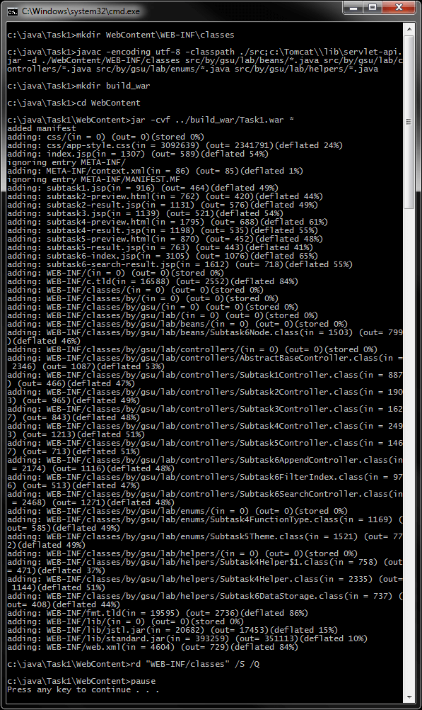
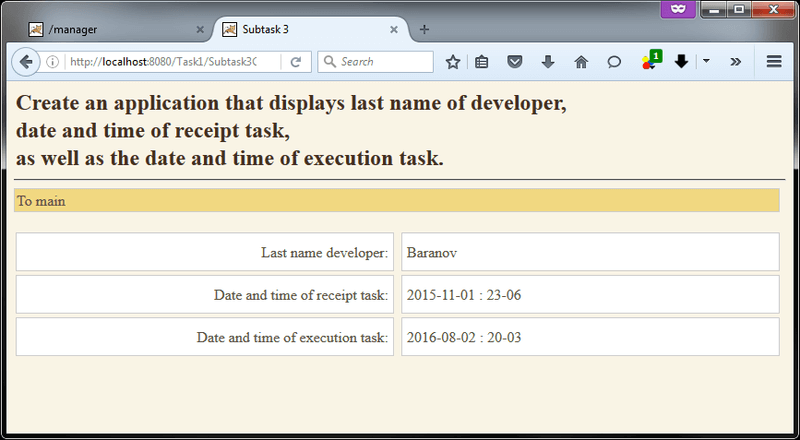
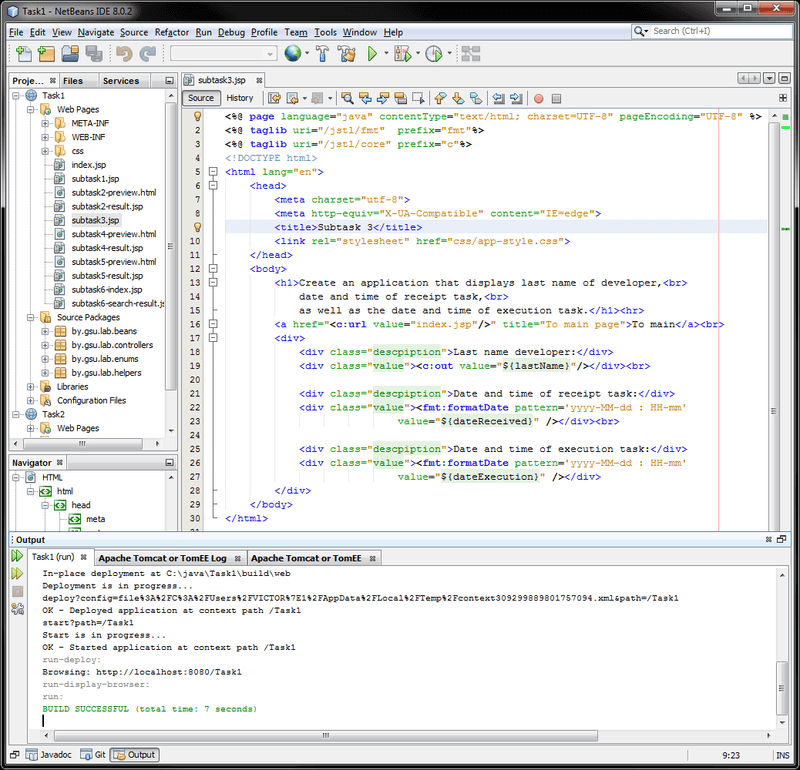
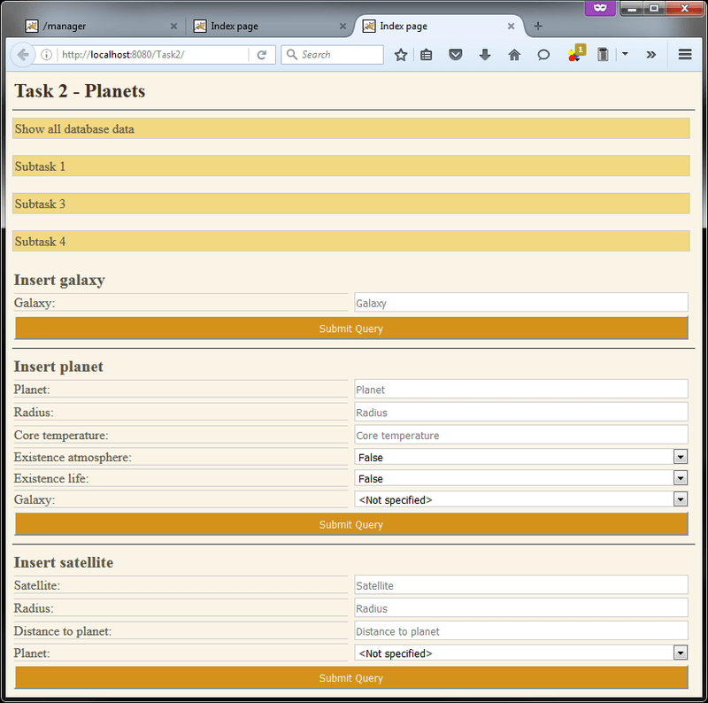
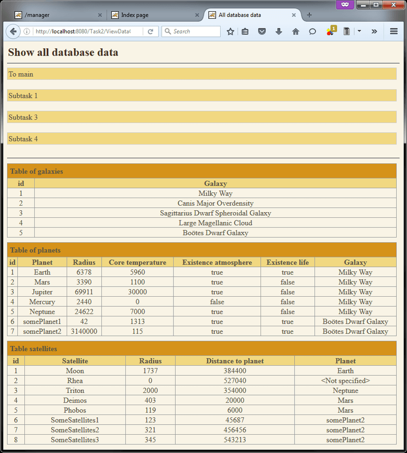
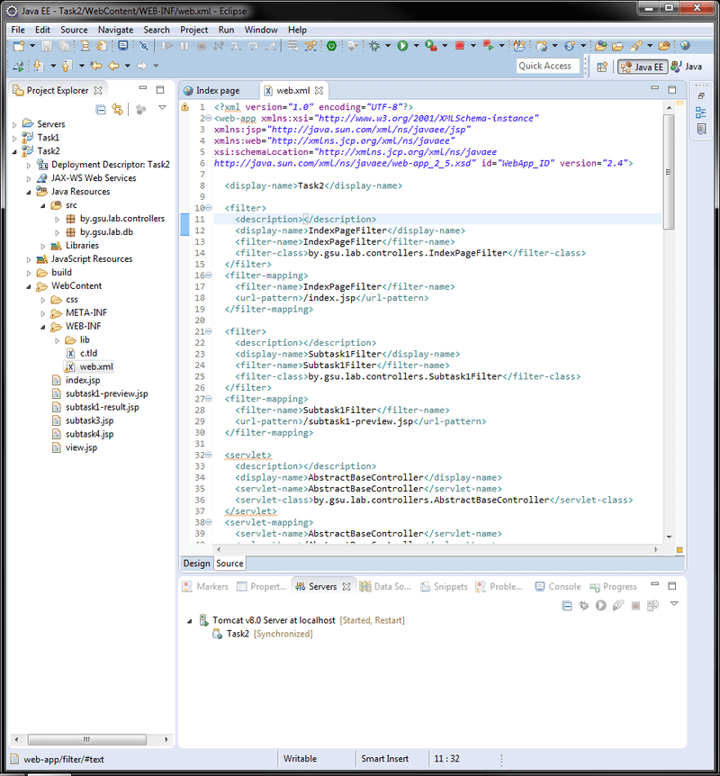
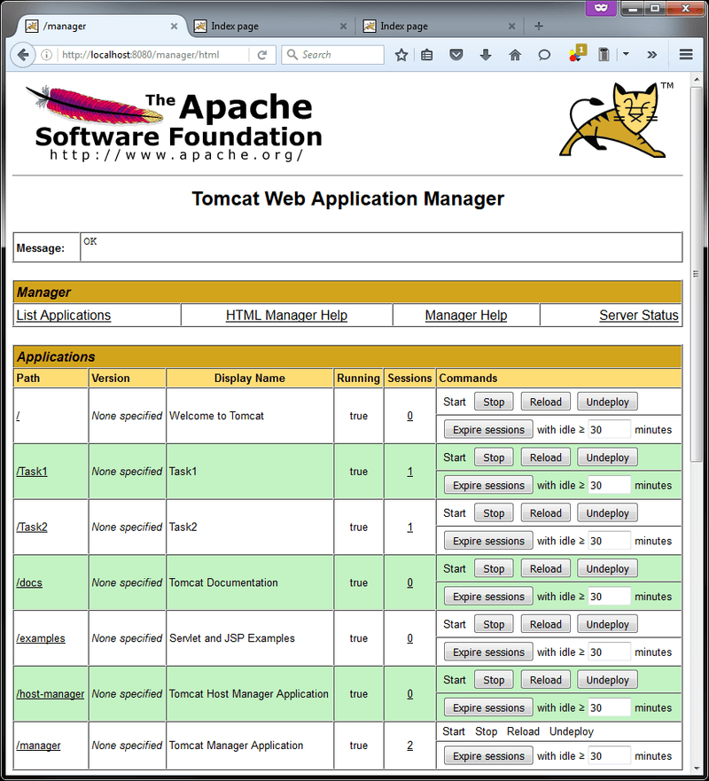

# Основы Java EE (Tomcat, Сервлеты, JSP, JDBC)
[&lt; назад](../)  
<!--- *Прочтите это на другом языке:* *[~~English~~](README.en.md)*, **[Русский](README.md)**.  -->
Дисциплина: *Разработка JEE приложений*.  
Примеры приложений предполагают запуск в JDK 8 и контейнере сервлетов Apache Tomcat 8.  
Также приложены инструкции по импорту и запуску приложения в IDE Eclipse и NetBeans.

## Задания:
 * 1. Создать динамический web-проект, который должен содержать совокупность сервлетов и jsp-страниц, выполняющих решение следующих задач (В файле index.html (или index.jsp) должно располагаться меню выбора задач со ссылками на соответствующие jsp-страницы):
   * 1.1.Вывести полное название страны и языка;
   * 1.2.Задать температуру. Если она меньше нуля, вывести значение температуры синим цветом, если больше, то красным;
   * 1.3.Создать приложение, выводящее фамилию разработчика, дату и время получения задания, а также дату и время его выполнения;
   * 1.4.Вычисление тригонометрических функций в градусах и радианах с указанной точностью. Выбор функций должен осуществляться через выпадающий список;
   * 1.5.Выбор изображения по тематике (природа, автомобили, дети и т.д.) и его отображение;
   * 1.6.**Телефонный справочник**. Таблица должна быть в текстовом виде и содержать Фамилию, Адрес, Номер телефона (разделители, например, “;”). Поиск должен производиться по части фамилии или по части номера. Результаты должны выводиться вместе с датой выполнения в JSP.
 * 2. Создать БД (MySQL). Привести таблицы к одной из нормированных форм. Создать динамический web-проект. Создать класс для выполнения запросов на извлечение информации из БД с использованием компилированных запросов (PreparedStatement). Создать класс на добавление информации. Создать класс, реализующий выбор задания и вывод результатов запросов.  
 **Предметная область**: Планеты.  
 В БД хранится информация о *планетах*, их *спутниках* и *галактиках*.  
 Для <b>планет</b> необходимо хранить:
 <ul>
 	<li>название;</li>
 	<li>радиус;</li>
 	<li>температуру ядра;</li>
 	<li>наличие атмосферы;</li>
 	<li>наличие жизни;</li>
 	<li>спутники.</li>
 </ul>
 Для <b>спутников</b> необходимо хранить:
 <ul>
 	<li>название;</li>
 	<li>радиус;</li>
 	<li>расстояние до планеты.</li>
 </ul>
 Для <b>галактик</b> необходимо хранить:
 <ul>
 	<li>название;</li>
 	<li>планеты.</li>
 </ul>
 <b>Запросы</b>:
 <ul>
 	<li>Вывести информацию обо всех планетах, на которых присутствует жизнь, и их спутниках в заданной галактике;</li>
 	<li>Вывести информацию о планетах и их спутниках, имеющих наименьший радиус и наибольшее количество спутников;</li>
 	<li>Вывести информацию о планете, галактике, в которой она находится, и ее спутниках, имеющей максимальное количество спутников, но с наименьшим общим объемом этих спутников;</li>
 	<li>Найти галактику, сумма ядерных температур планет которой наибольшая.</li>
 </ul>

## Компиляция/сборка приложений (war-архивов) в CMD:
Для Компиляции/сборки приложения в ОС требуется установленная JDK версии 8.  
В переменных окружения ОС должны быть прописаны пути к JDK (Для компиляции и запуска из CMD).  
Также, в переменных окружения должен быть прописан путь к каталогу контейнера Tomcat `CATALINA_HOME` и в `Path` добавлен `%CATALINA_HOME%\bin`.
Также, для второго задания, требуется установленная БД MySQL версии 5.1 или выше, либо доступ к удалённой БД MySQL. База данных, во время запуска приложений, должна быть создана из приложенных скриптов и запущена. Также нужно изменить логин/пароль/хост/порт подключения к БД в классе `DBConstants.java`.
* 1. Для компиляции и сборки приложения, в структуру каталогов следует добавить каталог для размещения скомпилированных java-классов. Структурой war-архивов указано, что каталог *classes* должен располагаться в каталоге *WEB-INF*. В *cmd* можно воспользоваться коммандой:  
`mkdir WebContent\WEB-INF\classes`  
* 2. При компиляции java-файлов в class-файлы, следует указать путь к библиотеке сервлетов из Tomcat (используется путь относительно *CATALINA_HOME*), а также пути к пакетам приложений.  
Для **Задания 1**:  
`javac -encoding utf-8 -classpath ./src;%CATALINA_HOME%\lib\servlet-api.jar -d ./WebContent/WEB-INF/classes src/by/gsu/lab/beans/*.java src/by/gsu/lab/controllers/*.java src/by/gsu/lab/enums/*.java src/by/gsu/lab/helpers/*.java`  
Для **Задания 2**:  
`javac -encoding utf-8 -classpath ./src;%CATALINA_HOME%\lib\servlet-api.jar -d ./WebContent/WEB-INF/classes src/by/gsu/lab/controllers/*.java src/by/gsu/lab/db/*.java`
* 3. Далее требуется собрать war-архив. Для этого из каталога *WebContent* запускаем комманду:  
`jar -cvf Task1.war *` (Для **Задания 1**)  
`jar -cvf Task2.war *` (Для **Задания 2**)

Для упрощения ввода вышеперечисленных команд в *cmd*, в корне каталогов с проектами находится<br>скрипт *compile and build.bat*.

## Развёртывание war-архивов в контейнере Tomcat:
Для развёртывания приложений в Apache Tomcat есть 2 пути: ручное копирование war-архива, либо использование *Tomcat Web Application Manager* (более гибкое решение).  
* 1. Ручное копирование war: просто скопировать сгенерированный war в `%CATALINA_HOME%\webapps\`.  
Если Tomcat в данный момент запущен, то через пару секунд он сам должен развернуть веб-приложение из архива. При этом он создаст одноимённые папки в `%CATALINA_HOME%\webapps\` для размещения приложения и в `%CATALINA_HOME%\work\Catalina\localhost\` для размещения скомпилированных jsp. Также Tomcat может создать конфигурационный xml-файл в `%CATALINA_HOME%\conf\Catalina\localhost\`.  
Если Tomcat в данный момент не запущен, то он совершит вышеуказанные действия при последующем запуске.  
Приложения будут доступны по адресам:  
`http://localhost:8080/Task1/` (Для **Задания 1**)  
`http://localhost:8080/Task2/` (Для **Задания 2**)  
В случае, если потребуется развёртывание изменённой версии приложения, то нужно лишь заменить war-архив в `%CATALINA_HOME%\webapps\` - через пару секунд Tomcat развернёт новую версию.  
В случае, если нужно удалить веб-приложение из контейнера, нужно удалить этот war-архив и одноимённую папку, папку со скомпилированными jsp и конфигурационный файл.
* 2. Развёртывание через *Tomcat Web Application Manager*: для использования этого способа в Apache Tomcat 8 требует пользователь с ролью *manager-gui*.
  * 2.1. Для того, чтобы создать пользователя (либо узнать логин/пароль) нужно открыть файл `%CATALINA_HOME%\conf\tomcat-users.xml`. Если в файле нет пользователя с такой ролью, можно добавить и перезапустить контейнер:  
  `<user username="admin" password="12345" roles="manager-gui" />`
  * 2.2. Теперь нужно авторизоваться в системе.  
  Переходим по адресу *http://localhost:8080/*, кликаем *Manager App* и вводим логин/пароль.
  * 2.3. На вкладке *Deploy* выбираем нужный war-архив и нажимаем *deploy* - приложение спустя пару секунд должно развернуться и появиться в таблице *Applications*. Также в этой таблице присутсвуют ссылка на развёрнутое приложение, текущий статус, указание количества активных сессий и комманды управления приложением: *Start/Stop*, *Reload*, *Undeploy*.

Для упрощения ручного копирования, в корне каталогов с проектами находятся скрипты *deploy.bat* и *undeploy.bat*.

## Импорт и запуск проектов в IDE
Для импорта и запуска проекта в IDE также должны быть установлены JDK/JRE. Для второго задания должен быть доступ к MySQL, а базы данных должны быть созданы и запущены. Также нужно изменить логин/пароль/хост/порт подключения к БД в классе `DBConstants.java`.  
* **Eclipse**.
  * 1.Если в IDE не указана ссылка на контейнер, нужно *добавить* Tomcat в Eclipse. Для этого:
    * 1.1.Переключить перспективу на Java EE: *Window &rarr; Perspective &rarr; Open perspective &rarr; Other &rarr; Java EE*.
    * 1.2.Перейти на вкладку *Servers*: *Window &rarr; Show View &rarr; Servers*.
    * 1.3.Кликнуть по ссылке *No server are available*, выбрать нужную версию Tomcat и указать путь к нему.
  * 2.Создать новый *Dynamic Web Project*: *File &rarr; New &rarr; Other &rarr; Web &rarr; Dynamic Web Project*.
  * 3.Импортировать исходники в созданный проект: *File &rarr; Import &rarr; General &rarr; File System*.  
  Требуется указать только каталоги *src* и *WebContent*.
  * 4.Для запуска проекта Tomcat не должен быть запущен, так как его запуск осуществляет IDE.  
  Кликаем *RunAs &rarr; Run on Server* и приложение запускается.  
  Управление сервером и приложением на сервере осуществляется из вкладки *Servers*.  
  В случае, когда запуск осуществляется вышеуказанным способом, приложение развёртывается не в каталоге Tomcat'а, а в воркспэйсе Eclipse и приложение не будет доступно после завершения работы IDE. 
  * 5.Также можно собрать war-архив через IDE и развернуть его в самостоятельно.  
  Для сборки war-архива: *Export &rarr; WAR file*.  
  Развёртывание war-архива в контейнере Tomcat описано выше в соответсвующем разделе.
* **NetBeans**.  
  * 1.Если в IDE не указана ссылка на контейнер, нужно *добавить* Tomcat в NetBeans.  
  Для этого: *Tools &rarr; Servers &rarr; Add Server...*  
  Затем выбрать нужную версию Tomcat и указать путь к нему.
  * 2.Создать новый Web Application проект из существующих исходников:  
  *File &rarr; New Project &rarr; Java Web &rarr; Web Application With Exiting Sources*  
  Затем нужно указать путь в корневой каталог проекта - IDE автоматичеки распознает структуру каталогов.
  * 3.Для запуска проекта Tomcat не должен быть запущен, так как его запуск осуществляет IDE.  
  В случае, когда запуск осуществляется из IDE, приложение развёртывается не в каталоге Tomcat'а, и приложение не будет доступно после завершения работы IDE.  
  * 4.Также можно собрать war-архив через IDE и развернуть его в самостоятельно.  
  Для сборки war-архива: *Run &rarr; Clean and Build Project (Shift+F11)*.  
  При этом в каталоге проекта *dist* создаётся war.  
  Развёртывание war-архива в контейнере Tomcat описано выше в соответсвующем разделе.

  В некоторых версиях Tomcat есть ошибка в конфигурационном файле, которая приводит к невозможности запуска сервера из NetBeans с ошибкой:  
  `'127.0.0.1*' is not recognized as an internal or external command`  
  Решение проблемы: в файле *%CATALINA_HOME%\bin\catalina.bat* убрать двойные кавычки из строк:  
  ```
  :noJuliConfig
  set "JAVA_OPTS=%JAVA_OPTS% %LOGGING_CONFIG%"
  
  :noJuliManager
  set "JAVA_OPTS=%JAVA_OPTS% %LOGGING_MANAGER%"
  ```
  Описание дефекта (Tomcat): https://bz.apache.org/bugzilla/show_bug.cgi?id=56895  
  Описание дефекта (NetBeans): https://netbeans.org/bugzilla/show_bug.cgi?id=248182  
  Описание решения: https://stackoverflow.com/questions/26485487/error-starting-tomcat-from-netbeans-127-0-0-1-is-not-recognized-as-an-inter

## Демонстрационные скриншоты:








