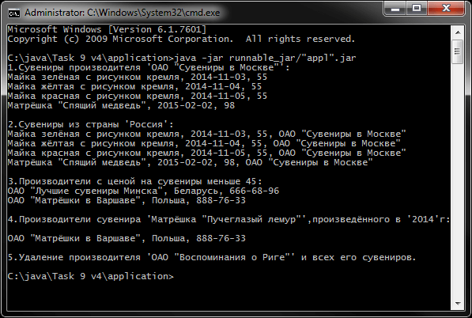

# Основы Java SE (Math, Collection, JDBC)
[&lt; назад](../)  
<!--- *Прочтите это на другом языке:* *[~~English~~](README.en.md)*, **[Русский](README.md)**.  -->
Дисциплина: *Введение в Java EE*.  
Примеры приложений предполагают запуск в JDK 7 и выше.  
Также приложены инструкции по импорту и запуску приложения в IDE Eclipse, NetBeans и IDEA.

## Задания:
 * 1.*Форматирование строк*. Разработать консольное приложение для чтения небольшого набора входных данных, форматирования этих данных удобным для чтения образом и отображения отформатированных результатов. Данные представляют собой текст, содержащий пары чисел, представляющие x и y-координаты месторасположения объекта. Каждая строка текста содержит один набор координат.  
 Пример входных данных:  
 *&nbsp;&nbsp;&nbsp;&nbsp;23.8976,12.3218  
 &nbsp;&nbsp;&nbsp;&nbsp;25.7639,11.9463  
 &nbsp;&nbsp;&nbsp;&nbsp;24.8293,12.2134*  
 Результат:  
 *&nbsp;&nbsp;&nbsp;&nbsp;X: 23,8976 Y: 12,3218  
 &nbsp;&nbsp;&nbsp;&nbsp;X: 25,7639 Y: 11,9463  
 &nbsp;&nbsp;&nbsp;&nbsp;X: 24,8293 Y: 12,2134*
 * 2.*Массивы*. Написать программу, которая удаляет все элементы, большие 5 из целочисленного массива, и при этом подсчитывает их количество.
 * 3.*Math*. Разработать тип, позволяющий вычислить корень n-ой степени из числа методом Ньютона с заданной точностью. Предусмотреть возможность сравнения полученного результата со значением рассчитываемом с помощью java.
 * 4.*Math*. Разработать тип, реализующий алгоритм Евклида для вычисления НОД двух целых чисел.  
 Добавить к разработанному типу дополнительную функциональность в виде перегруженных методов вычисления НОД для трёх, четырёх или пяти целых чисел.  
 Добавить к разработанному типу метод, реализующий алгоритм Штейна (бинарный алгоритм Евклида) для расчёта НОД двух целых чисел. Метод должен принимать выходной параметр, содержащий значение времени, необходимое 
 для выполнения расчётов.
 * 5.*Math*. Разработать класс треугольник для работы с треугольником, заданным на плоскости сторонами a, b, c. Предусмотреть возможность проверки существования треугольника, реализовать функции подсчёта его площади и периметра.
 * 6.*Math*. Разработать класс «вектор» для работы с трехмерными векторами. Перегрузить для класса операции, допустимые для работы с трехмерными векторами.
 * 7.*Math*. Разработать класс «многочлен» для работы с многочленами от одной переменной. Перегрузить для класса операции, допустимые для работы с многочленами.
 * 8.*Коллекции*. Исходные данные следует считывать из текстового файла (формат записей произвольный). Результаты выводить на консоль.  
 <table><tr><th>Вариант</th><th>Задание</th></tr><tr><td>2</td><td>Ввести число, занести его цифры в стек. Вывести число, у которого цифры идут в обратном порядке</td></tr><tr><td>3</td><td>Определить множество на основе множества целых чисел. Создать методы для определения пересечения и объединения множеств</td></tr><tr><td>8</td><td>Ввести строки из файла, записать в список ArrayList. Выполнить сортировку строк, используя метод sort() из класса Collections</td></tr><tr><td>12</td><td>Во входном файле хранятся наименования некоторых объектов. Построить список C1, элементы которого содержат наименованияи шифры данных объектов, причем элементы списка должны быть упорядочены по возрастанию шифров. Затем "сжать" список C1, удаляя дублирующие наименования объектов</td></tr></table>

 * 9.*JDBC*. Спроектировать базу данных модели в соответствии с вариантом. Можно использовать БД MySQL.  

 **Вариант**: 4.  
 **Предметная область**: Сувениры.  
 В БД хранится информация о *сувенирах* и их *производителях*.  
 Для **сувениров** необходимо хранить: название, реквизиты производителя, дату выпуска, цену.  
 Для **производителей** необходимо хранить: название, страну.  
 Запросы:

 <ul>
  	<li>Вывести информацию о сувенирах заданного производителя.</li>
  	<li>Вывести информацию о сувенирах, произведенных в заданной стране.</li>
  	<li>Вывести информацию о производителях, чьи цены на сувениры меньше заданной.</li>
  	<li>Вывести информацию о производителях заданного сувенира, произведенного в заданном году.</li>
  	<li>Удалить заданного производителя и его сувениры.</li>
 </ul>

 **Вариант**: 7.  
 **Предметная область**: Погода.  
 В БД хранится информация о *погоде* в различных *регионах*.  
 Для **погоды** необходимо хранить: регион, дату, температуру, осадки.  
 Для **регионов** необходимо хранить: название, площадь, тип жителей.  
 Для **типов жителей** необходимо хранить: название, язык общения.  
 Запросы:
 <ul>
  	<li>Вывести сведения о погоде в заданном регионе.</li>
  	<li>Вывести даты, когда в заданном регионе шел снег и температура была ниже заданной отрицательной.</li>
  	<li>Вывести информацию о погоде за прошедшую неделю в регионах, жители которых общаются на заданном языке.</li>
  	<li>Вывести среднюю температуру за прошедшую неделю в регионах с площадью больше заданной.</li>
 </ul>

 **Вариант**: 11.  
 **Предметная область**: Точки.  
 В БД хранится некоторое конечное множество точек с их координатами.  
 Запросы:
 <ul>
  	<li>Вывести точку из множества, наиболее приближенную к заданной.</li>
  	<li>Вывести точку из множества, наиболее удаленную от заданной.</li>
  	<li>Вывести точки из множества, лежащие на одной прямой с заданной прямой.</li>
 </ul>

 **Вариант**: 13.  
 **Предметная область**: Словарь.  
 В БД хранится англо-русский словарь, в котором для одного английского слова может быть указано несколько его значений и наоборот. Со стороны клиента вводятся последовательно английские (русские) слова. Для каждого из них вывести на консоль все русские (английские) значения слова.

## Описание решения заданий по JDBC:
В задании по JDBC, в качестве БД выбрана MySQL. В каталогах с проектами размещены папки *db-scripts*, в которых находятся скрипты создания таблиц и запросов указаных в заданиях. Для подключения к БД требуется указать нужные константы (логин, пароль, порт и хост БД) в классе `DBConstants.java`.

## Компиляция и запуск приложения в CMD:
Для запуска приложения в ОС требуется установленная JDK версии 7 или выше.  
В переменных окружения ОС должны быть прописаны пути к JDK (Для компиляции и запуска из CMD).  
Также, для задания по JDBC, требуется установленная БД MySQL версии 5.1 или выше, либо доступ к удалённой БД MySQL. База данных, во время запуска приложений, должна быть создана из приложенных скриптов и запущена.
* 1. Для компиляции java-файлов в class-файлы в *cmd*:  
`javac -encoding utf-8 -classpath ./src -d ./src src/Runner.java`
* 2. Далее, для запуска, есть 2 пути: запуск скомпилированных class-файлов "как есть", либо предварительная сборка class-файлов в "запускаемый" jar-архив и запуск через него.
  * 2.1. *Запуск class-файлов "как есть"*: для этого в *cmd* нужно воспользоваться командой:  
  `java -classpath ./src; Runner`  
  Если осуществяется запук задания по JDBC нужно воспользоваться командой (с указанием драйвера БД):  
  `java -classpath ./src;./libs/com.mysql.jdbc_5.1.5.jar Runner`
  * 2.2. *Сборка запускаемого jar*:  
    * 2.2.1. Упаковка jar-файла осуществляется коммандой:  
    `jar cvmf manifest.mf filename.jar -C ./src .`
    * 2.2.2. Запуск созданного jar-файла осуществляется коммандой:  
    `java -jar "filename".jar`

Для упрощения ввода вышеперечисленных команд в *cmd*, в корне каталогов с проектами находятся скрипты *compile and run.bat*.

## Импорт и запуск проекта в IDE
Для импорта и запуска проекта в IDE также должны быть установлены JDK/JRE. В задании по JDBC должен быть доступ к MySQL, а базы данных должны быть созданы и запущены. Также нужно изменить логин/пароль/хост/порт подключения к БД в классе `DBConstants.java`.  
* **Eclipse**.  
  * 1. В случае с задачей по JDBC, исходные java-файлы представлены в кодировке UTF-8 без BOM, так как требуются строковые литералы на русском языке. Русские символы в этой кодировке поддерживается IDE NetBeans и IDEA, но неподдерживаются IDE Eclipse. Поэтому требуется предварительно перекодировать java-файлы в UTF-8 с BOM с помощью строннего текстового редактора, например AkellaPad.
  * 2. Создать новый Java SE проект: *File &rarr; New &rarr; Java Project*.
  * 3. Импортировать исходники в созданный проект: *File &rarr; Import &rarr; General &rarr; File System*.  
  Требуется указать каталог *src* и проигнорировать файл манифеста и батник.  
  В случае запуска задания по JDBC, также требуется указать при импорте каталог *lib*.
  * 4. В случае запуска задания по JDBC, требуется указать в свойствах проекта путь к драйверу БД:  
  *File &rarr; Properties &rarr; Java Build Path &rarr; Libraries &rarr; Add JARs &rarr; libs/com.mysql.jdbc_5.1.5.jar*  
  При этом ссылка на драйвер БД появляется во вкладке проекта *Referenced Libraries и приложение готово к запуску.
* **NetBeans**.
  * 1. Создать новый Java проект из существующих исходников:  
  *File &rarr; New Project &rarr; Java &rarr; Java Project With Exiting Sources*  
  Затем нужно указать путь в каталог *src* проекта: *Exiting Sources &rarr; Source Package Folders &rarr; Add Folder*  
  Эта IDE не корректно распознаёт структуру каталогов, и может сделать корневым пакетом *src*, поэтому указывать нужно именно на java-файлы **внутри** *src*. В случае, если это не задание по JDBC, приложение готово к запуску.
  * 2. Если это задание по JDBC:
    * 2.1. Если в каталоге созданного нет каталога *lib* - то создать его и  
    вручную скопировать в него файл драйвера *libs/com.mysql.jdbc_5.1.5.jar*
    * 2.2. Требуется указать в свойствах проекта путь к скопированному драйверу БД:  
    *Проект &rarr; Properties &rarr; Libraries &rarr; Compile &rarr; Add JAR/Folder &rarr; Relative Path &rarr; lib/com.mysql.jdbc_5.1.5.jar*  
    При этом ссылка на драйвер БД появляется во вкладке проекта *Libraries* и приложение готово к запуску.
* **IntelliJ IDEA**.
  * 1. Импорт проекта - при запуске IDE:  
  *Import Project &rarr; Указать путь к проекту &rarr; Create project from exiting sources*  
  В случае, если это задание по JDBC, драйвер БД IDE находит автоматически, однако его нужно вручную добавить в зависимости.
  * 2. В задании по JDBC, нужно указать драйвер БД в зависимостях:  
  *File &rarr; Project Structure &rarr; Modules &rarr; Dependecies &rarr; + &rarr; Library &rarr; Add Selected*  
  При этом ссылка на драйвер БД появляется в *Dependecies* и приложение готово к запуску.

## Демонстрационные скриншоты:

