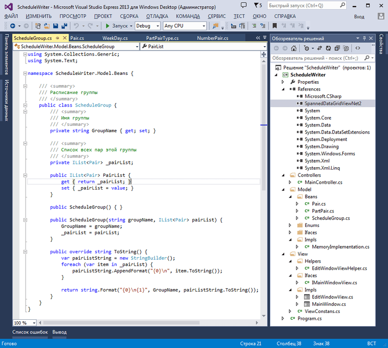

# Производственная технологическая практика (C#, WinForms, MVC)
[&lt; назад](../)  
<!--- *Прочтите это на другом языке:* *[~~English~~](README.en.md)*, **[Русский](README.md)**.  -->
Исходный код проекта предполагает запуск в IDE Visual Studio 13.  
Работоспособность исходников в других IDE не проверялась.

## Задача:
Разработать программное средство составления студенческого расписания занятий на платформе Windows. Для создания пользовательского интерфейса использовать элементы управления Windows Forms.
В качестве основы для разработки приложения использовать mvc-подход, позволяющий разделить функциональность отдельных архитектурных частей и обеспечить слабую связанность между ними.

## Описание решения:  
Ввиду отсутсвия в платформе .Net визуального компонента с возможностью создания спанов ячеек таблицы, использована open-source библиотека [SpannedDataGridView](https://github.com/Slike9/SpannedDataGridView)

### Слои приложения:
В ходе выполнения задания производственной практики были разработаны и реализованы три слоя архитектуры приложения: модель, представление и контроллер.  
Слой модели включает в себя объектную иерархию сущностей предметной области, интерфейс для работы с моделью и реализацию этого интерфейса, классы перечислений для указания различных состояний и полей классов сущностей.  
Слой представления состоит из интерфейса главного для работы со слоем, который реализуется в классе главного окна приложения, класса окна редактирования, а также класса helper'а с методами обработки логики окна.  
Слой контроллера представляет собой класс, связывающий слой модели и представления. Запросы данных модели из представления осуществляются посредством методов класса контроллера, что обеспечивает слабую связность слоёв.
### Пользовательские элементы управления:
Пользовательские элементы управления состоят из главного окна приложения и окна редактирования записи.  
Главное окно представляет расписание в табличной форме. При наведении мыши на ячейки таблицы появляется динамическая панель с кнопками управления записью: добавление/редактирование, копирование, вставка и удаление. Функции  и состояние кнопок панели изменяются для каждой ячейки: для пустых ячеек доступны только добавление и вставка, для заполненных редактирование, копирование, вставка и удаление.  

  

Окно редактирования записи состоит из 9 кнопок с  типом учебной пары, кнопок "Назад", "Сохранить" и меток дня недели и редактируемой пары.  

  

При нажатии на кнопки типа пары появляется панель с полями ввода "Предмет", "Аудитория", "Лектор 1", "Лектор 2" и кнопки отмены.  

  

Размер и место расположения панели уникальный для каждой из кнопок типа. Так как расписание одной пары может быть составленным из нескольких подгрупп и/или с учётом чётности недели, некоторые кнопки панели скрываются, а некоторые нет.  
  
  
  

