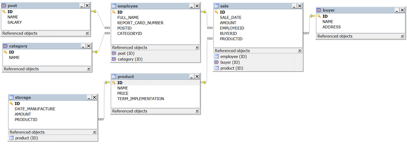
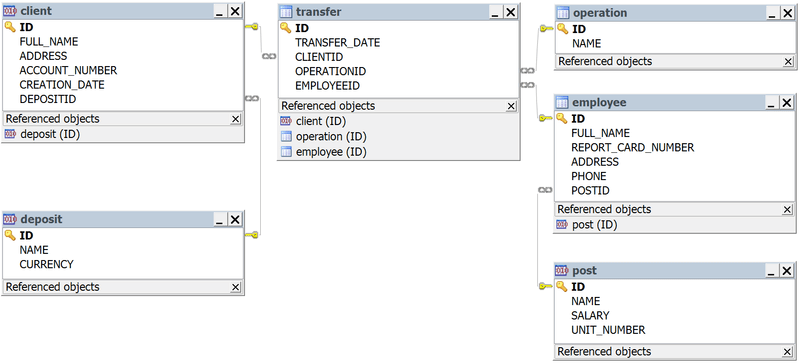
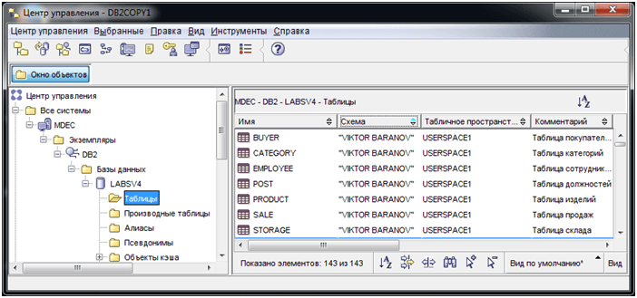
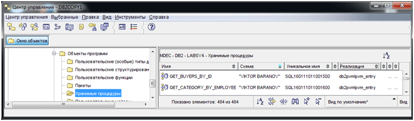
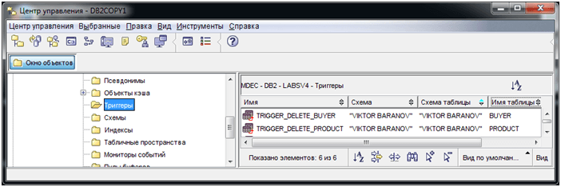
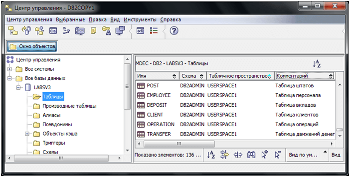
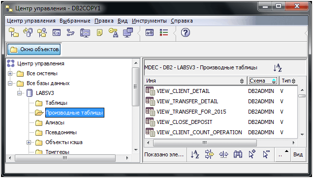

# Основы DB2
[&lt; назад](../)  
<!--- *Прочтите это на другом языке:* *[~~English~~](README.en.md)*, **[Русский](README.md)**.  -->
Дисциплина: *СУБД DB2*.  
Примеры скриптов предполагают запуск в базе данных DB2 9.7.  
Работоспособность скриптов в других БД не проверялась.

## Задания:
* 1.Разработать, создать и заполнить таблицы данных для своей предметной области (не менее 5 таблиц).
* 2.Разработать различного вида запросы (не менее 6): с условиями для выборки данных, с группировкой данных, вычисляемыми полями, с подзапросами.
* 3.Создать не менее 5 производных таблиц на основе разработанных запросов.
* 4.Создать 2-3 триггера.
* 5.Создать 1-2 хранимые процедуры.
* 6.Создать sql-файлы, содержащий запросы удаления, создания и заполнения таблиц, создание производных таблиц, триггеров, хранимых процедур с иллюстрацией их работы с помощью соответствующих запросов.  
Запускать sql-файл в центре команд.

<table>
<tr><th>Вариант</th><th>Предметная область</th><th>Информационные объекты</th></tr>
<tr>
<td>4</td><td>Отдел сбыта предприятия</td>
	<td><b>Изделие</b> (Код изделия, Наименование, Цена, Срок реализации) 
	<b>Склад</b> (Код поступления, Код изделия, Дата изготовления, Количество) 
	<b>Сотрудники отдела</b> (Табельный номер сотрудника, ФИО, Код должности, Код категории) 
	<b>Должности</b> (Код должности, Название, Оклад) 
	<b>Категория</b> (Код категории, Название) 
	<b>Покупатели</b> (Код покупателя, Название, Адрес) 
	<b>Продажа</b> (Код продажи, Дата продажи, Код покупателя, Код изделия, Количество, Код сотрудника)
	</td>
</tr>
<tr>
<td>3</td><td>Банк</td>
	<td><b>Штаты</b> (Код должности, Должность, Оклад, Количество должностных единиц) 
	<b>Персонал</b> (Табельный  номер  сотрудника,  ФИО,  Код  должности, Адрес, Телефон) 
	<b>Вклады</b> (Код вида вклада, название, Вид валюты) 
	<b>Клиенты</b> (Номер счета, ФИО, Адрес, Вид вклада, Дата создания) 
	<b>Операции</b> (Код операции, Наименование) 
	<b>Движение денег</b> (Номер движения, Номер счета, Код операции, Дата, Табельный номер сотрудника)
	</td>
</tr>
</table>

*Дополнительно*:  
Свободно распространяемые дистрибутивы DB2 9.7: [ссылка](https://cloud.mail.ru/public/ryL5pvaB9vfw/db2).  
Установка продукта: [ссылка](http://www.xcarecrows.com/eclipse/doc/Xcarecrows4SMV/current_version/html/installationGuide/IBM%20Tools%20installation%20-%20DB2.html).

## Схемы связей таблиц:

**Вариант 4 - Отдел сбыта предприятия**:  

  

**Вариант 3 - Банк**:  

## Демонстрационные скриншоты:

  
  
  
  

