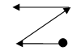
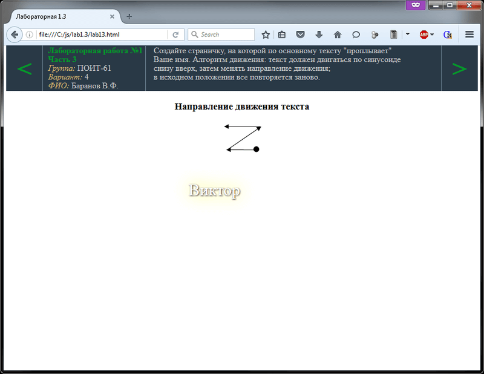
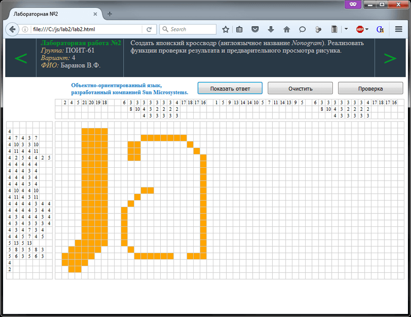
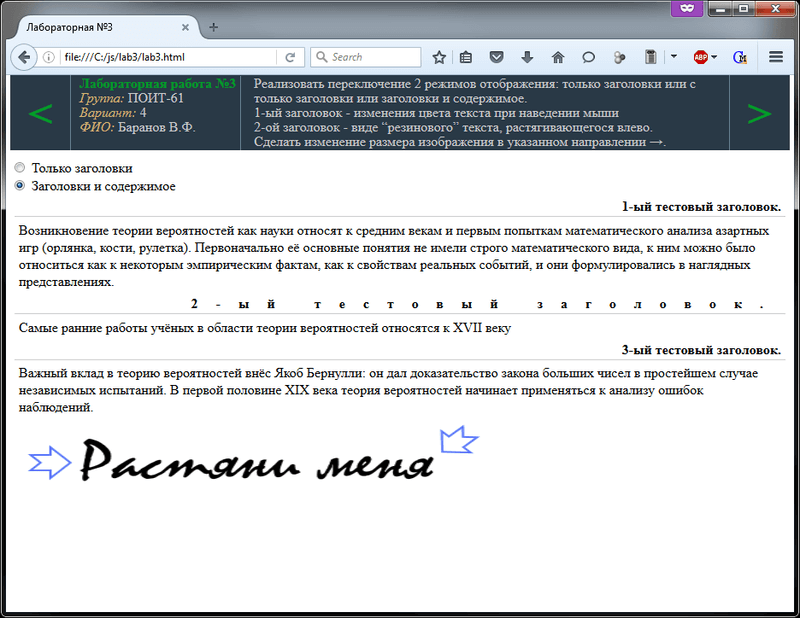
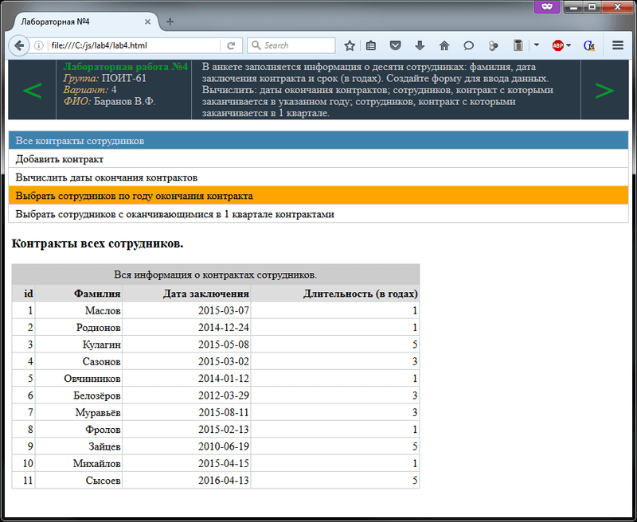
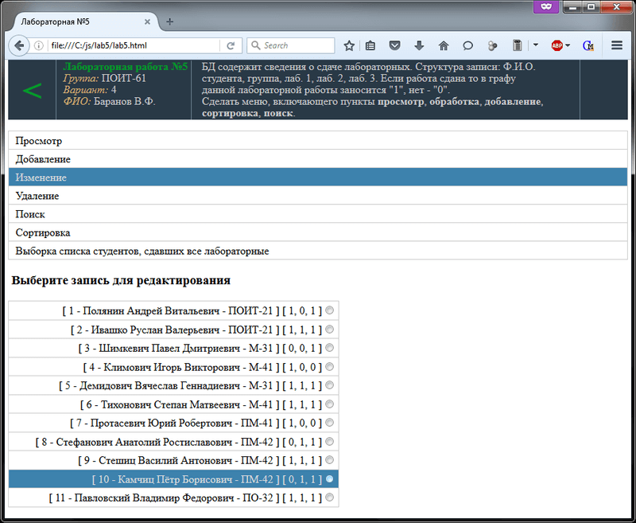

# Основы JS
[&lt; назад](../)  
<!--- *Прочтите это на другом языке:* *[~~English~~](README.en.md)*, **[Русский](README.md)**.  -->
Дисциплина: *Скриптовый язык Java Script*.

## Задания:
* 1.*Обработка событий*.
  * 1.1.Создайте страничку, на которой по основному тексту "проплывает" Ваше имя.  
  Алгоритм движения: текст двигается по заданной траектории; через некоторое время текст "скачком" возвращается в исходное положение и все повторяется.  
  
  * 1.2.Создайте страничку, на которой по основному тексту "проплывает" Ваше имя.  
  Алгоритм движения: текст начинает двигаться по заданной траектории; через некоторое время текст меняет направление движения, доходит до исходного положения и все повторяется.
  * 1.3.Создайте страничку, на которой по основному тексту "проплывает" Ваше имя.  
  Алгоритм движения: текст должен двигаться по синусоиде снизу вверх, затем менять направление движения; в исходном положении все повторяется заново.
  * 1.4.Создайте страничку, на которой "Ваше имя" убегает от курсора мыши.
* 2.*Японский кроссворд*.
* 3.*Динамические стили и анимация*.  
Создать сайт, в котором реализовать возможность переключения между двумя режимами отображения документа (только заголовки или заголовки и содержимое).  
 - Предусмотреть возможность изменения цвета текста при наведении указателя мыши на первый заголовок.  
 - Второй заголовок реализовать в виде “резинового” текста, растягивающегося влево.  
 - Реализовать возможность изменения размера изображения в указанном направлении &rarr;.
* 4.*Даты*.  
В анкете заполняется информация о десяти сотрудниках: фамилия, дата заключения контракта и срок (в годах), на какой заключен контракт. Создайте форму для ввода данных.  
Напишите сценарий, определяющий:  
 - дату окончания контракта;  
 - сотрудников, контракт c которыми заканчивается в определенном году (год выбирается пользователем);  
 - сотрудников, контракт с которыми заканчивается в 1 квартале.
* 5.*Пользовательские объекты*.  
Запись содержит сведения о сдаче лабораторных работ.  
Структура записи:  
 - Ф.И.О. студента;  
 - группа;  
 - Лаб. 1;  
 - Лаб. 2;  
 - Лаб. 3.  
Если работа сдана то в графу данной лабораторной работы заносится "1", нет - "0".  
Распечатать список студентов сдавших все лабораторные работы.

## Демонстрационные скриншоты:

  
  
  
  

