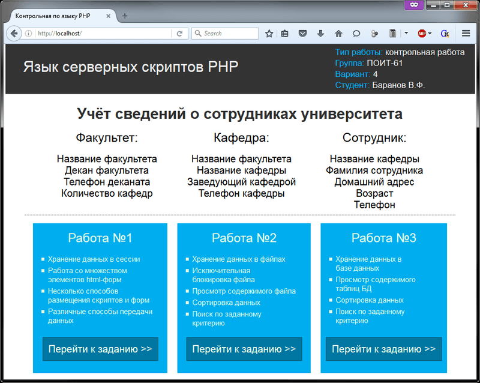
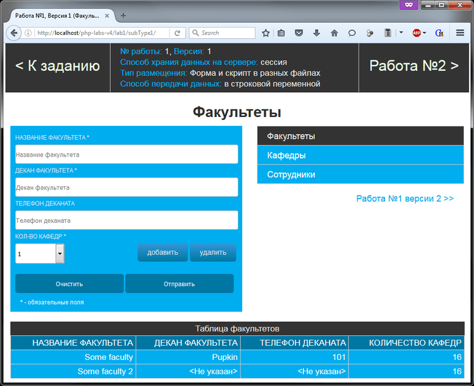
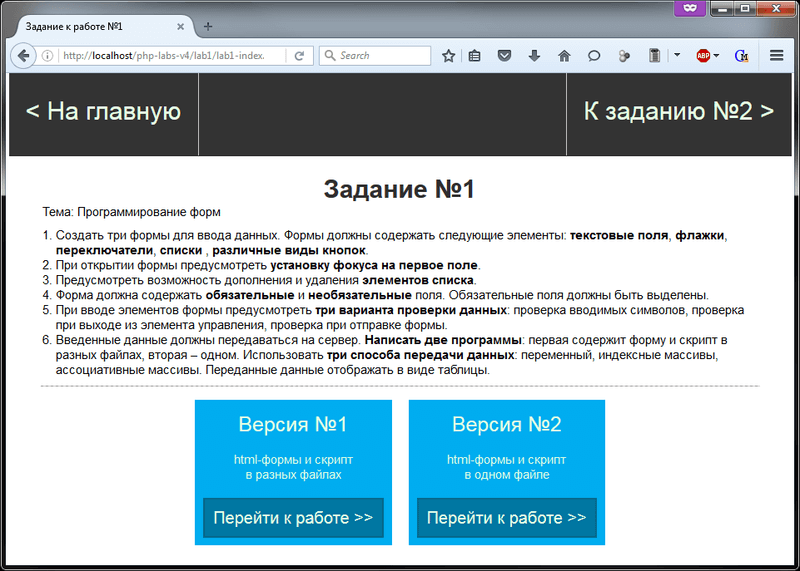
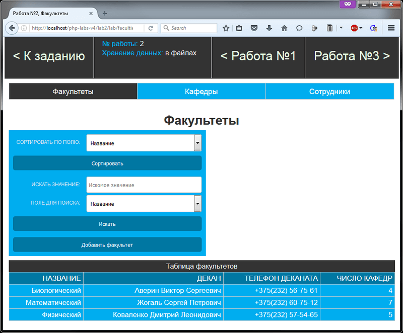
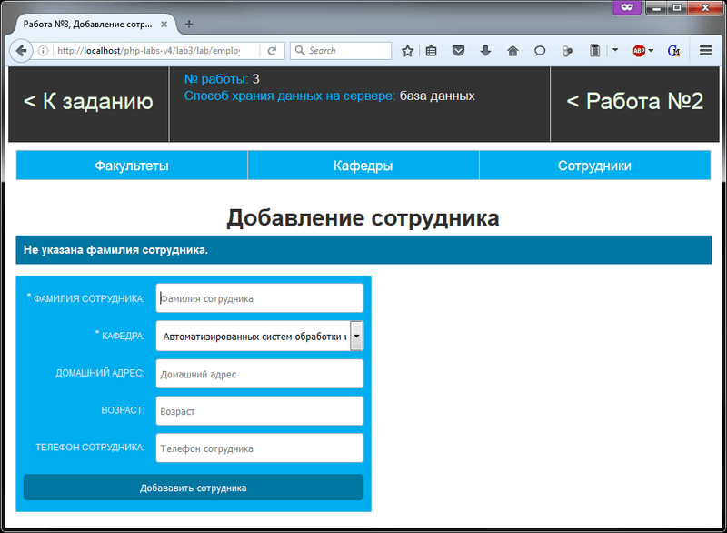
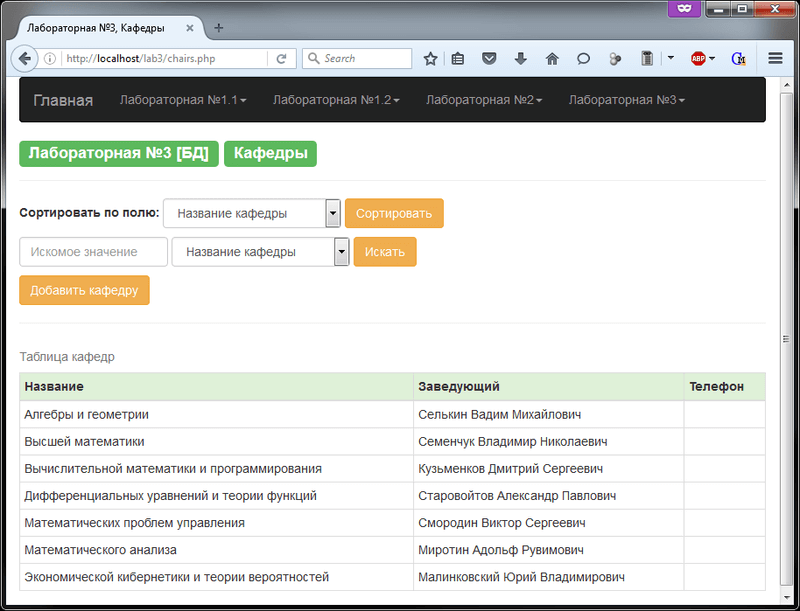
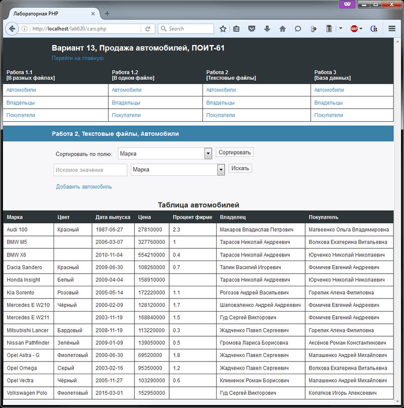

# Основы PHP
[&lt; назад](../)  
<!--- *Прочтите это на другом языке:* *[~~English~~](README.en.md)*, **[Русский](README.md)**.  -->
Дисциплина: *Язык серверных скриптов: PHP*.  
Примеры приложений предполагают запуск в PHP7 и БД MySQL.  

## Задания:
* 1.**Программирование форм. Передача данных с формы на сервер**.
  <table>
	<tr><th>Вариант</th><th>Предметная область</th><th>Таблицы</th></tr>
	<tr>
		<td>4</td>
		<td>Сведения о сотрудниках университета</td>
		<td>
		<b>Факультет</b>: Название факультета, Декан факультета, Телефон деканата, Количество кафедр. 
		<b>Кафедра</b>: Название факультета, Название кафедры, Заведующий кафедрой, Телефон кафедры. 
		<b>Сотрудник</b>: Название кафедры, Фамилия сотрудника, Домашний адрес, Возраст, Телефон.
	</td>
	</tr>
	<tr>
		<td>3</td>
		<td>Сведения о начислении заработной платы по кафедрам математического факультета</td>
		<td>
		<b>Кафедра</b>: Название кафедры, Фамилия заведующего, Телефон. 
		<b>Сведения о сотрудниках</b>: Название кафедры, Фамилия сотрудника, Должность, Домашний адрес, Телефон. 
		<b>Сведения о зарплате</b>: Фамилия сотрудника, Оклад, Начислено, Удержано.
		</td>
	</tr>
	<tr>
		<td>13</td>
		<td>Продажа автомобилей</td>
		<td>
		<b>Автомобиль</b>: Марка, Цвет, Дата выпуска, Цена, Процент фирме. 
		<b>Владельцы</b>: ФИО, Адрес, Телефон. 
		<b>Покупатели</b>: ФИО, Адрес, Телефон.
		</td>
	</tr>
  </table>
<ul>
	<li>
		a).Создать три формы для ввода данных. Формы должны содержать следующие элементы:  
		<ul>
			<li>текстовые поля,</li>
			<li>флажки,</li>
			<li>переключатели,</li>
			<li>списки,</li>
			<li>различные виды кнопок.</li>
		</ul>
	</li>
	<li>
		b).При открытии формы предусмотреть установку фокуса на первое поле.
	</li>
	<li>
		c).Предусмотреть возможность дополнения и удаления элементов списка.
	</li>
	<li>
		d).Форма должна содержать обязательные и необязательные поля. Обязательные поля должны быть выделены.
	</li>
	<li>
		e).При вводе элементов формы предусмотреть три варианта проверки данных:
		<ul>
			<li>проверка вводимых символов,</li>
			<li>проверка при выходе из элемента управления,</li>
			<li>проверка при отправке формы.</li>
		</ul>
	</li>
	<li>
		f).Введенные данные должны передаваться на сервер. Использовать три способа передачи данных: через переменные, индексные массивы, ассоциативные массивы. Переданные данные отображать в виде таблицы.  
		При необходимости, в таблицы можно добавлять поля.
	</li>
</ul>

* 2.**Работа с текстовыми файлами. Блокировка файла**.  
Используя условия задания №1 сохранить данные из формы в текстовый файл и вывести файл в виде таблицы. Создать страничку, содержащую следующие пункты меню:  
 - Ввод данные с формы и запись в тестовый файл.  
 - Просмотр содержимого файла.  
 - Сортировка данных с использованием стандартных функций сортировки.  
 - Поиск данных по заданному критерию.  
Содержимое файла должно отображаться в виде таблицы.  
При работе с файлами предусмотреть следующий вид блокировки:  
<table>
	<tr>
		<th>Вариант</th>
		<th>Тип блокировки</th>
	</tr>
	<tr>
		<td>4, 13</td>
		<td>исключительная блокировка</td>
	</tr>
	<tr>
		<td>3</td>
		<td>блокировка с запретом подвисания</td>
	</tr>
</table>

* 3.**Работа базой данных**.  
Создать базу данных, используя условия задания №1.  
Сохранить данные из формы в базу данных и вывести её в виде таблицы.  
Создать страничку, содержащую следующие пункты меню:  
 - Ввод данные с формы и запись в базу данных.  
 - Просмотр содержимого таблиц базы данных.  
 - Сортировка данных с использованием стандартных функций сортировки.  
 - Поиск данных по заданному критерию.  
Содержимое таблиц базы данных должно отображаться в виде таблиц.

## Демонстрационные скриншоты:

  
  
  
  
  
  

