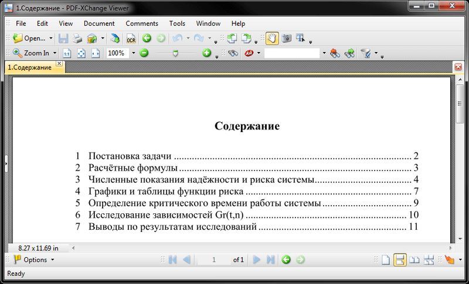
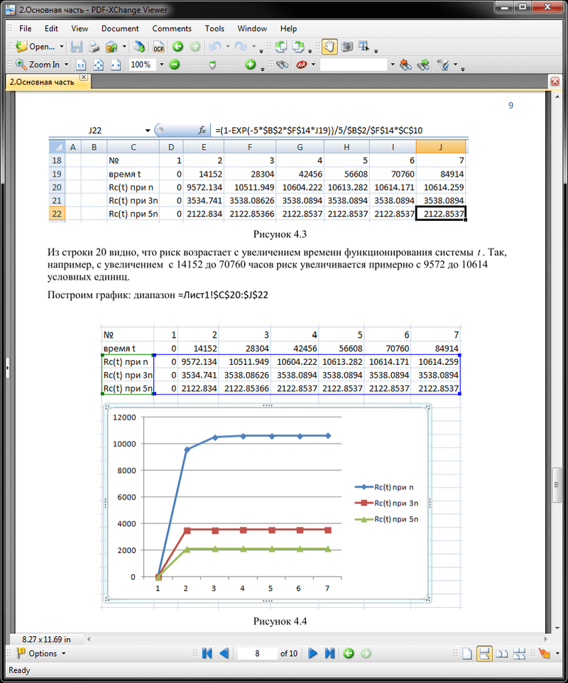
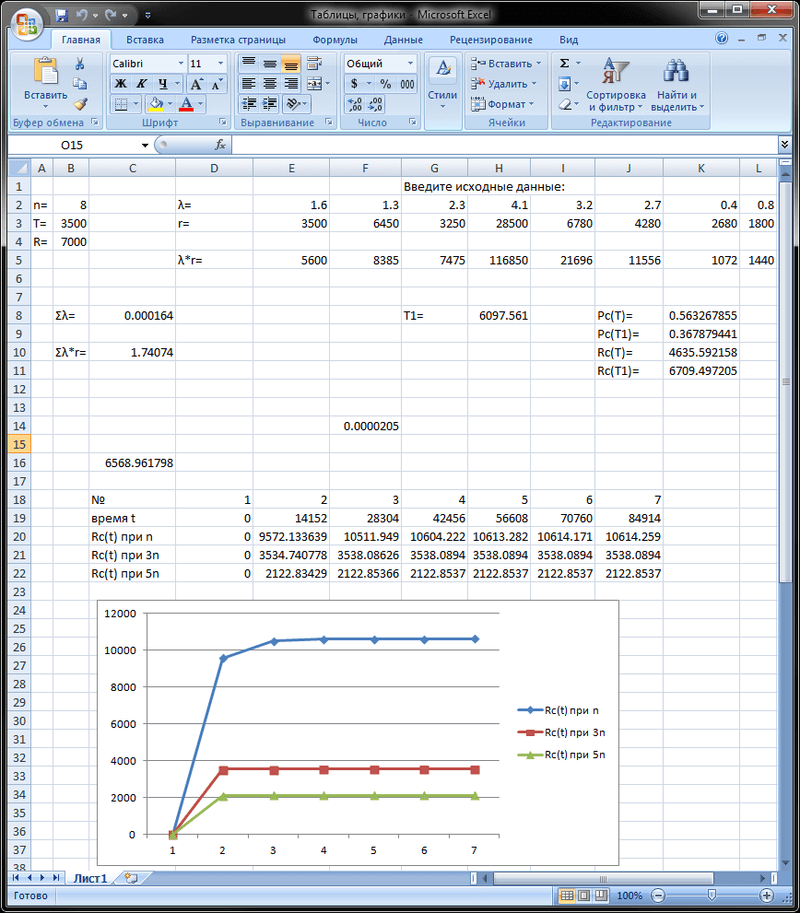
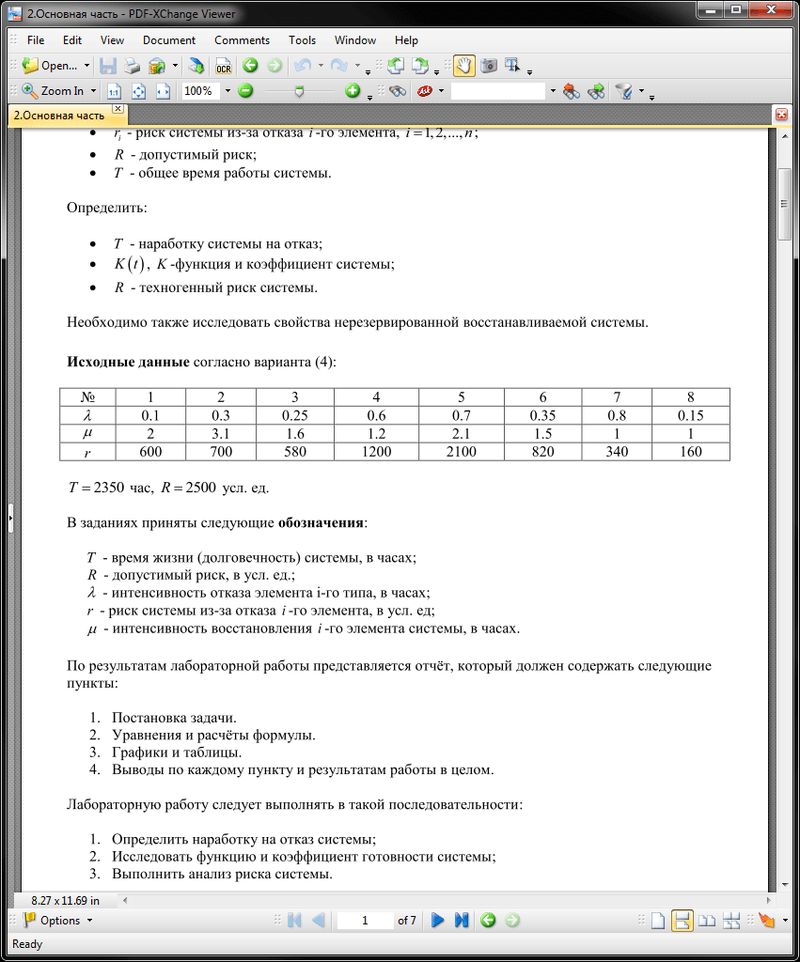
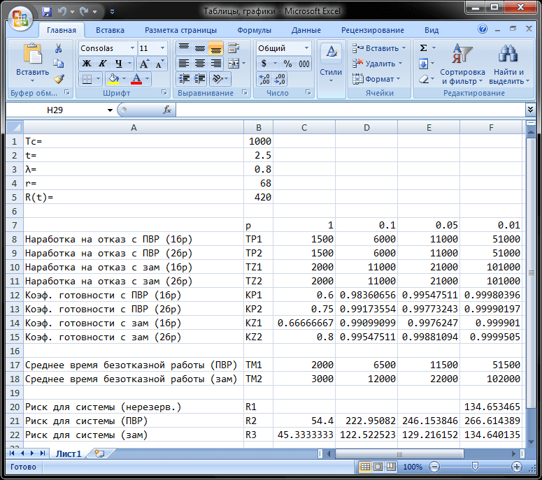

# Надёжность ПО
[&lt; назад](../)  
<!--- *Прочтите это на другом языке:* *[~~English~~](README.en.md)*, **[Русский](README.md)**.  -->
Дисциплина: *Надёжность программного обеспечения*.

## Задания:
* 1.**Исследование надёжности и риска нерезервированной технической системы**.
  * Постановка задачи.  
    Дано:  
    * *n* – число элементов системы;  
    * *λi* – интенсивность отказа i-го элемента системы, i = 1, 2,..., n;  
    * *ri* – риск из-за отказа i-го элемента системы, i = 1, 2,..., n;  
    * *R* – допустимый риск;  
    * *Т* – суммарное время работы системы.

    Определить в показатели надёжности системы:  
    * *Pc(t)* – вероятность безотказной работы системы в течение времени t,  
    а также ее значения при t = T и t = T1  
    * T1 – среднее время безотказной работы системы;  
    * *Rc(t)* – риск системы как функцию времени; значение риска при t = T и t = T1;  
    * Возможность расчета риска по приближенной формуле.

    **Исходные данные** согласно варианта (4):  
    <table>
		<tr>
			<th>Номера элементов</th>
			<th>1</th>
			<th>2</th>
			<th>3</th>
			<th>4</th>
			<th>5</th>
			<th>6</th>
			<th>7</th>
			<th>8</th>
		</tr>
		<tr>
			<td><i>λ*10-5, час-1</i></td>
			<td>1,6</td>
			<td>1,3</td>
			<td>2,3</td>
			<td>4,1</td>
			<td>3,2</td>
			<td>2,7</td>
			<td>0,4</td>
			<td>0,8</td>
		</tr>
		<tr>
			<td><i>r</i>, усл.ед.</td>
			<td>3500</td>
			<td>6450</td>
			<td>3250</td>
			<td>28500</td>
			<td>6780</td>
			<td>4280</td>
			<td>2680</td>
			<td>1800</td>
		</tr>
    </table>
    *T* = 3500 час, *R* = 7000 усл. ед.

* 2.**Исследование надежности и риска восстанавливаемой нерезервированной системы**.
  * Постановка задачи.  
    Дано:  
    * *n* – число элементов нерезервированной системы;  
    * *λi*, *µi* – интенсивность отказа и восстановление элемента i-го типа, 1,2,...,n;  
    * *ri* – риск системы из-за отказа i-го элемента системы, i = 1, 2,..., n;  
    * *R* – допустимый риск;  
    * *Т* – суммарное время работы системы.

    Определить:  
    * *Т* - наработку системы на отказ;
    * *К(t)*, *К* - функция и коэффициент готовности системы;
    * *R* - техногенный риск системы;
    * Необходимо также исследовать свойства нерезервированной восстанавливаемой системы.

    **Исходные данные** согласно варианта (4):  
    <table>
		<tr>
			<th>Номера элементов</th>
			<th>1</th>
			<th>2</th>
			<th>3</th>
			<th>4</th>
			<th>5</th>
			<th>6</th>
			<th>7</th>
			<th>8</th>
		</tr>
		<tr>
			<td><i>λ</i></td>
			<td>0.1</td>
			<td>0.3</td>
			<td>0.25</td>
			<td>0.6</td>
			<td>0.7</td>
			<td>0.35</td>
			<td>0.8</td>
			<td>0.15</td>
		</tr>
		<tr>
			<td><i>µ</i></td>
			<td>2</td>
			<td>3.1</td>
			<td>1.6</td>
			<td>1.2</td>
			<td>2.1</td>
			<td>1.5</td>
			<td>1</td>
			<td>1</td>
		</tr>
		<tr>
			<td><i>r</i></td>
			<td>600</td>
			<td>700</td>
			<td>580</td>
			<td>1200</td>
			<td>2100</td>
			<td>820</td>
			<td>340</td>
			<td>160</td>
		</tr>
    </table>
    *T* = 2350 час, *R* = 2500 усл. ед.

* 3.**Исследование надёжности и риска восстанавливаемой резервированной системы**.
  * Постановка задачи.  
    Целью настоящей лабораторной работы является изучение влияния восстановления (ремонта) на надёжность и риск технической системы.  
    Дана техническая система, имеющая следующие показатели:  
    * *Tс* – срок службы (долговечность), лет;  
    * *t* – время непрерывной работы, час;  
    * *λ* – интенсивность  отказов, час-1;  
    * *μ* – интенсивность  восстановления, час-1;  
    * *m* — допустимая кратность резервирования;  
    * *r* — риск из-за отказов системы, усл. ед.;  
    * *R(t)* — допустимый риск в течение времени *t*, усл. ед.

    Определить:  
    * показатели надёжности и риска исходной нерезервированной системы;  
    * показатели надёжности и риска резервированной системы с заданной кратностью резервирования *m*;  
    * Эффективность резервирования и восстановления, как средств повышения и снижения риска техники.

    **Исходные данные** согласно варианта (4):  
    <table>
		<tr>
			<td><i>*Tс*</i> - срок службы, час:</td>
			<td>1000</td>
		</tr>
		<tr>
			<td><i>t</i> - время непрерывной работы, час:</td>
			<td>2.5</td>
		</tr>
		<tr>
			<td><i>λ</i> - интенсивность отказов, <i>час-1</i>:</td>
			<td>0.8</td>
		</tr>
		<tr>
			<td><i>r</i> - риск из-за отказов системы, в усл. ед.:</td>
			<td>68</td>
		</tr>
		<tr>
			<td><i>R(t)</i> - допустимый риск в течение времени <i>t</i>, в усл. ед.:</td>
			<td>420</td>
		</tr>
    </table>

## Демонстрационные скриншоты:

  
  
  
  

