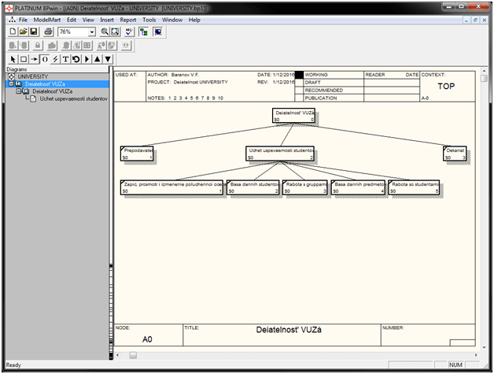

# Технология разработки ПО (Java, BPwin, ERwin)
[&lt; назад](../)  
<!--- *Прочтите это на другом языке:* *[~~English~~](README.en.md)*, **[Русский](README.md)**.  -->
Дисциплина: *Технология разработки программного обеспечения*.  
Примеры проектов представлены для NetBeans 8 \[JDK8\] (Lab1-5), BPwin 2.5 (Lab6) и ERwin 4.0 (Lab7).

## Задания:
* 1.Разработать ПС, в котором присутствовали бы некоторые критерии и примитивы качественного программного обеспечения.  
Имеется арифметический квадрат:  
1    1    1    1    1    1   …  
1    2    3    4    5    6   …  
1    3    6  10  15  21   …  
1    4  10  20  35  56   …  
Найти n(i,j) член квадрата.  
  
* 2.Разработать ПС, представленное по правилам хорошего стиля программирования.  
Сгенерировать последовательность 100 случайных чисел Xi с экспоненциальным (показательным) законом распределения с параметром λ (lambda)=0,1.  
Сформировать новую последовательность, состоящую из элементов: *Yi = Yi-1 + Xi, где Y1 == X1*.  
Для полученной последовательности вычислить среднее значение, дисперсию и вывести последовательность на печать в виде гистограммы, разделив диапазон на 10 интервалов.  

 *Справочный материал*:  
  
     Математическое ожидание:  
           
     Дисперсия:  
           
     Равномерный закон распределения: <i>z = (b-a)\*xi+a</i>, где *xi* - случайное число из диапазона *[a,b]*;  
     Нормальный закон распределения:  
           
     Экспоненциальный закон распределения:  
           

* 4.Разработать ПС и протестировать в нормальных, экстремальных и исключительных ситуациях.  
Вычислить значение определённого интеграла методом трапеций с точностью ε.  
  
Сделать графическую интерпретацию результата.  

* 5.Требуется разработать ПС, с оптимальной структурой данных.  
Выражение (a*b)+c-a*(b+c) соответствует дереву:  
  
Напишите программу, которая по введённому выражению строит дерево.

* 6.В среде ВРwin разработать функциональные модели для предметной области согласно варианта:  
**деканат - сотрудники и студенты факультета**.  
При выполнении лабораторной учебной работы по созданию  IDEF0-модели  предметной  области  необходимо  выполнить следующие **основные шаги**:  
  * 1.Создание новой модели.
  * 2.Описание главной работы.
  * 3.Описание цели, точки зрения, предметной области и границ.
  * 4.Описание других свойств модели.
  * 5.Нанесение стрелок.
  * 6.Описание стрелок.
  * 7.Заполнение всех полей бланка диаграммы.
  * 8.Декомпозиция.
  * 9.Объединение работ и стрелок.
  * 10.Нанесение внутренних стрелок.
  * 11.Описание стрелок.
  * 12.Заполнение всех полей бланка диаграммы.
  * 13.Создание диаграмм дерева узлов.
  * 14.Создание отчета по модели.  

 Разработанная модель должна содержать контекстную диаграмму и два уровня декомпозиции. Предусмотреть наличие связей со скрытым источником и скрытым приемником (туннелирование связей).
* 7.С помощью Erwin разработать модели баз данных для следующей предметной области, согласно варианта:  
**деканат - сотрудники и студенты факультета**.  
Модель должна включать в себя не менее пяти сущностей, связанных между собой.  
На первом этапе выполнения лабораторной учебной работы создаётся **логический уровень модели**. Он включает шаги:
  * 1.Создание сущностей.
  * 2.Описание сущностей.
  * 3.Создание связей между сущностями.
  * 4.Описание связей между сущностями.
  * 5.Описание атрибутов.  

 На втором этапе работы - **физический уровень модели**. Он включает шаги:
  * 1.Определение целевой СУБД.
  * 2.Задание типов данных.
  * 3.Создание базы данных.

## Описание решений:
 * Исходники лабораторных 1-5 представлены для IDE NetBeans 8 (JDK8). Запуск в других Java IDE невозможен, так как для конструирования UI использовался визуальный конструктор интерфейса библиотеки Swing. Для вёрски элементов окон он создаёт файл с раширением form, который не поддерживается другими Java IDE.
 * Для лабораторной работы 2 и 4, ввиду отсутствия в стандартной библиотеке Swing компонентов для отображения гистограмм, для этой цели использовался опенсурсный фреймворк JFreeChart.
 * Для лабораторной работы 4, для отображения интеграла в главном окне приложения, использовалась опенсурсная библиотека JMathTex. Для создания LATEX-формы представления интеграла использовался [этот](https://www.codecogs.com/latex/eqneditor.php) ресурс.
 * При работе с BPwin 2.5 и ERwin 4.0, при установленной английской локали и отсутсвии пакета русификации OC Windows, русские слова отображаются крякозябрами. Поэтому все сущности и названия набраны транслитом.

## Демонстрационные скриншоты:

  
  
  
  
  

