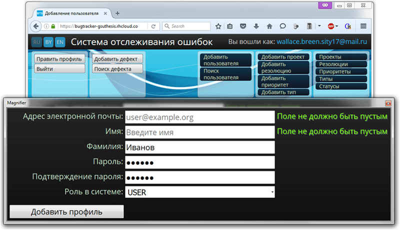

# Дипломная работа - BugTracker<br>(JEE, Tomcat, Maven, Spring, Hibernate, MySQL)
[&lt; назад](../)  
<!--- *Прочтите это на другом языке:* *[~~English~~](README.en.md)*, **[Русский](README.md)**.  -->
* [Задание](#%D0%97%D0%B0%D0%B4%D0%B0%D0%BD%D0%B8%D0%B5)
* [Описание приложения](#%D0%9E%D0%BF%D0%B8%D1%81%D0%B0%D0%BD%D0%B8%D0%B5-%D0%BF%D1%80%D0%B8%D0%BB%D0%BE%D0%B6%D0%B5%D0%BD%D0%B8%D1%8F)
* [Архитектура системы](#%D0%90%D1%80%D1%85%D0%B8%D1%82%D0%B5%D0%BA%D1%82%D1%83%D1%80%D0%B0-%D1%81%D0%B8%D1%81%D1%82%D0%B5%D0%BC%D1%8B)
* [Сборка приложения (war-архива) в CMD (в Maven)](#%D0%A1%D0%B1%D0%BE%D1%80%D0%BA%D0%B0-%D0%BF%D1%80%D0%B8%D0%BB%D0%BE%D0%B6%D0%B5%D0%BD%D0%B8%D1%8F-war-%D0%B0%D1%80%D1%85%D0%B8%D0%B2%D0%B0-%D0%B2-cmd-%D0%B2-maven)
* [Развёртывание war-архива в локальном контейнере Tomcat](#%D0%A0%D0%B0%D0%B7%D0%B2%D1%91%D1%80%D1%82%D1%8B%D0%B2%D0%B0%D0%BD%D0%B8%D0%B5-war-%D0%B0%D1%80%D1%85%D0%B8%D0%B2%D0%B0-%D0%B2-%D0%BB%D0%BE%D0%BA%D0%B0%D0%BB%D1%8C%D0%BD%D0%BE%D0%BC-%D0%BA%D0%BE%D0%BD%D1%82%D0%B5%D0%B9%D0%BD%D0%B5%D1%80%D0%B5-tomcat)
* [Импорт и запуск проекта в IDE (Eclipse и NetBeans](#%D0%98%D0%BC%D0%BF%D0%BE%D1%80%D1%82-%D0%B8-%D0%B7%D0%B0%D0%BF%D1%83%D1%81%D0%BA-%D0%BF%D1%80%D0%BE%D0%B5%D0%BA%D1%82%D0%B0-%D0%B2-ide-eclipse-%D0%B8-netbeans)
* [Демонстрационные скриншоты](#%D0%94%D0%B5%D0%BC%D0%BE%D0%BD%D1%81%D1%82%D1%80%D0%B0%D1%86%D0%B8%D0%BE%D0%BD%D0%BD%D1%8B%D0%B5-%D1%81%D0%BA%D1%80%D0%B8%D0%BD%D1%88%D0%BE%D1%82%D1%8B)

## Задание
Спроектировать и написать [систему отслеживания ошибок](https://ru.wikipedia.org/wiki/Система_отслеживания_ошибок) на платформе Java Enterprise Edition (Java EE).

## Описание приложения
Система, в демонстрационных целях, развёрнута на хостинге OpenShift: https://bugtracker-gsuthesis.rhcloud.com  
      
Система представляет собой web-приложение на платформе Java Enterprise Edition и позволяет развернуть систему контейнере сервлетов **Apache Tomcat** (в других контейнерах работоспособность не проверялась). База данных по умолчанию **MySQL**, однако благодаря использованию **ORM Hibernate** поддерживается большинство других реляционных БД - нужно лишь подключить другой драйвер в настройках. В качестве системы автоматизации сборки проекта используется **Apache Maven**. Для создания каркаса архитектуры системы, управления транзакциями, авторизации пользователей и управлению доступом к данным используется фреймворк **Spring**. Для отправки электронной почты из системы - технология **JavaMail**.  
В системе есть возможность **смены языка** на *русский*, *белорусский* или *английский*. Перевод для описания дефектов остаётся тем же, на котором и был написан.  
Дефект проходит в системе стадии жизненного цикла:  

      

Поддерживается гибкая градация серьёзности и приоритета дефектов.  
Система поддерживает технологию оповещения пользователей по электронной почте.  
Приложение поддерживает ведение нескольких проектов и гибкую систему доступа, основанную на ролях: гость, пользователь и администратор.  
<table>
<tr><th>Привилегии / Роли</th><th>Гость</th><th>Пользователь</th><th>Администратор</th></tr>
<tr><td>Просмотр дефекта</td><td> <b>+</b> </td><td> <b>+</b> </td><td> <b>+</b> </td></tr>
<tr><td>Редактирование дефекта</td><td> - </td><td> <b>+</b> </td><td> <b>+</b> </td></tr>
<tr><td>Добавление дефекта</td><td> - </td><td> <b>+</b> </td><td> <b>+</b> </td></tr>
<tr><td>Добавление комментариев к дефекту</td><td> - </td><td> <b>+</b> </td><td> <b>+</b> </td></tr>
<tr><td>Прикрепление файлов к дефекту</td><td> - </td><td> <b>+</b> </td><td> <b>+</b> </td></tr>
<tr><td>Закрытие дефекта</td><td> - </td><td> <b>+</b> </td><td> <b>+</b> </td></tr>
<tr><td>Повторное открытие дефекта</td><td> - </td><td> <b>+</b> </td><td> <b>+</b> </td></tr>
<tr><td>Назначение ответсвенного за исправление дефекта</td><td>-</td><td><b>+</b></td><td><b>+</b></td></tr>
<tr><td>Поиск дефектов</td><td> <b>+</b> </td><td> <b>+</b> </td><td> <b>+</b> </td></tr>
<tr><td>Поиск профилей пользователей</td><td> - </td><td> - </td><td> <b>+</b> </td></tr>
<tr><td>Получение оповещений по электронной почте</td><td> - </td><td> <b>+</b> </td><td> <b>+</b> </td></tr>
<tr><td>Редактирование собственных пользовательских данных</td><td>-</td><td><b>+</b></td><td><b>+</b></td></tr>
<tr><td>Просмотр данных профилей всех пользователей</td><td> - </td><td> - </td><td> <b>+</b> </td></tr>
<tr><td>Редактирование данных профилей всех пользователей</td><td> - </td><td> - </td><td> <b>+</b> </td></tr>
<tr><td>Добавление профилей пользователей</td><td> - </td><td> - </td><td> <b>+</b> </td></tr>
<tr><td>Добавление проектов</td><td> - </td><td> - </td><td> <b>+</b> </td></tr>
<tr><td>Редактирование проектов</td><td> - </td><td> - </td><td> <b>+</b> </td></tr>
<tr><td>Редактирование статусов дефектов</td><td> - </td><td> - </td><td> <b>+</b> </td></tr>
<tr><td>Добавление резолюций к закрытию дефекта</td><td> - </td><td> - </td><td> <b>+</b> </td></tr>
<tr><td>Редактирование резолюций к закрытию дефекта</td><td> - </td><td> - </td><td> <b>+</b> </td></tr>
<tr><td>Добавление приоритетов дефектов</td><td> - </td><td> - </td><td> <b>+</b> </td></tr>
<tr><td>Редактирование приоритетов дефектов</td><td> - </td><td> - </td><td> <b>+</b> </td></tr>
<tr><td>Добавление типов дефектов</td><td> - </td><td> - </td><td> <b>+</b> </td></tr>
<tr><td>Редактирование типов дефектов</td><td> - </td><td> - </td><td> <b>+</b> </td></tr>
</table>


## Архитектура системы
При разработке архитектуры использовался материал этой статьи: [https://habrahabr.ru/post/111102/](https://habrahabr.ru/post/111102/).  
*Архитектурный каркас* системы базируется на шаблоне проектирования **MVC**. В разработанном приложении наиболее удобной оказалась следующая методика разделения слоёв: *представление* и *контроллер* остались без существенных изменений базовой концепции, а слой модели разделён на составляющие: уровень сервисов, уровень с доменными объектами и уровень организации взаимодействия с базой данных.  
Реализация расслоения архитектуры системы (стрелками указано о том, что слой "знает" о методах другого слоя):  

       
  

<table>
	<tr>
		<th>Слой</th>
		<th>Описание</th>
	</tr>
	<tr>
		<td><b>View</b></td>
		<td>Отображения пользовательского интерфейса.<br>Охватывает все, что имеет отношение к общению пользователя с системой.<br>Представлен jsp-файлами и представлен в каталоге WEB-INF/views.<br>Файлы стилей, шрифтов и иной статический контент размещены в каталоге /resources.<br>Для каждой из страниц системы заведено отдельное представление со своим назначением.<br>Для текстовых полей выполняется проверка корректности или пустоты полей, через JS.<br>Для списков дефектов и проектов есть <b>пагинация</b> и <b>сортировка</b> через jQuery и AJAX.<br>На каждой странице системы действует механизм "горячего" переключения языка для всех строковых сообщений – <b>русский</b>, <b>белорусский</b> или <b>английский</b>. Реализуется через конфигурирование spring-фреймворка при помощи LocaleChangeInterceptor и CookieLocaleResolver.<br>
		Файлы свойств с сообщениями хранятся в src/main/resource.</td>
	</tr>
	<tr>
		<td><b>Controller</b></td>
		<td>Связующее звено между представлением и моделью данных.<br>Возможные действия в системе объединены в 7 классов контроллеров:
		<ul>
			<li><b>UsersServlet</b> добавление, просмотр, редактирование и поиск профилей пользователей.</li>
			<li><b>RootServlet</b> отображение и пагинация списков дефектов, поиск и просмотр отдельных дефектов. Иными словами, все действия неавторизованных пользователей.</li>
			<li><b>PropertyServlet</b> обработка действий по добавлению или изменению свойств дефектов: приоритетов, типов, резолюций и статусов.</li>
			<li><b>ProjectsServlet</b> обработка действий с проектами: отображение, пагинация списков проектов, добавление проектов и версий сборок, изменение данных проектов.</li>
			<li><b>IssuesServlet</b> работа с дефектами: добавление и изменение, прикрепление комментариев и файлов.</li>
			<li><b>EditProfileServlet</b> нужен только для редактирования своих данных в профиле.</li>
			<li><b>GlobalExceptionController</b> требуется для отображения страницы с ошибкой при появлении непредвиденной ошибки работы сервера.</li>
		</ul></td>
	</tr>
	<tr>
		<td><b>Service</b></td>
		<td>Предназначен для выполнения операций с методами, в которых используются несколько реализаций классов доступа к данным. Методы слоя поддерживают транзакционные операции.<br>В системе слой представлен интерфейсами в пакете by.gsu.bugtracker.service, и реализациями в by.gsu.bugtracker.service.impl<br>Классы слоя включают в себя как обобщённые наборы действий для всех сущностей, так и более специализированные и характерные только для одной.</td>
	</tr>
	<tr>
		<td><b>Data Access Object (DAO)</b></td>
		<td>Предоставляет интерфейс к хранилищу данных (Реляционная БД MySQL в этом случае).<br>В системе представлен интерфейсами в пакете by.gsu.bugtracker.dao, и реализациями в by.gsu.bugtracker.dao.persistence.<br>Запросы к бд написаны на ООП-языке запросов HQL.<br>Классы слоя включают в себя как обобщённые наборы действий для всех сущностей, так и более специализированные и характерные только для одной.</td>
	</tr>
	<tr>
		<td><b>Domain</b></td>
		<td>Размещение всех классов, описывающих простые сущности системы (<a href="https://ru.wikipedia.org/wiki/POJO">POJO</a>).<br>Все сущности системы, которые хранятся в базе данных, унаследованы от класса GenericDomainObject, который хранит в себе поле идентификатора, переопределённые методы hashCode, equals и toString. Данный класс помечен аннотацией @MappedSuperclass, которая определяет класс, описанные свойства и методы которого будут применены в классах-наследниках, но этот класс не будет отображаться на отдельную таблицу. Классы наследники помечены аннотациями @Entity и @Table – они нужны для указания JPA на хранение этих классов в хранилище данных. Поля классов наследников помечаются аннотациями @Column, а в некоторых случаях @Size, @Enumerated, @Pattern, @JoinColumn, @ManyToOne, @OneToMany – они нужны для указания на столбцы таблиц в хранилище, указания корректных размеров строк для проверки, указания на перечисление, для проверки данных регулярным выражением, для указания объединений таблиц, а также типов связей между таблицами.<br><br><b>UML-диаграмма</b> классов слоя (Скриншот из Umbrello UML Modeller 2.18.2):<br>(Кликните для открытия в новом окне)<br>
		</td>
	</tr>
	<tr>
		<td><b>DB</b></td>
		<td>При разработке использована MySQL 5.5, однако система поддерживает большинство реляционных баз данных посредством указания сущностей LocalContainerEntityManagerFactoryBean и dataSource в конфигурационных файлах Spring, а также указания требуемого драйвера для подключения к базе данных в файле pom.xml.<br>Инициализация всех требуемых таблиц, благодаря использованию Hibernate, происходит автоматически при первом запуске сервера.<br>Однако требуется первичное заполнение начальными данными таблиц приоритетов, резолюций, статусов и типов дефектов, а также создания хотя бы одного пользователя с правами администратора (приложенный скрипт initial.sql). <br><br><b>Схема связей</b> таблиц БД (Кликните для открытия в новом окне):<br>
    </td>
	</tr>
</table>

## Сборка приложения (war-архива) в CMD (в Maven):
Для компиляции и сборки приложения, в ОС требуется установленная JDK версии 8 и Apache Maven.  
В переменных окружения ОС должны быть прописан путь к JDK `JAVA_HOME` и в `Path` добавлен `%JAVA_HOME%\bin`.  
В переменных окружения должен быть прописан путь к Maven `M2` и в `Path` добавлен `%M2%\bin`.  
Также нужно изменить логин/пароль/имя_бд для подключения к БД  
в файле `src\main\webapp\WEB-INF\jdbc.properties`.  
Если требуется оповещение пользователей о дефектах по электронной почте, нужно изменить настройки подключения **SMTP** (сущность *JavaMailSenderImpl*) в файле `src\main\webapp\WEB-INF\spring\root-context.xml`. 
* 1. Для компиляции и сборки приложения из директории с pom-файлом запустить: `mvn clean package`  
* 2. В созданной директории target будет находится war-архив с приложением (и всеми библиотеками).

Для упрощения ввода команды в *cmd*, в корне каталога с проектом находится скрипт *build.bat*.

## Развёртывание war-архива в локальном контейнере Tomcat:
В переменных окружения должен быть прописан путь к каталогу контейнера Tomcat `CATALINA_HOME` и в `Path` добавлен `%CATALINA_HOME%\bin`.  
Для развёртывания приложений в Apache Tomcat есть 2 пути: ручное копирование war-архива, либо использование *Tomcat Web Application Manager* (более гибкое решение).  
* 1. Ручное копирование war: просто скопировать сгенерированный war в `%CATALINA_HOME%\webapps\`.  
Если Tomcat в данный момент запущен, то через пару секунд он сам должен развернуть веб-приложение из архива. При этом он создаст одноимённые папки в `%CATALINA_HOME%\webapps\` для размещения приложения и в `%CATALINA_HOME%\work\Catalina\localhost\` для размещения скомпилированных jsp. Также Tomcat может создать конфигурационный xml-файл в `%CATALINA_HOME%\conf\Catalina\localhost\`.  
Если Tomcat в данный момент не запущен, то он совершит вышеуказанные действия при последующем запуске.  
Приложение будет доступно по адресу:  
`http://localhost:8080/BugTracker/`  
В случае, если потребуется развёртывание изменённой версии приложения, то нужно лишь заменить war-архив в `%CATALINA_HOME%\webapps\` - через пару секунд Tomcat развернёт новую версию.  
В случае, если нужно удалить веб-приложение из контейнера, нужно удалить этот war-архив и одноимённую папку, папку со скомпилированными jsp и конфигурационный файл.
* 2. Развёртывание через *Tomcat Web Application Manager*: для использования этого способа в Apache Tomcat 8 требует пользователь с ролью *manager-gui*.
  * 2.1. Для того, чтобы создать пользователя (либо узнать логин/пароль) нужно открыть файл `%CATALINA_HOME%\conf\tomcat-users.xml`. Если в файле нет пользователя с такой ролью, можно добавить и перезапустить контейнер:  
  `<user username="admin" password="12345" roles="manager-gui" />`
  * 2.2. Теперь нужно авторизоваться в системе.  
  Переходим по адресу *http://localhost:8080/*, кликаем *Manager App* и вводим логин/пароль.
  * 2.3. На вкладке *Deploy* выбираем нужный war-архив и нажимаем *deploy* - приложение спустя пару секунд должно развернуться и появиться в таблице *Applications*. Также в этой таблице присутсвуют ссылка на развёрнутое приложение, текущий статус, указание количества активных сессий и комманды управления приложением: *Start/Stop*, *Reload*, *Undeploy*.

Для упрощения ручного копирования, в корне каталога с проектом находятся скрипты *deploy.bat* и *undeploy.bat*.

## Импорт и запуск проекта в IDE (Eclipse и NetBeans)
Перед запуском, нужно запустить MySQL и создать пустую базу данных bugtracker (название может быть другим).
* **Eclipse**.
  * 1.Если в IDE не указана ссылка на контейнер, нужно *добавить* Tomcat в Eclipse. Для этого:
    * 1.1.Переключить перспективу на Java EE: *Window &rarr; Perspective &rarr; Open perspective &rarr; Other &rarr; Java EE*.
    * 1.2.Перейти на вкладку *Servers*: *Window &rarr; Show View &rarr; Servers*.
    * 1.3.Кликнуть по ссылке *No server are available*, выбрать нужную версию Tomcat и указать путь к нему.
  * 2.*Import &rarr; Maven &rarr; Exiting Maven Projects*.
  * 3.Изменить настройки подключения к БД (логин/пароль/имя бд) в *src/main/webapp/WEB-INF/jdbc.properties*.  
  Если требуется оповещение пользователей о дефектах по электронной почте, нужно изменить настройки подключения **SMTP** (сущность *JavaMailSenderImpl*) в файле `src\main\webapp\WEB-INF\spring\root-context.xml`. 
  * 4.Запустить приложение в Tomcat.  
  При первом запуске, в бд будут созданы все таблицы (при помощи hibernate).  
  Для запуска проекта Tomcat не должен быть запущен, так как его запуск осуществляет IDE.  
  Кликаем *RunAs &rarr; Run on Server* и приложение запускается.  
  Управление сервером и приложением на сервере осуществляется из вкладки *Servers*.  
  В случае, когда запуск осуществляется вышеуказанным способом, приложение развёртывается не в каталоге Tomcat'а, а в воркспэйсе Eclipse и приложение не будет доступно после завершения работы IDE.
  * 5.Выполнить скрипт инициализации **initial.sql** - для первичной инициализации таблиц свойств дефектов и создания первого администратора приложения (который может добавлять пользователей в приложение). Если нужно, в демонстрационных целях, можно заполнить бд из скрипта **filling.sql**;
  * 6.Также можно собрать war-архив через IDE и развернуть его в самостоятельно.  
  Для сборки war-архива: *Export &rarr; WAR file*. Также в этот архив упаковываются все библиотеки (Spring и т.п.).  
  Развёртывание war-архива в контейнере Tomcat описано выше в соответсвующем разделе.

* **NetBeans**.  
  * 1.Если в IDE не указана ссылка на контейнер, нужно *добавить* Tomcat в NetBeans.  
  Для этого: *Tools &rarr; Servers &rarr; Add Server...*  
  Затем выбрать нужную версию Tomcat и указать путь к нему.
  * 2.*File &rarr; New Project &rarr; Maven &rarr; Project with existing POM*.
  * 3.Изменить настройки подключения к БД (логин/пароль/имя бд) в *Web Pages &rarr; WEB-INF &rarr; jdbc.properties*.  
  Если требуется оповещение пользователей о дефектах по электронной почте, нужно изменить настройки подключения **SMTP** (сущность *JavaMailSenderImpl*) в файле `src\main\webapp\WEB-INF\spring\root-context.xml`. 
  * 4.Запустить приложение в Tomcat.  
  При первом запуске, в бд будут созданы все таблицы (при помощи hibernate).  
  Для запуска проекта Tomcat не должен быть запущен, так как его запуск осуществляет IDE.  
  В случае, когда запуск осуществляется из IDE, приложение развёртывается не в каталоге Tomcat'а, и приложение не будет доступно после завершения работы IDE.
  * 5.Выполнить скрипт инициализации **initial.sql** - для первичной инициализации таблиц свойств дефектов и создания первого администратора приложения (который может добавлять пользователей в приложение). Если нужно, в демонстрационных целях, можно заполнить бд из скрипта **filling.sql**.
  * 6.Также можно собрать war-архив через IDE и развернуть его в самостоятельно.  
  Для сборки war-архива: *Run &rarr; Clean and Build Project (Shift+F11)*.  
  При этом в каталоге проекта *target* создаётся war.  
  Развёртывание war-архива в контейнере Tomcat описано выше в соответсвующем разделе.

  В некоторых версиях Tomcat есть ошибка в конфигурационном файле, которая приводит к невозможности запуска сервера из NetBeans с ошибкой:  
  `'127.0.0.1*' is not recognized as an internal or external command`  
  Решение проблемы: в файле *%CATALINA_HOME%\bin\catalina.bat* убрать двойные кавычки из строк:  
  ```
  :noJuliConfig
  set "JAVA_OPTS=%JAVA_OPTS% %LOGGING_CONFIG%"
  
  :noJuliManager
  set "JAVA_OPTS=%JAVA_OPTS% %LOGGING_MANAGER%"
  ```
  Описание дефекта (Tomcat): https://bz.apache.org/bugzilla/show_bug.cgi?id=56895  
  Описание дефекта (NetBeans): https://netbeans.org/bugzilla/show_bug.cgi?id=248182  
  Описание решения: https://stackoverflow.com/questions/26485487/error-starting-tomcat-from-netbeans-127-0-0-1-is-not-recognized-as-an-inter

## Демонстрационные скриншоты:

  
  
  
  
  
  
  
  

