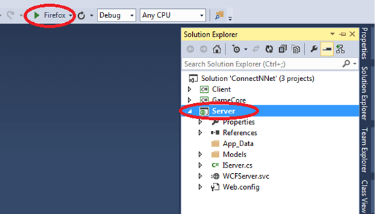
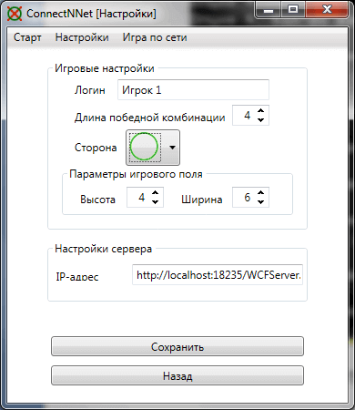

# Игра ConnectFourNet (C#, WPF, WCF, MVVM)
[&lt; назад](../)  
<!--- *Прочтите это на другом языке:* *[~~English~~](README.en.md)*, **[Русский](README.md)**.  -->
Исходники проектов предполагают запуск в Visual Studio 13 Professional или Enterpise.  
В версии Express нет поддержки WCF и проект будет валиться с кучей ошибок.  
Работоспособность исходников в других версиях Visual Studio не проверялась.

## Техническое задание:
Необходимо разработать клиент-серверное приложение на C# для игры [Четыре в ряд](https://ru.wikipedia.org/wiki/Четыре_в_ряд).

## Описание приложения:

Приложение состоит из клиентской и серверной части, а так же игрового ядра. В качестве графической подсистемы клиентского приложения используется технология Windows Presentation Foundation (WPF). Архитектура клиентского приложения строится на базе шаблона проектирования Model-View-ViewModel (MVVM) для разделения слоёв модели и представления. Серверная часть приложения реализована на программном фреймворке Windows Communication Foundation (WCF).  

Доступно 2 версии проектов:
* 1. С резидентным размещением сервера в управляемом приложении .NET.  
 **ConnectFourNet (server in exe-app) [with report]**  
 В этой версии также приложен отчёт по курсовому проекту и "*чертёж*" диаграммы последовательности.
* 2. С размещение сервера в IIS (либо на ASP.Net-хостинге).  
 **ConnectFourNet (server in IIS)**

Помимо сетевой версии игры, на клиенте также можно запускать игру с "компьютерным соперником" (ботом) - для этого подключение к сети не нужно.  

В проектах используются библиотеки:
* CommonServiceLocator 1.3;
* MvvmLight 5.2.0.0
* MvvmLightLibs 5.2.0.0  

Они будут скачаны (~7 мб) при сборке приложения автоматически, с помощью пакетного менеджера NuGet.

## Развёртывание сервера:
Ниже представлены 3 сценария развёртывания сервера приложения:
* 1.Развёртывание сервера из exe-приложения для игры по LAN;
* 2.Развёртывание сервера в IIS для игры по LAN;
* 3.Развёртывание сервера на хостинге для игры по интернету (На примере smarterasp.net).

### 1.Развёртывание сервера из exe-приложения для игры по LAN
(*Версия проекта*: **ConnectFourNet (server in exe-app) [with report]**)  
* 1.Узнать IPv4-адрес компьютера в локальной сети, на котором будет запущен сервер:  
*Win+R &rarr; cmd &rarr; ipconfig*.  
В абзаце Local Area Connection указан IPv4 (в моём случае 192.168.1.2).  
Этот адрес будет использоваться в настройках сервера, и во всех клиентах.  

* 2.Изменение ip-адреса в настройках сервера:
  * 2.1.В Visual Studio открываем xml-файл: Server_Host -> App.config.
  * 2.2.Меняем *localhost* на тот IP, который узнали ранее, в строках:  
  <pre>
  &lt;?xml version="1.0" encoding="utf-8" ?&gt;
  &lt;configuration&gt;
      ...
      &lt;add baseAddress="http://<b>localhost</b>:18235/WCFServer.svc"/&gt;
      ...
      &lt;endpoint address="http://**localhost**:18235/WCFServer.svc"
                binding="basicHttpBinding"
                contract="ConnectNNet.Server.IServer" /&gt;
      ...
   &lt;/configuration&gt;
   </pre>
   Этот адрес также можно изменить и в скомпилированном приложении: этот xml размещается в файле Server_Application.exe.config и настройки загружаются именно из него.  

* 3.Изменение ip-адреса клиентов: его можно изменить в свойствах проекта в Visual Studio или уже в запущенном клиентском приложении, на тот адрес, который узнали заранее:
  * 3.1.В Visual Studio: Client &rarr; Properties &rarr; Settings &rarr; ServerAdress.
  <pre>http://<b>localhost</b>:18235/WCFServer.svc</pre>
  * 3.2.На запущенном клиенте: Настройки &rarr; Настройки сервера &rarr; IP-адрес.  

* 4.Если в OC, на которой запущен сервер, установлен и запущен Брэндмаузер Windows, потребуется добавить разрешение на подключение к порту этого ПК (18235 в моём примере). Если порт на сервере будет закрыт, то будет появляться ошибка:  
  

### 2.Развёртывание сервера в IIS для игры по LAN
(*Версия проекта*: **ConnectFourNet (server in IIS)**)  
* 1.Узнать IPv4-адрес компьютера в локальной сети, на котором будет запущен сервер:  
*Win+R &rarr; cmd &rarr; ipconfig*.  
В абзаце Local Area Connection указан IPv4 (в моём случае 192.168.1.2).  
Этот адрес будет использоваться в настройках сервера, и во всех клиентах.  

* 2.Далее, нужно проверить наличии IIS-сервера в системе. Этот мануал подразумевает, что IIS был установлен вместе с Visual Studio. Если он был установлен иным способом, то скорее всего, этот мануал не подойдёт. Проверить наличие нужного сервера можно в *Control Panel &rarr; Programs and Features*. У меня была установлена *IIS 8.0 Express*, с той же датой установки что Visual Studio.  

* 3.Далее, в каталоге с документами пользователя открываем xml с настройками сервера каким-нибудь редактором.  
Путь к файлу: **%USERPROFILE%\Documents\IISExpress\config\applicationhost.config**  
Требуется изменить *localhost* (выделен жирным) на тот IP, который узнали ранее:  
<pre>
&lt;?xml version="1.0" encoding="UTF-8"?>
&lt;configuration&gt;
	...
	&lt;system.applicationHost&gt;
		...
		&lt;sites&gt;
			...
			&lt;site name="Server_Service" id="2"&gt;
				...
				&lt;bindings&gt;
					&lt;binding protocol="http" bindingInformation="*:18235:<b>localhost</b>" /&gt;
				&lt;/bindings&gt;
			&lt;/site&gt;
			...
		&lt;/sites&gt;
	...
	&lt;/system.applicationHost&gt;
	...
&lt;/configuration&gt;
</pre>
* 4.Далее, нужно запустить Visual Studio от имени администратора ->  
ПКМ по проекту Server -> Properties -> Web -> Servers и изменить строку *Project Url*:  
(*localhost* заменить на найденый ранее IP)  
<pre>http://<b>localhost</b>:18235/</pre>

* 5.Изменение ip-адреса клиентов: его можно изменить в свойствах проекта в Visual Studio или уже в запущенном клиентском приложении, на тот адрес, который узнали заранее:
  * 5.1.В Visual Studio: ПКМ по Client &rarr; Properties &rarr; Settings &rarr; ServerAdress.
  <pre>http://<b>localhost</b>:18235/WCFServer.svc</pre>
  * 5.2.На запущенном клиенте: Настройки &rarr; Настройки сервера &rarr; IP-адрес.  

* 6.Если в OC, на которой запущен сервер, установлен и запущен Брэндмаузер Windows, потребуется добавить разрешение на подключение к порту этого ПК (18235 в моём примере). Если порт на сервере будет закрыт, то будет появляться ошибка:  
  

* 7.Сам запуск осуществляется нажатием на зелёный треугольник, при выделенном проекте с сервером:  

   

 При этом в системном трее появляется значок управления сервером:  

   

 При попытке перейти по указанному IP:порту (http://192.168.1.2:18235/ в моём примере) с любого ПК в сети, должна появиться такая страница:  

   

### 3.Развёртывание сервера на хостинге для игры по интернету
(*Версия проекта*: **ConnectFourNet (server in IIS)**)  
  
Пример развёртывания сервера приводится на примере хостига [smarterasp.net](https://www.smarterasp.net/).  
Он предоставляет бесплатный 30-дневный период для проверки работы приложения.  
* 1.Создать на хостинге учётную запись.  
Я использовал сервис [10minutemail](https://10minutemail.com) для регистрационной почты.  
Сам процесс регистрации аккаунта:
  * 1.1.На главной странице кликнуть GetStarted и попадаешь на страницу регистрации.
  * 1.2.В Hosting Plan - указал "60-тидесяти дневный триал".  
  Login Name - я использовал часть сгенерированного в 10minutemail email: i1708381  
  Password - тоже часть email: i1708381
  Далее требуется подтвердить адрес электронной почты.
  * 1.3.Теперь нужно зайти на сайта под своим логин/паролем - на главной странице кликнуть Customer Login.
  * 1.4.Активация учётной записи: *Учётная запись &rarr; Try Now &rarr; Next &rarr; Отправить*.  

       
* 2.Теперь нужно получить от хостинга конфиги для VS (Для *публикации*):
  * 2.1.Заходим под своей учёткой на сайт.
  * 2.2.Далее "Панель управления хостингом" &rarr; "Мои сайты" &rarr; "site1" &rarr; VSWeb Deploy (Статус включить)  

       
  * 2.3.В появившемся абзаце кликам по кнопке "Получить установки для публикации"  

       
  * 2.4.Копируем появившийся xml-текст в буфер обмена:  

       
  * 2.5.В папке с проектом, в папке Server находится WCFServer.publish.xml (Если нет - нужно создать).  
  Открываем его и вставляем конфиг из буфера обмена.  

* 3.Непосредственно процесс развёртывания:  
  * 3.1.В Visual Studio: ПКМ по проекту Server &rarr; Publish.
  * 3.2.В появившемся окне: Profile &rarr; Import и выбираешь WCFServer.publish.xml из папки Server.  

       
  * 3.3.В следующем окне: в пустое поле Password - вписываем пароль панели управления (у меня i1708381)  

       
  * 3.4.Теперь кликаем по кнопке Publish и сервер, через секунд 20, развёртывается на хостинге. Собственно, с развёртывание сервера закончено. У меня при этом открылась дефолтная страница сервера в браузере:  

       

* 4.Указание клиентам адреса сервера. Адрес сервера в моём примере:  
<pre>http://i1708381-001-site1.atempurl.com/WCFServer.svc</pre>  
При переходе по этому адресу из браузера должна появиться такая страница:  

    
  
Если эта страница не появлется, то, вероятно, при публикации была допущена ошибка или адрес некорректный.  
Изменение ip-адреса клиентов: его можно изменить в свойствах проекта в Visual Studio или уже в запущенном клиентском приложении, на тот адрес, который узнали заранее:  
  * 4.1.В Visual Studio: ПКМ по Client &rarr; Properties -> Settings &rarr; ServerAdress.
  * 4.2.На запущенном клиенте: Настройки &rarr; Настройки сервера &rarr; IP-адрес.

## Демонстрационные скриншоты:

 
  
  
  
