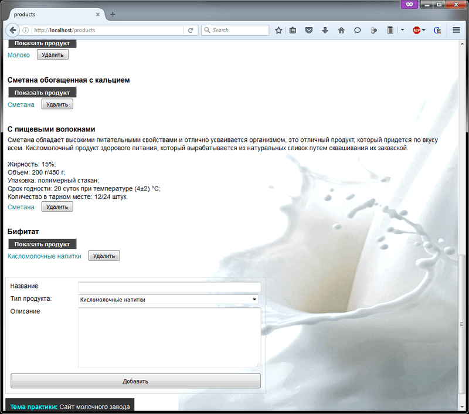
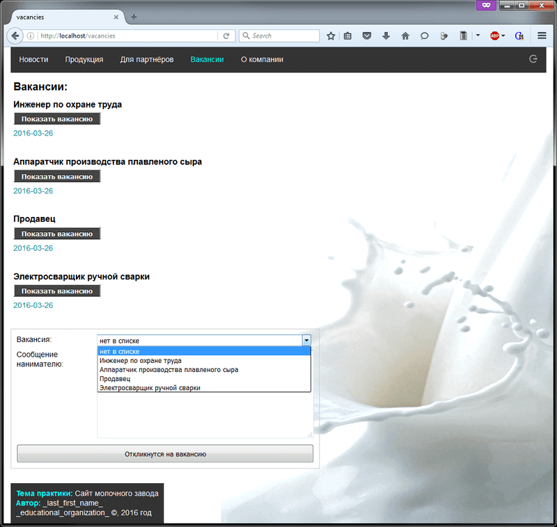

# Сайт молочного завода (PHP, MySQL)
[&lt; назад](../)  
<!--- *Прочтите это на другом языке:* *[~~English~~](README.en.md)*, **[Русский](README.md)**.  -->
Пример сайта предполагает запуск в PHP7 и БД MySQL5.5.  
Работоспособность исходников в других версиях языка и другой БД не проверялась.

## Техническое задание:
Необходимо разработать сайт молочного завода (выдуманного). Спроектировать и написать не менее 6 страниц, с использованием JS на каждой странице сайта.

## Описание сайта:

К качестве базы данных для сайта выбрана БД MySQL. В базе хранится 8 таблиц: новости (news), информация для партнёров (partners), пользователь (users), типы продуктов (typeproducts), продукты (products), вакансии (vacancies), присланные резюме (resume) и информация о компании (about).  
Пары таблиц *'Резюмэ' &rarr; 'Вакансии'* и *'Продукты' &rarr; 'Типы продуктов'* связаны вторичным ключом.  

Структуры таблиц БД:  
  
  

Работа сайта реализуется посредством концепции "единой точки входа": все запросы отправляемые пользователями перенаправляются в один файл(index.php), который, в свою очередь, занимается обработкой этих запросов, и возвращает результат обработки запроса. Концепция работает благодаря файлу **.htaccess**, размещённому в корневом каталоге сайта:
```
<IfModule mod_rewrite.c>
    RewriteEngine On
    RewriteBase /
    RewriteCond %{REQUEST_FILENAME} !-f
    RewriteCond %{REQUEST_FILENAME} !-d
    RewriteRule ^(.*)$ index.php?filename=$1 [L,QSA]
</IfModule>
```
При любом запросе (строчка с **^(.*)$**) идет перенаправление на index.php.  
Вся строка, идущая после домена, записывается в переменную **$_GET['filename']**.  
В зависимости от условий, в операторе switch выбирается какие именно файлы нужно включить при этом запросе и при этой роли пользователя.  
У данного способа есть **побочный эффект**: обращения к статическим ресурсам (css, js) идут относительно корневого каталога сайта, а не текущего каталога с php-файлом. Обращения к ресурсам (графические файлы) из css - такому эффекту не подвержены.  
  
По структуре каталогов сайта: их можно разделить на *inc* и *tpl*.  
В *inc* - находятся БД-обработчики, которые ничего не выводят на страницу. В основном, их суть: извлечь, сохранить, изменить или удалить данные таблиц БД.  
В *tpl* - почти все файлы только выводят что-то пользователю на страницу, логики работы с БД там почти нет.  
index.php, собственно, и определяет какой именно обработчик (inc) запустить и что отобразить пользователю (tpl), в зависимости от запроса.  

У сайта есть 2 версии: для обычных пользователей и администраторкая (так называемая *админка*). В админке можно удалять, добавлять данные (дописываются html-формы в конце страницы или добавляются кнопки для удаления возле записей). В нескольких случаях есть страницы доступные только из админки.

Таблица **возможностей** пользователя на сайте, в зависимости от **роли**:  

<table>
<tr><th>Страница</th><th>Обычный пользователь (Гость)</th><th>Залогиненый пользователь (Администратор)</th></tr>
<tr><td>Новости<br>(news)</td><td>Просмотр</td><td>Просмотр, добавление, удаление</td></tr>
<tr><td>Продукция<br>(products)</td><td>Просмотр</td><td>Просмотр, добавление, удаление</td></tr>
<tr><td>Типы продукции<br>(products-type)</td><td><b>Недоступна</b></td><td>Просмотр, добавление, удаление</td></tr>
<tr><td>Для партнёров<br>(partners)</td><td>Просмотр</td><td>Просмотр, добавление, удаление</td></tr>
<tr><td>Вакансии<br>(vacancies)</td><td>Просмотр,<br>отклик на вакансию</td><td>Просмотр, добавление, удаление</td></tr>
<tr><td>Резюме<br>(resume)</td><td><b>Недоступна</b></td><td>Просмотр, удаление</td></tr>
<tr><td>О компании<br>(about)</td><td>Просмотр</td><td>Редактирование и сохранение</td></tr>
<tr><td>Страница&nbsp;аутентификации<br>(auth)</td><td>Вход на сайт (через html-форму)</td><td>Страница доступна,<br>но в меню отсутвуют ссылки</td></tr>
</table>

Как сказано в задании, js используется почти на каждой странице сайта:
* Валидация форм перед отправкой (в основном проверка на пустоту полей);
* "Разворачивание" свёрнутых блоков текста (замена css-класса с visible у div, при нажании на кнопку "Показать").

## Развёртывание сайта на локальном хостинге:

* 1. Запустить MySQL и создать базу данных из приложенных скриптов.
* 2. Поместить php-скрипты в директорию размещения сайта  
(как правило, в большинстве php-сборок вроде Xampp или Денвер, это *htdocs*).
* 3. Изменить логин/пароль/хост/порт для подключения к БД в файле config/config.php.

## Синхронизация каталога localhost и проекта в PHPStorm:

Каталог с localhost: *C:\xampp\htdocs\*  
Каталог с PHP-проектом в IDE PHPStorm 10: *c:\phpProjectWorkspace\FirstProject\*  

Последовательность действий в IDE:
* 1. Tools &rarr; Deployment &rarr; Configuration;
* 2. + &rarr; Local or mounted folder;
* 3. Upload/Download project files: C:\xampp\htdocs
* 3. Local path: C:\phpProjectWorkspace\FirstProject
* 4. Deployment path on server: \
* 5. Tools &rarr; Deployment &rarr; Automatic Upload.
* 6. Первый раз нужно задеплоить проект вручную: ПКМ по проекту &rarr; Upload to ...

Теперь, при каждом изменении файлов в проекте, они в реальном времени будет деплоится в локалхост.

## Демонстрационные скриншоты:

  
  
  
  
  
  
  
  
  
  