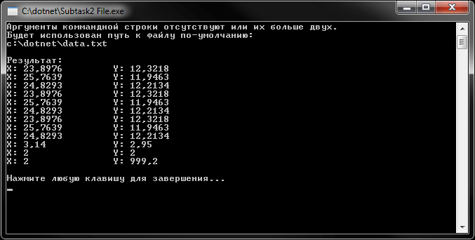
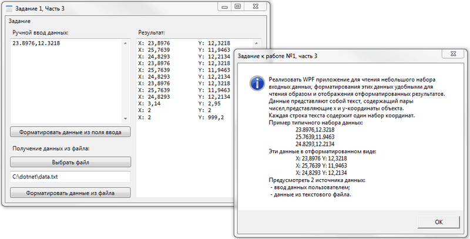
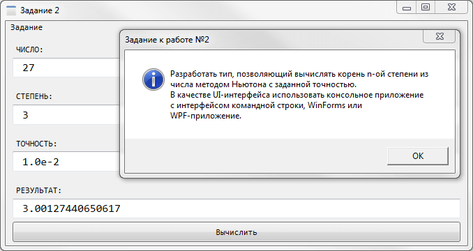
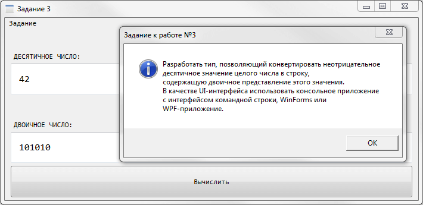
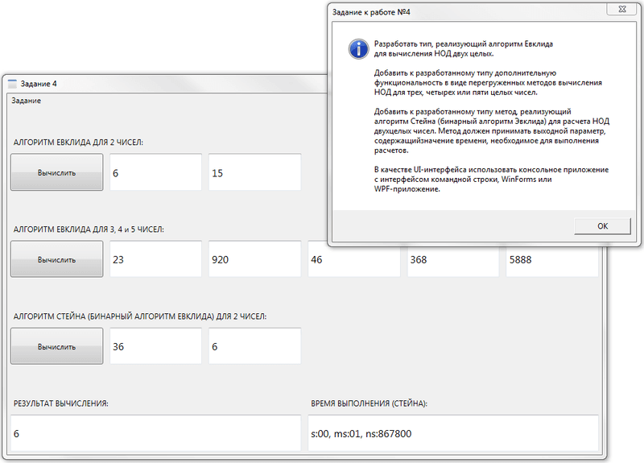
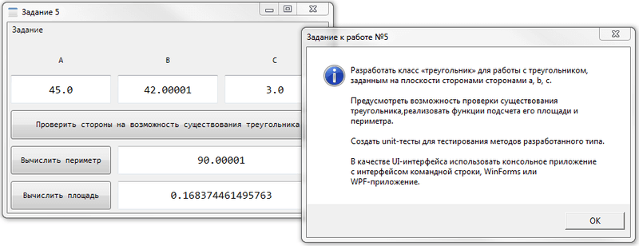
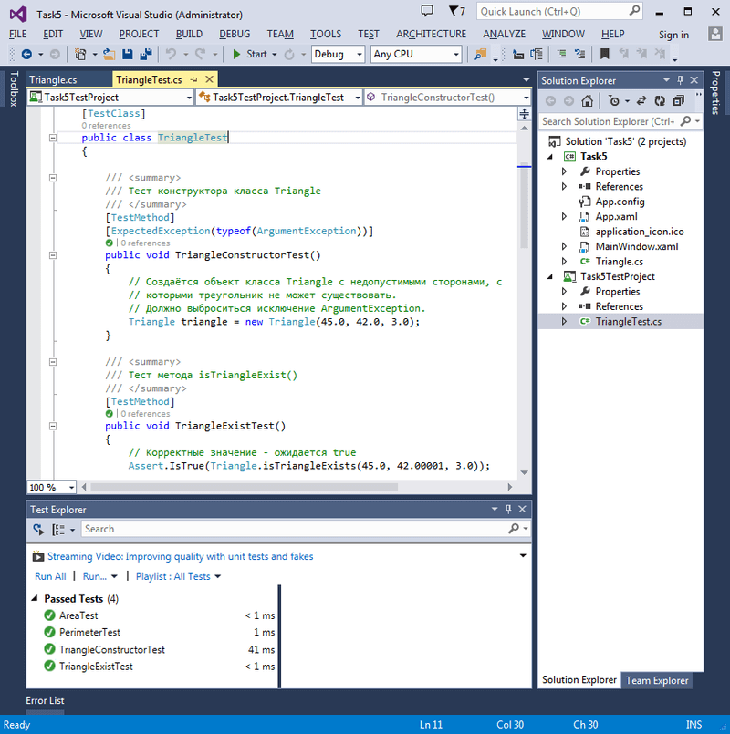

# Лабораторные работы (C#, WPF, Unit-тесты)
[&lt; назад](../)  
<!--- *Прочтите это на другом языке:* *[~~English~~](README.en.md)*, **[Русский](README.md)**.  -->
Примеры проектов предполагают запуск в IDE Visual Studio 13.  
Работоспособность исходников в других IDE не проверялась.

## Задания:
 * 1.Разработать приложение для чтения небольшого набора входных данных, форматирования этих данных удобным для чтения образом и отображения отформатированных результатов. Данные представляют собой текст, содержащий пары чисел, представляющие x и y-координаты месторасположения объекта. Каждая строка текста содержит один набор координат.
  * 1.1. Консольное приложение с ручным вводом данных;
  * 1.2. Консольное приложение с вводом данных из файла;
  * 1.3. Оконное приложение на WFP.  

 Пример входных данных:  
 *&nbsp;&nbsp;&nbsp;&nbsp;23.8976,12.3218  
 &nbsp;&nbsp;&nbsp;&nbsp;25.7639,11.9463  
 &nbsp;&nbsp;&nbsp;&nbsp;24.8293,12.2134*  
 Результат:  
 *&nbsp;&nbsp;&nbsp;&nbsp;X: 23,8976 Y: 12,3218  
 &nbsp;&nbsp;&nbsp;&nbsp;X: 25,7639 Y: 11,9463  
 &nbsp;&nbsp;&nbsp;&nbsp;X: 24,8293 Y: 12,2134*  

 * 2.Разработать тип, позволяющий вычислять корень n-ой степени из числа методом Ньютона с заданной точностью. В качестве UI-интерфейса использовать консольное приложение с интерфейсом командной строки, WinForms или WPF-приложение.

 * 3.Разработать тип, позволяющий конвертировать неотрицательное десятичное значение целого числа в строку, содержащую двоичное представление этого значения. В качестве UI-интерфейса использовать консольное приложение с интерфейсом командной строки, WinForms или WPF-приложение.

 * 4.Разработать тип, реализующий алгоритм Евклида для вычисления НОД двух целых. Добавить к разработанному типу дополнительную функциональность в виде перегруженных методов вычисления НОД для трех, четырех или пяти целых чисел. Добавить к разработанному типу метод, реализующий алгоритм Стейна (бинарный алгоритм Эвклида) для расчета НОД двух целых чисел. Метод должен принимать выходной параметр, содержащий значение времени, необходимое для выполнения расчетов. В качестве UI-интерфейса использовать консольное приложение с интерфейсом командной строки, WinForms или WPF-приложение.

 * 5.Разработать класс «треугольник» для работы с треугольником, заданным на плоскости сторонами сторонами a, b, c. Предусмотреть возможность проверки существования треугольника, реализовать функции подсчета его площади и периметра. Создать unit-тесты для тестирования методов разработанного типа. В качестве UI-интерфейса использовать консольное приложение с интерфейсом командной строки, WinForms или WPF-приложение.

## Запуск тестов в лабораторной 5:
*Test &rarr; Run &rarr; All Tests (Ctrl+R, A)*

## Демонстрационные скриншоты:

  
  
  
  
  
  

