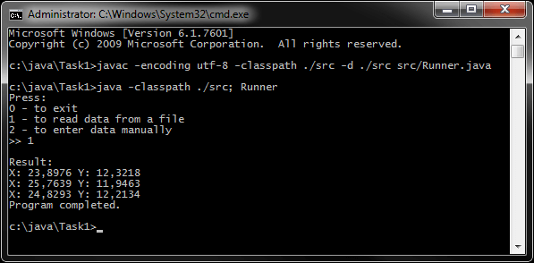
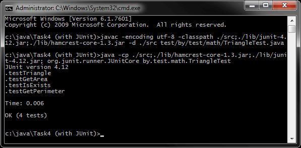
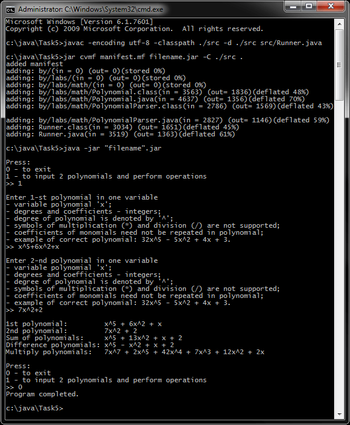
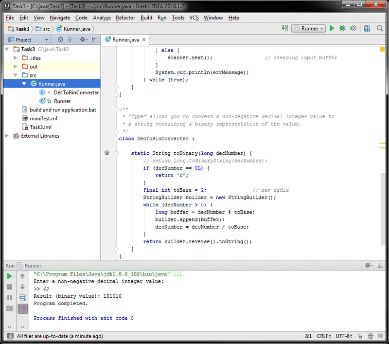
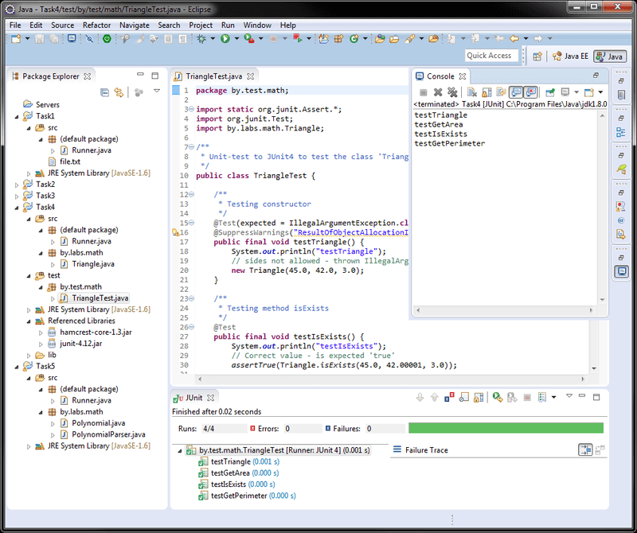
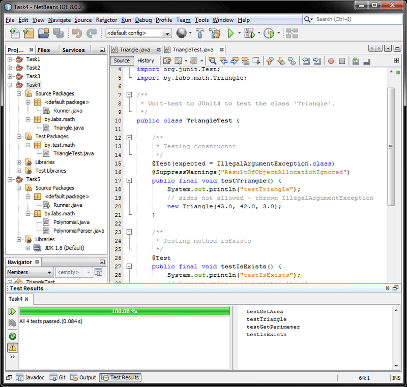

# Лабораторные работы (Java, JUnit)
[&lt; назад](../)  
<!--- *Прочтите это на другом языке:* *[~~English~~](README.en.md)*, **[Русский](README.md)**.  -->
Примеры приложений предполагают запуск в JDK 6 и выше.  
Тесты для лабораторной 4 предполагают запуск в JUnit 4.  
Также приложены инструкции по импорту и запуску приложения в IDE Eclipse, NetBeans и IDEA.

## Задания:
Во всех лабораторных, в качестве UI-интерфейса, использовать консольное приложение с интерфейсом командной строки. Также, во всех лабораторных, требуется ручной ввод данных.
 * 1.Разработать консольное приложение для чтения небольшого набора входных данных, форматирования этих данных удобным для чтения образом и отображения отформатированных результатов. Данные представляют собой текст, содержащий пары чисел, представляющие x и y-координаты месторасположения объекта. Каждая строка текста содержит один набор координат.  
 Пример входных данных:  
 *&nbsp;&nbsp;&nbsp;&nbsp;23.8976,12.3218  
 &nbsp;&nbsp;&nbsp;&nbsp;25.7639,11.9463  
 &nbsp;&nbsp;&nbsp;&nbsp;24.8293,12.2134*  
 Результат:  
 *&nbsp;&nbsp;&nbsp;&nbsp;X: 23,8976 Y: 12,3218  
 &nbsp;&nbsp;&nbsp;&nbsp;X: 25,7639 Y: 11,9463  
 &nbsp;&nbsp;&nbsp;&nbsp;X: 24,8293 Y: 12,2134*  
 Перенаправить ввод для запуска приложения с помощью текстового файла, содержащего данные, которые нужно отформатировать.
 * 2.Разработать тип, позволяющий вычислить корень n-ой степени из числа методом Ньютона с заданной точностью. Предусмотреть в нем возможность сравнения полученного результата со значением, рассчитываемым с помощью метода Math.Pow библиотеки классов.
 * 3.Разработать тип, позволяющий конвертировать неотрицательное десятичное значение целого числа в строку, содержащую двоичное представление этого значения.
 * 4.Разработать класс треугольник для работы с треугольником, заданным на плоскости сторонами a, b, c. Предусмотреть возможность проверки существования треугольника, реализовать функции подсчёта его площади и периметра. Создать *unit*-тесты для тестирования методов разработанного типа.
 * 5.Разработать класс «многочлен» для работы с многочленами от одной переменной. Перегрузить для класса операции, допустимые для работы с многочленами.

## Компиляция и запуск приложения в CMD:
Для запуска приложения в ОС требуется установленная JDK версии 6 или выше.  
В переменных окружения ОС должны быть прописаны пути к JDK (Для компиляции и запуска из CMD).
* 1. Для компиляции java-файлов в class-файлы в *cmd*:  
`javac -encoding utf-8 -classpath ./src -d ./src src/Runner.java`
* 2. Далее, для запуска, есть 2 пути: запуск скомпилированных class-файлов "как есть", либо предварительная сборка class-файлов в "запускаемый" jar-архив и запуск через него.
  * 2.1. *Запуск class-файлов "как есть"*: для этого в *cmd* нужно воспользоваться командой:  
  `java -classpath ./src; Runner`
  * 2.2. *Сборка запускаемого jar*:  
    * 2.2.1. Упаковка jar-файла осуществляется коммандой:  
    `jar cvmf manifest.mf filename.jar -C ./src .`
    * 2.2.2. Запуск созданного jar-файла осуществляется коммандой:  
    `java -jar "filename".jar`

Для упрощения ввода вышеперечисленных команд в *cmd*, в корне каталогов с проектами находятся скрипты *build and run application.bat*.

## Компиляция и запуск тестов лабораторной 4 в CMD:
Для запуска приложения в ОС требуется установленная JDK версии 6 или выше.  
В переменных окружения ОС должны быть прописаны пути к JDK (Для компиляции и запуска из CMD).
* 1. Для компиляции java-файлов тестов и тестируемых классов в class-файлы в *cmd*:  
`javac -encoding utf-8 -classpath ./src;./lib/junit-4.12.jar;./lib/hamcrest-core-1.3.jar -d ./src test/by/test/math/TriangleTest.java`
* 2. Запуск теста *TriangleTest* из class-файлов:  
`java -cp ./src;./lib/hamcrest-core-1.3.jar;./lib/junit-4.12.jar; org.junit.runner.JUnitCore by.test.math.TriangleTest`

Для упрощения ввода вышеперечисленных команд в *cmd*, в корне каталога с проектом лабораторной 4 находится скрипт *compile and run tests.bat*.

## Импорт и запуск проектов (и тестов лабораторной 4) в IDE
Для импорта и запуска проекта в IDE также должны быть установлены JDK/JRE.
* **Eclipse**.
  * 1. Создать новый Java SE проект: *File &rarr; New &rarr; Java Project*.
  * 2. Импортировать исходники в созданный проект: *File &rarr; Import &rarr; General &rarr; File System*.  
  Требуется указать каталог *src* и проигнорировать файл манифеста и батник.  
  В случае запуска задания 4, также требуется указать при импорте каталог с библиотеками тестов *lib* и каталог с тестами *test*. При этом все лабораторные готовы к запуску.
  * 3. В случае запуска тестов из задания 4, требуется указать в свойствах проекта путь к библиотекам тестов:  
  *File &rarr; Properties &rarr; Java Build Path &rarr; Libraries &rarr; Add JARs &rarr; libs/hamcrest-core-1.3.jar* и *libs/junit-4.12.jar*. Ссылки на библиотеки должны появиться во вкладке проекта *Referenced Libraries*.  
  Далее, нужно кликнуть правой кнопкой мыши по каталогу *test* в *Package Explorer*, затем *Build Path* и  
  *Use as Source Folder*. После этого, в конфигурациях запуска, появляется пункт для запуска тестов:  
  *Run &rarr; Run As &rarr; JUnit Test (Alt+Shift+X, T)*

* **NetBeans**.
  * 1. Создать новый Java проект из существующих исходников:  
  *File &rarr; New Project &rarr; Java &rarr; Java Project With Exiting Sources*  
  Затем нужно указать путь в каталог *src* проекта: *Exiting Sources &rarr; Source Package Folders &rarr; Add Folder*. Если это лабораторная 4, также нужно указать путь в каталог *test* в *Test Package Folders*,    
  Эта IDE не корректно распознаёт структуру каталогов, и может сделать корневым пакетом *src* (*test* для лабораторной 4), поэтому указывать нужно именно на java-файлы **внутри** *src* (и *test* для лабораторной 4). Библиотеки для тестов импортировать не нужно, так как IDE подгружает в проект свои и их достаточно для тестирования (*JUnit 3.8.3* и *JUnit 4.10*). После этого приложение готово к запуску.
  * 2. Запуск тестов для лабораторной 4: кликнуть правой кнопкой мыши по проекту &rarr; Test (Alt+F6).

* **IntelliJ IDEA**.
  * 1. Импорт проекта - при запуске IDE:  
  *Import Project &rarr; Указать путь к проекту &rarr; Create project from exiting sources*.
  * 2. Запуск тестов для лабораторной 4:  
  кликнуть правой кнопкой мыши по проекту &rarr; Run 'All Tests' (Ctrl+Shift+F10).

## Демонстрационные скриншоты:

  
  
  
  
  

