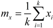

# Лабораторные работы (MS Excel, Java)
[&lt; назад](../)  
<!--- *Прочтите это на другом языке:* *[~~English~~](README.en.md)*, **[Русский](README.md)**.  -->
Примеры проектов представлены для NetBeans 8 \[JDK8\] (Lab1,2,4,5).  
Пример БД - в MS Excel 2007 (Lab3).

## Задания:
* 1.Разработать ПС, в котором присутствовали бы некоторые критерии и примитивы качественного программного обеспечения.  
Найдите все делители заданного числа **n**.  
  
* 2.Разработать ПС, представленное по правилам хорошего стиля программирования.  
Сгенерировать три последовательности по 30 случайных чисел каждая. Числа в каждой последовательности равномерно распределены в диапазонах **от 0 до 5**, **от 2 до 8**, **от 4 до 10**.  
Свести их в один массив, расположив по возрастанию. Для сформированного массива вычислить *среднее значение*, *дисперсию* и вывести результаты на печать в виде *гистограммы*, разбив диапазон на 10 интервалов.  

 *Справочный материал*:  
  
     Математическое ожидание:  
           
     Дисперсия:  
           
     Равномерный закон распределения: <i>z = (b-a)\*xi+a</i>, где *xi* - случайное число из диапазона *[a,b]*;  
     Нормальный закон распределения:  
           
     Экспоненциальный закон распределения:  
           

* 3.Разработать программное средство и его схему информационных связей. Сделать возможность корректировки, добавления и удаления записей. Файл должен содержать не менее 5 записей. В отчетных формах возможен поиск, отчет за период и т.д. Разработать 2 формы отчетности с возможностью подключения 3-й формы.  
Создать БД «Сессия», включающую следующую информацию: ФИО студента, факультет, специальность, курс, оценки по 4 предметам.

* 4.Разработать ПС и протестировать в нормальных, экстремальных и исключительных ситуациях.  
Построить синтаксический анализатор для понятия список геометрических фигур (СГФ):  

       
  
* 5.Требуется разработать ПС, с оптимальной структурой данных.  
Составить программу для нахождения на курсе групп, в которых учатся студенты, имеющие одинаковые фамилии.  

## Описание решений:
 * Исходники лабораторных 1, 2, 4 и 5 представлены для IDE NetBeans 8 (JDK8). Запуск в других Java IDE невозможен, так как для конструирования UI использовался визуальный конструктор интерфейса библиотеки Swing. Для вёрски элементов окон он создаёт файл с раширением form, который не поддерживается другими Java IDE.
 * Для лабораторной работы 2, ввиду отсутствия в стандартной библиотеке Swing компонентов для отображения гистограмм, для этой цели использовался опенсурсный фреймворк JFreeChart.
 * База данных, для лабораторной 3, была построена с помощью СУБД MS Access 2007, которая также обладает всем необходимым инструментарием для создания интерфейса ведения БД. Схема связей таблиц БД:  
 

## Демонстрационные скриншоты:

  
  
  
  

