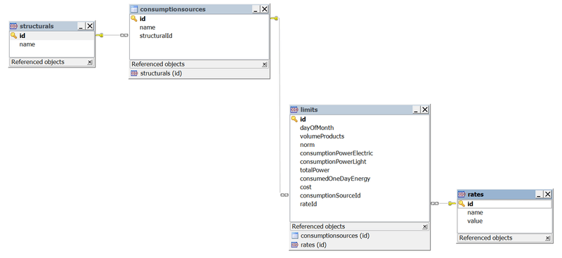
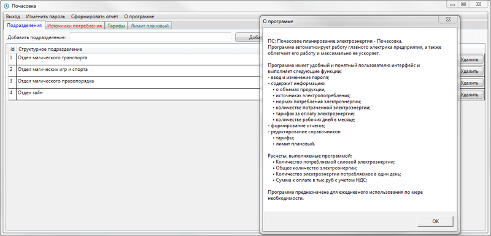
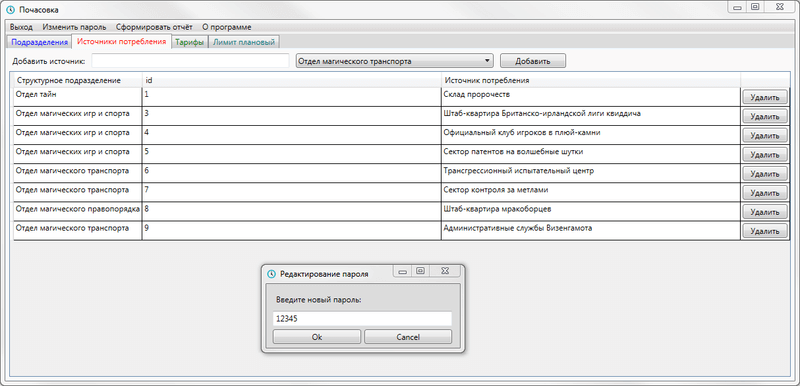
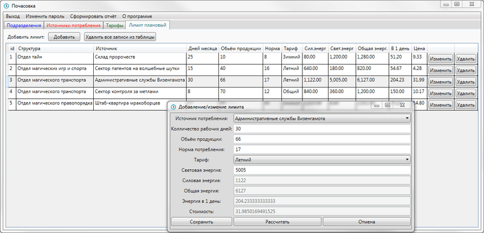
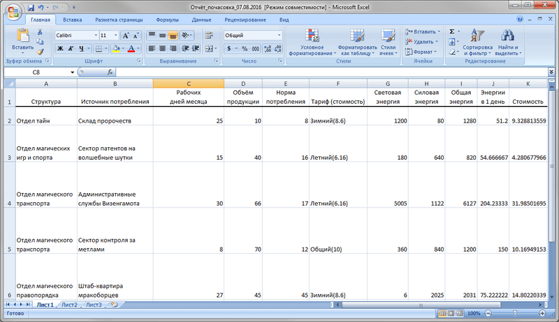

# Почасовка (C#, XAML, SQLLite)
[&lt; назад](../)  
<!--- *Прочтите это на другом языке:* *[~~English~~](README.en.md)*, **[Русский](README.md)**.  -->
Проект предполагает запуск в IDE MS Visual Studio 2013 Express.  
Для формирования отчётов в приложении, в OC должен быть установлен MS Excel 2007 или выше.

## Техническое задание:
Необходимо разработать программное средство **«Почасовое планирование электроэнергии - Почасовка»**. Программа должна автоматизировать работу главного электрика предприятия, а также облегчить его работу и максимально ее ускорить. Программа должна иметь удобный и понятный пользователю интерфейс и выполнять следующие функции:
* ввод и изменение пароля;
* содержать информацию о:
  * объемах продукции;
  * источниках электропотребления;
  * нормах потребления электроэнергии;
  * количестве потраченной электроэнергии;
  * тарифах за оплату электроэнергии;
  * количестве рабочих дней в месяце;
* формирование отчетов;
* редактирование справочников:
  * тарифы;
  * лимит плановый.

Расчеты, выполняемые программой:  

* Количество потребляемой силовой электроэнергии рассчитывается по формуле:  
    <b>СилЭн = Vпрод. * Нпотр.</b>  
    где <b>СилЭн</b> – количество силовой электроэнергии;  
          <b>Vпрод.</b> – объем продукции;  
          <b>Нпотр.</b> – норма потребления.

* Общее количество электроэнергии рассчитывается по формуле:  
    <b>&sum;э = СилЭн + СвЭн</b>  
    где <b>&sum;э</b> – количество электроэнергии;  
          <b>СилЭн</b> – количество силовой электроэнергии;  
          <b>СвЭн</b> – количество световой электроэнергии.

* Количество электроэнергии потребляемое в один день рассчитывается по формуле:  
    <b>Эд = &sum;э / Дн</b>  
    где <b>Эд</b> – количество электроэнергии потребляемое в один день;  
          <b>&sum;э</b> – количество электроэнергии;  
          <b>Дн</b> – дней в месяце.

* Сумма к оплате в тыс.руб с учетом НДС рассчитывается по формуле:  
    <b>&sum;о = &sum;э * ta / 1000 * 1.18</b>  
    где <b>&sum;о</b> – сумма к оплате в тыс.руб с учетом НДС;  
          <b>&sum;э</b> – количество электроэнергии;  
          <b>ta</b> – тариф.

Программа предназначена для ежедневного использования по мере необходимости.

## Описание приложения:

К качестве базы данных для приложения выбрана файловая БД SQLite.  
Визуальная *схема связей* таблиц БД:  
  
  
  
*Описание* таблиц БД:  
* Таблица **структурных подразделений** (Structurals):
  * id (Идентификатор);
  * name (Название).
* Таблица **источников потребления** (ConsumptionSource):
  * id (Идентификатор);
  * name (Название);
  * structuralId (Идентификатор структурного подразделения).
* Таблица **тарифов** (Rates):
  * id (Идентификатор);
  * name (Название);
  * value (Численное значение тарифа).
* Таблица **плановых лимитов** (Limits):
  * id (Идентификатор);
  * name (Название);
  * volumeProducts (Обьём продукции);
  * norm (Норма);
  * consumptionPowerElectric (Силовая энергия);
  * consumptionPowerLight (Световая энергия);
  * totalPower (Общая энергия);
  * consumedOneDayEnergy (Общая энергия за 1 день месяца);
  * cost (Цена);
  * consumptionSourceId (Идентификатор источника потребления);
  * rateId (Идентификатор тарифа).

База данных и пароль для приложения хранятся в каталоге *AppData*:  
*AppData/DB.Pochasovka.s3db* и *AppData/password*.  
Никаких требований к хранению пароля не предъявлялось, поэтому он хранится в открытом виде, без шифрования.  
В случае удаления файла БД, файла с паролем или всего каталога *AppData*, они будут созданы заново автоматически (Пароль по умолчанию - пустой).

В проекте используется несколько строронних библиотек, для создания MS Excel отчётов и работы с SQLite:
  * EntityFramework 6.0;
  * Excel-DNA.Interop 14.0.1;
  * System.Data.SQLite 1.0.99.0.

Все библиотеки (~65 мб) будут скачаны при сборке приложения автоматически, с помощью пакетного менеджера NuGet.  
Также, для создания отчетов, в OC должен быть установлен MS Excel - библиотека *Excel-DNA.Interop* использует его во время создания отчёта и в случае отсутствия MS Excel возникает исключительная ситуация.

## Демонстрационные скриншоты:

  
  
  
  

